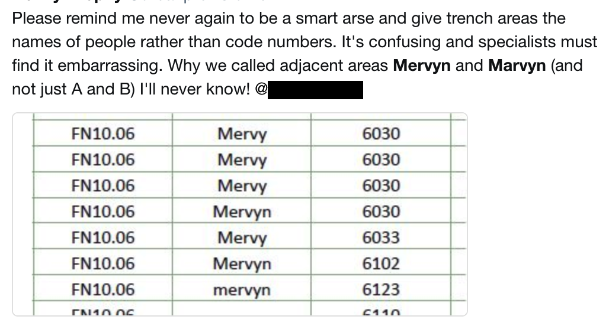
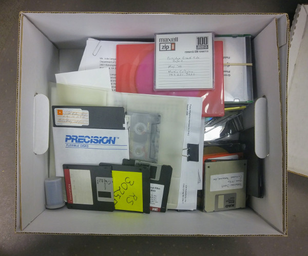

# 2.1 Uygun Ön Planlama

[İngilizce Metin:](https://o-date.github.io/draft/book/proper-prior-planning.html)

Kendinizi küçük bir yolculuğa hazırlayın. Rüya gibi bir durumdayken kendinizi bir zaman makinesinin içinde buluyorsunuz ve çok uzak olmayan bir gelecekte bir noktaya seyahat ettiğinizi fark ediyorsunuz. Kendi laboratuvarınıza geldiğinizde, daha önce oluşturduğunuz bilgiler üzerinde kafa yoran, sonuçlarınızı yeniden yapılandırmaya ve bunlardan bir tür anlam çıkarmaya çalışan bir grup araştırmacıyı bulursunuz.

"What are these strange codes?"
"Does this thing go with that? It looks like there's a bit missing, but we can't be sure."
"What was on all those corrupted flash drives? Does anyone even have a flash-drive-to-skull-jack converter around here?"
"WHAT WAS THIS PERSON THINKING?"

"Bu garip kodlar nedir?"

"Bu şey buna uyar mı? Biraz eksik gibi görünüyor ama emin olamayız."

"Bütün bu bozuk flash sürücülerde ne vardı? Buralarda flash sürücüyü kafatası girişine dönüştüren var mı?"

"BU KİŞİ NE DÜŞÜNÜYORDU?"

Bu şekilde olmak zorunda değil. Çoğu arkeolojik araştırmacı, başka birinin verilerini kullanmaya çalışırken veya saha notlarından ve kazı raporlarından elde ettiği sonuçları yeniden oluşturmaya çalışırken “kötü” verilerle karşılaştı. Bir veri kümesini kullanışsız kılan nedir? Nasıl daha iyi hale getirebiliriz?

A Useful Warning from Kenny Brophy

Kenny Brophy’den Faydalı Bir Uyarı

Anlaşılabilir değil. Veri kümesi okunaksız olabilir (kötü el yazısı veya basılı kopya belgenin kötü taranması). Anlamlarını çözmenin hiçbir yolu olmayan kodlardan oluşmuş olabilir. Artık mevcut yazılım tarafından okunamayan (veya artık kullanılmayan bir fiziksel formatta) dijital bir ikili dosya olabilir.

Kolayca erişilebilir değil. Veri kümesi yalnızca pahalı ve özel yazılımların okuyabileceği bir biçimde kaydedilmiş olabilir. Pek çok büyüleyici bilgiden oluşabilir ancak PDF gibi bir formattan çıkarılması zor olabilir.

Tekrar kullanılması zordur. Veri kümesinde tutarsız terminoloji kullanılmış olabilir. Veriler bir görüntü (PDF’deki bir tablonun resmi) olarak kaydedilmiş, ancak aslında bir yapıya sahip olabilir (mesela kolayca çıkarılabilir metin ve sayılar). Veriler halihazırda daha fazla analizi imkansız hale getirecek şekilde işlenmiş olabilir.

Bu hayal kırıklıkları akılda tutulduğunda, “iyi” verinin nitelikleri ortaya çıkıyor. İyi veriler stabildir, insanlar tarafından okunabilir ve erişilebilirdir. Yeniden düzenlenebilir ve yeniden karıştırılabilirler. Verileri bu şekilde saklamak, onları zamanın tahribatlarından korumaya yardımcı olabilir.

# 2.1.1 Verileri Anlamlı Hale Getirmek: Ön Planlama

İyi veri oluşturmak planlama gerektirir. Araştırmanızın başından itibaren verinin yapısını, araştırmacılar tarafından kullanımına ilişkin beklentileri planlamak ve saklanmasını düzenlemek önemlidir. Ancak bunun için başka bir şeylerden vazgeçmek zorunda kalınabileceği gerçeğiyle yüzleşmek gerekebilir.

Başlangıçta, araştırma sorularınızı ve hedeflerinizi belirlerken kendinize bazı sorular sorun: Verilerimin ne yapmasını istiyorum? Ne kadar ayrıntı toplamam gerekiyor? Oluşturduğum veri kümelerini düzenlemek için bir planım var mı? Bunu yapabilecek bir yer var mı? Seçici olmam gerekecek mi?
Tekrarlanabilirlik derecesi	| Veri | Analiz	| Hesaplamalı ortam	| Yorum |
| --- | --- | --- | --- | --- | 
| Tekrarlanamaz |  Ham verilere ait özet istatistikler sunulmaktadır.	| Yöntemlerin kısa anlatımı sunulmaktadır. | Hiçbir bilgi verilmemektedir.| Bilimsel dergi makaleleri için mevcut durum bu şekildedir.|
|Tekrarlanabilirliği az | Okuyucu, verilere erişim için yazarla iletişime geçmeye davet edildi. | Yöntemlerin kısa anlatımı sunulmuş, yazılımların isimleri ve versiyon numaraları belirtilmiştir. | Hiçbir bilgi verilmemektedir. | Sıklıkla görülür. Okuyucuları işlenmemiş verilere erişmek için yazarla iletişime geçmeye zorlar, ham verilerin mevcut olduğunu garanti etmez. |
|Orta Derecede Tekrarlanabilirlik | Dergi makalesi, PDF veya Excel (ing. binary) dosyalarındaki işlenmemiş veri tablolarının dosyalarını içerir. | Yöntemlerin kısa anlatımı sunulmuş, yazılımların isimleri ve versiyon numaraları belirtilmiştir. | Hiçbir bilgi verilmemektedir.	Sıklıkla görülür. İşlenmemiş verilerin ek materyalde bulunması, yazardan talep edilmesi gereken duruma kıyasla onu çok daha erişilebilir hale getirir. Ancak ham verileri bir PDF’den veya başka bir ikili dosya formatından çıkarmak zaman alabilir ve hatalara neden olabilir. Bu durum verilerin yeniden kullanılmasının önünde engeller oluşturmaktadır. | 
|Tekrarlanabilirliği yüksek | Dergi makalesi, işlenmemiş verilerin düz metin dosyalarını (örn. CSV formatı) içerir. | Dergi makalesi, analizin önemli kısımlarını gösteren (ancak makalede sunulan tüm sonuçları oluşturmayan) Python kodunun R komut dosyası dosyalarını içeir. | Hiçbir bilgi verilmemektedir. | Yaygın değildir. Düz metin formatındaki ham veriler, yeniden kullanımı oldukça verimli hale getirir. Kod içeren komut dosyası klasörleri, makale metninde anlatılmayan analitik kararlara ilişkin değerli bilgiler sağlar. Ancak kod tam olmadığından, makalenin sonuçlarını yeniden oluşturmak ve kodu yeni çalışmalarda yeniden kullanmak için diğer araştırmacıların büyük çaba ve beceriye ihtiyacı vardır. Bu, kodun yeniden kullanılmasının önünde engeller oluşturur. | 
| Yüksek Tekrarlanabilirlik | Dergi makalesi, işlenmemiş verilerin düz metin dosyalarını (örn. CSV formatı) içeren açık erişimli bir veri havuzunun DOI’lerini içerir. | Makalede bağlantısı verilen açık erişim veri deposu, makaledeki tüm analiz çıktılarını ve grafikleri yeniden oluşturmak için sürüm kontrollü R paketini veya R veya Python kodunun komut dosyalarını içerir. | Makalede bağlantısı verilen açık erişim veri deposu, yayınlanan analizin hesaplamalı ortamını belgeleyen bir docker dosyası ve başka bir kişinin bu ortamı kullanmasına izin veren bir docker görüntüsü içerir. | Şu anda nadiren görülüyor. Diğer araştırmacıların, düz metin veri dosyalarının, makaledeki her analizi ve görselleştirmeyi belgeleyen kodun ve orijinal analizin hesaplama ortamının ayrıntılarının bu kombinasyonuyla, yayınlanan sonuçları yeniden üretme, yeniden kullanma ve genişletme şansına sahip olmaları gerekir. Bunun kalıcı tekrarlanabilirliği garanti etmediğini ancak şu anda sağlayabildiğimiz en iyi oranları verdiğini unutmayın. Açık erişim veri deposunun kullanılması, araştırmacıların dergiye aboneliği olmasa bile dosyalara erişebilmesi anlamına gelir ve dergi web sitesinin değişmesi durumunda dosyaların kullanılabilirliğini sağlar.|    

 *Tablo Marwick’ten (2017) alınmıştır.*

Mükemmellik ulaşılmazdır. Hiçbir veri kümesi hiçbir zaman gerçek anlamda “tam” olmayacaktır. Giderek daha iyi çözünürlüklerde sonsuza kadar veri toplayabilir, ölçebilir ve üretebilirsiniz. Ama sen bunu yapmak istemiyorsun. Kapsamlı olduğunuzu düşünseniz bile topladığınız tüm veriler, gerçek dünyanın belirli bir andaki yalnızca belirli ve sınırlı bir temsilidir. Mükemmel şekilde kullanılabilir ve korunabilir bir veri kümesine olabildiğince yaklaşmak için hem üst verileri hem de paradataları toplamalısınız.

Üst veri kavramı veriye ilişkin veridir. Yani nitelikleri tanımlayan ve yapıyı belgeleyen verilerdir. Paradata ise veri günlüğü gibi verinin yanındaki veridir ([H. et a. Denard 2009](https://o-date.github.io/draft/book/proper-prior-planning.html#ref-denard2009london)). [Heritage Jam](https://heritagejam.hosted.york.ac.uk/index.php/resources-new/) gibi etkinliklerde paradata çalışırken görebilirsiniz. Konsept, analitik ve teknik dijital projelere büyük bir etki yaratacak şekilde geniş çapta uygulanabilir. Bir paradata dosyası tutmak, verileri üretirken ve düzenlerken doğal olarak yaptığımız bazı varsayımları açıklamaya yardımcı olabilir. Bu modele göre veriler hiçbir zaman “işlenmemiş” değildir [Gitelman (2013)](https://o-date.github.io/draft/book/proper-prior-planning.html#ref-gitelman_raw_2013). Yayınlanmış analize sahip bir arkeolojik kazı bağlamında bu bilgi, gri bir literatür raporunun bölümleri veya bir yayının eki şeklinde olabilir. Veya bir veri dosyası koleksiyonunun yanında “benioku” (ing. readme) olarak eklenmiş bir metin belgesi olabilir.

Üst veriler de aynı şekilde kritik bir kavramdır. Dosya boyutu veya fotoğrafik EXIF verileri gibi bazı değerler makine tarafından oluşturulurken, diğer tanımlayıcı üst veriler elle yazılır. Bunu, geri kalan bilgilerinizi faydalı kılan el kitabı (ing. codex) olarak düşünün.

# 2.1.2 Verileri Dayanıklı Hale Getirmek: Uzun Dönemli Koruma ve Sürdürülebilirlik

Format, yapı ve açıklamalar gibi konulara yönelik öngörüyle çalışmanızın ömrünü uzatmak için çok şey yapabilirsiniz. En başından itibaren, verilerinizi dijital bir veri arşivinde (ingilizce digital repository link çalışmıyor) nihai kullanım için hazırlamayı mı, kendiniz muhafaza etmeyi mi yoksa her ikisini de yapmayı mı planladığınızı düşünün. Dijital koruma disiplininde, [LOCKSS](https://www.lockss.org/) (Lots of Copies Keep Stuff Safe) yani çok sayıda kopya, üretilen şeyleri güvende tutar ilkesi, yedeklilik sağlamak için verilerin çeşitli konumlarda saklanmasını önerir.  

Basit formatlar, yazılım ve donanım geliştikçe daha kolay geçişe olanak sağlayabilir. Dosya formatları arasındaki farkları anlamak, dijital koruma planlamasında önemlidir. Bazı veriler, yalnızca belirli programlar tarafından okunabilen (Microsoft Access .mdb gibi) veya tamamen insan tarafından okunabilen (.csv biçimindeki tablo gibi) ikili dosyalarda depolanır. Görüntülerin saklanması kolay olabilir, ancak sıkıştırıldığında “kayıplı” olabilir (.jpg dosyaları) veya daha büyük ve “kayıpsız” olabilir (.tif dosyaları). Birçok kişi CAD (bilgisayar destekli tasarım) dosyaları için üzerinde anlaşmaya varılmış bir arşiv formatının olmadığını öğrendiklerinde şaşırıyor.
FM0 FC111111111:zzzzzz0 e129 078043891e4ac1e816c14c0 bac2fd159148f c06147 fe5 97a13513a4 b541231229 bc7111 e4c 959 ff c0a 7e7 ed aac 712129 9cb 67a12f103d a5a13511e5 b2313b1362 bd31411451 d4a14713fe c6b13b13ae b56

Bu medya koleksiyonu yazarın masasının altında işlenmeyi bekliyor. Muhtemelen bazı veriler sonsuza kadar kaybolacak.

**Zaman senin düşmanın**

Arkeologlar kazının yıkıcı bir eylem olduğunun farkındalar. Ne kadar korusak da koruma hiçbir zaman sonsuza kadar sürmez. Kazdığımızda, fiziksel materyali hem yorumlanmasını kolaylaştırırken kaçınılmaz bozulmaya karşı daha savunmasız hale getiriyoruz. Aynı riskler arkeolojik veriler için de geçerlidir. İşte bazı yaygın riskler:

Kullanımdan kaldırılan formatlar: **Deprecated formats**

Kaydet düğmesine bastıktan sonra dijital çalışmamızın güvenli ve sağlam olduğunu varsaymak kolaydır. Ancak bu noktada dosya formatlarını göz önünde bulundurmak gereklidir. Eski koleksiyonlar ve verilerle çalışan birçok kişi eski kelime işlem dosyalarıyla, veritabanlarıyla veya artık açılmayan coğrafi veri kümeleriyle karşılaşmıştır. Bunlar genellikle o zamandan beri geçerliliğini yitirmiş olan özel formatlardaki ikili dosyalar olarak tanımlanır. Buna karşı verileri korunmanın bir yolu, mümkün olduğunda kayıpsız formatlar kullanmak ve yazılım sürümlerine ayak uydurarak dosyaları düzenli olarak yeni sürümlerine dönüştürmektir.

Bit çürümesi ve bağlantı çürümesi: **Bit rot and link rot**

Bazı dosyalar, özellikle tekrar tekrar kopyalandığında veya sıkıştırıldığında zamanla bozulabilir. Kaynaklar taşındıkça veya yeniden yapılandırıldıkça web sitelerindeki bağlantılar bozulabilir veya “ölü” hale gelebilir. Dosyalar için daha yeni sürümlere geçiş planı tanımlamak, bit çürümesine karşı korunmanıza yardımcı olabilir (yani dosyalarınızı bir yere kaydedip yıllar sonra çalışmasını beklemeyin). Dosya bütünlüğünü kontrol etmenin bir yolu, bir dosyayı sakladığınızda periyodik olarak sağlama toplamları oluşturmaktır. Sağlama toplamı, dosyanın kendisindeki bitlerin içeriğine göre hesaplanan uzun sayıdır. Örneğin, bir görüntünün piksellerindeki küçük bir aksaklık bile sağlama toplamında değişikliklere neden olacaktır; dolayısıyla eşleşmeyen bir değer, dosyanızda bir şeylerin ters gittiğini size söyleyecektir. Bağlantı çürümesi, arşivlenmiş kaynaklara (yalnızca bir örnek olarak İnternet Arşivi’nin Wayback Makinesi) veya DOI’lere (dijital nesne tanımlayıcıları) bağlanılarak azaltılabilir.

Kaybolan kurumsal bilgi ve bilinçsiz varsayımlar: Bu kodlar ne anlama geliyordu? Bu hangi ölçü birimi? Ekipman nasıl kalibre edildi? Saha verisinin koordinatları neydi? Bunlar, kolaylıkla kaybolabilecek ve ilgili verilerin yeniden kullanılmasını zorlaştırabilecek veya imkansız hale getirebilecek kritik bilgi parçalarıdır.

Stratejiler: Bir Plan Yapın: **Strategies: Have a Plan**

İyi bir dijital koruma önceden üzerinde düşünmeyi gerektirir. Öncelikle neyi ve hangi düzeyde korumaya çalıştığınızı açıklayın. Destekleyici verileri (tablolar, resimler, diğer dosyalar), belgelerin tamamını (raporlar, yayınlar, tezler) veya dijital projeleri (web siteleri, etkileşimli içerik) mi koruyorsunuz? Bu tür bilgilerin tümü, korunması için farklı değerlendirmeler gerektirecektir. Bu dijital materyalleri kendiniz düzenlemeyi mi planlıyorsunuz? Daha sonra kişisel dijital arşivleme hakkında araştırma yapın.

Mevcut altyapı ve uzmanlıktan yararlanmak için uygun bir veri havuzu bulma seçeneklerini de araştırabilirsiniz. Bu depo bir üniversite kütüphanesi ekosisteminin parçası olabilir. Ya da Open Context veya tDAR gibi arkeolojik veriler için özel olarak tasarlanmış bir depolama alanı veya Zenodo gibi çok geniş bir şekilde tanımlanmış olabilir. Depo seçiminiz, topladığınız üst verinin türünü ve toplama şeklinizi belirleyebilir; dolayısıyla proje yaşam döngünüzde uzun vadeli depolama ve koruma seçeneklerini ne kadar erken değerlendirirseniz o kadar iyi olur.

Stratejiler: Üst Veri Oluşturun

Devam ederken kapsamlı üst veriler veya “verilerle ilgili veriler” oluşturun. Bu size, gelecekte verilerinizi kullanacaklara ve veri kümelerinizi düzenlemekle görevlendirilen kişilere yardımcı olacaktır. Değişkenlerin net açıklamaları ve ölçüm parametreleri üst verileri oluşturur. İyi adlandırılmış sütunlar karışıklığın azaltılmasına büyük ölçüde yardımcı olacaktır. Kullanılan tüm kodlar veya kısaltmalar tanımlanmalıdır. Üst veriler ayrı bir “benioku” belgesinde veya dosya türüne bağlı olarak doğrudan uygulamanın kendisinde saklanabilir. Ancak üst veriler yalnızca kaybolmadığı veya bağlantısı kesilmediği sürece çalışır.

Projeleri Web’de Korumak

Web arşivleme başlı başına bir disiplin olsa da, bazı ücretsiz araçlarla başlayabilirsiniz. [Webrecorder.io](https://webrecorder.io/) ile depolama ve koruma için herhangi bir web sitesinden, hatta karmaşık etkileşimli projelerden statik bir dosya paketi oluşturulabilir. WordPress veya Omeka gibi bir içerik yönetim sistemi kullanarak dinamik bir web projesi oluşturuyorsanız, kodda yapılan güncellemelerin sık olduğunu ve zamanla bazı şeylerin bozulmaya başlayabileceğini göreceksiniz. Güncellemeler olmadan güvenlik açıkları ortaya çıkacaktır. Yorum bölümleri iyi yönetilmezse, kısa sürede spam ile dolabilir. Yıllar genellikle web projeleri için iyi değildir, bu nedenle işleri statik HTML’ye kaydırmak için bir gün batımı planınız olsun. İşte Ed Summers’ın [Omeka](https://inkdroid.org/2018/07/08/omeka/) sitesini statik bir siteye dönüştürme konusunda harika bir rehberi. İşte statik bir siteye dönüştürmek için bir WordPress eklentisi. Statik sitelerin genellikle daha az bağımlılığı vardır ve güvenlik sorunlarına yatkınlıkları azdır.

# 2.1.3 Çıkarımlar

Koruma işlemlerinizi planlayın. Dosyalar bozulur ve formatlar geçerliliğini kaybeder.

Kısaltmaları ve varsayımları tanımlayarak veri kümelerinizi üst verilerle tanımlayın.

Tescilli dosya formatları korurken bazı zorluklara yol açabilir. Verileri CSV gibi metin dosyalarında saklamak güvenli bir yöntemdir.

Tekrarlanabilir sonuçlar yararlı verilerden oluşur. Tekrarlanabilirliği hedeflemek faydayı ve kullanılabilirliği artırır.

Gelecekteki araştırmacılar için üst veriler ve paradata biçiminde “kırıntılar” (ing. breadcrumbs) yani ipuçları bırakın.

# 2.1.4 Further Reading

Belirli arkeolojik türlerin oluşturulması ve korunmasına ilişkin tavsiyeler için bkz. [Guides to Good Practice published by the Archaeology Data Service and Digital Antiquity, 2011](http://guides.archaeologydataservice.ac.uk/g2gp/Main).

Dijital korumaya daha derinlemesine bakmak için bkz.[The Theory and Craft of Digital Preservation, T. Owens (2018)](https://o-date.github.io/draft/book/proper-prior-planning.html#ref-owens_theory_2018). [Full open access preprint available.](https://osf.io/preprints/lissa/5cpjt/)

Arkeolojiye özgü öneriler için bkz. the Archaeology Data Service and Digital Antiquity’s Guides to Good Practice.

**Referanslar**

[Marwick, Ben. 2017. “Computational Reproducibility in Archaeological Research: Basic Principles and a Case Study of Their Implementation.” Journal of Archaeological Method and Theory, 1–27](http://link.springer.com/article/10.1007/s10816-015-9272-9)

Denard, Hugh et al. 2009. “The London Charter for the Computer-Based Visualisation of Cultural Heritage.” February, 1–13.

Gitelman, Lisa, ed. 2013. Raw Data Is an Oxymoron. Cambridge, Massachusetts ; London, England: The MIT Press.

Owens, Trevor. 2018. The Theory and Craft of Digital Preservation. Johns Hopkins Press.