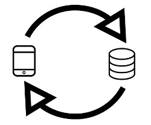

# 2.2 Veri Toplamanın Tasarlanması ve Kürasyon

[İngilizce Metin:](https://o-date.github.io/draft/book/designing-data-collection-and-curation.html)

Öğretimde ‘geriye doğru tasarım’ denilen bir kavram vardır; dersinizi öğrencilerinizin ulaşmasını istediğiniz son noktadan yola çıkarak tasarlarsınız. Aynı şey veriler için de geçerlidir. Arkeolojinin tahrip edici olduğunu ve arkeoloji süreçlerinin yeni türden eserler (çizimler, fotoğraflar, kayıt sayfaları, etiketler vb.) yarattığını bilerek, işe sondan başlamamız gerekir. İdeal olan, yarattığınız arkeolojik kaydı bir başkasının yeniden değerlendirmesine olanak tanıyacak şekilde son şeklinin verilmesidir. Gavin Lucas’ın (2012) yazdığı gibi, ‘arkeolojik kayıt’ fikri üç katlı, üçleme benzeri bir kavramdır-

    geniş anlamda maddi kültürün anlaşılması,
    maddi kültürün nasıl ortaya çıktığına dair ‘oluşum teorisi’,
    ve maddi kültürün inşasının şimdiki zamanda somutlaştırılması: arşivimiz  

Bu nedenle, veri toplama ile ilgili bu bölüme işlerin nereye gideceğini düşünerek başlayacağız.

İki ok arasında bir tablet (veri toplama) ve bir veritabanını temsil eden bir silindir görüntüsünü gösteren dairesel bir akış diyagramı ile temsil edilir.

Veri toplama tasarımı, veri tabanının yapısını bilgilendirir ve bunun tersi de geçerlidir.

Hangi veri alanlarının toplanacağı ve bunların nasıl toplanacağına ilişkin seçimler, veritabanınızın “şeklini” etkileyecek ve daha sonra ne kadar temizlik ve yeniden yapılandırma yapmanız gerekebileceği konusunda sonuçlar doğuracaktır.

.jpg)

[KoBoToolbox](https://www.kobotoolbox.org/)’ta tasarlanan bu form, kullanıcıdan birden fazla değeri virgülle ayırmasını isteyen bir metin kutusu içerir. Bu veri girişi için kolaydır, ancak sonuçları vardır. Veri Temizleme ile ilgili bir sonraki bölümde daha fazla bilgi edineceğiz / mevcuttur.

**Toplama Yöntemleri**

Sonuçta bu bir Dijital Arkeoloji Açık Ders Kitabı Ortamı olsa da, analog veri toplama seçeneğini göz ardı etmeyin. Bir dijital arkeoloji projesi kurarken yapacağınız diğer pek çok seçim gibi, burada da doğru bir varsayılan yoktur; bu sizin özel ihtiyaçlarınıza ve kısıtlamalarınıza bağlıdır.

**Ne topluyorsunuz?/ Ne tür bir veri topluyorsunuz?** 

Aşağıdaki tartışmaların çoğu, arkeolojik saha veri toplama planlaması yaptığınızı varsaymaktadır. Ancak dijital arkeoloji ve kültürel miras alanında durum böyle olmayabilir.

*Kağıttan dijitale*

Bazen sahada veri toplamanın en kolay yolu kağıt üzerine yazmaktır. Kağıt formların pili bitmez. Veri kaybı ve bütünlüğü sorunları hala gerçektir, ancak yedekleme mekanizmalarına bağlı olarak kağıtla çalışırken büyük veri kaybı daha az tehdit oluşturabilir.

Giriş formunda hedef veritabanının biçimini düşünmek ve önceden oluşturarak ileriye yansıtmak genellikle iyi bir seçimdir.

*Born-dijital*

Verilerinizi dijital olarak toplamanın önemli avantajları vardır. Hedef veritabanınızın yapısına karar verdiyseniz, dijital veri toplama, bilgileri sorunsuz bir şekilde entegre edebilir, ekstra adımları ortadan kaldırabilir ve transkripsiyon hataları için fırsatları azaltabilir.

Arkeolojide mobil veri toplama ortamı son yıllarda gelişti. Arkeologlar artık, belirli projelerin ve kuruluşların ihtiyaçlarını karşılamak üzere özel olarak tasarlanmış kullanıma hazır mobil veri toplama uygulamalarından, gerektiğinde ücretsiz, açık kaynaklı araçlardan oluşan bir paket oluşturmaya kadar geniş bir yelpazede veri toplama seçeneklerine erişebilmektedir.

Dijital veri toplamayı tasarlamanın püf noktası, aşırı kısıtlama yapmadan sınırları belirlemektir. Bir Excel elektronik tablosundaki alanlara veri yazmak dijital veri toplamadır, ancak elektronik tablo işlevleriyle veri girişini standartlaştırmak için kontroller kurmak karmaşık ve kırılgan olabilir. (Kendinizi bağımlı seçim listeleri ve ilişkiler için formüller içeren karmaşık bir elektronik tablo tasarlarken bulursanız, bu yanlış aracı kullandığınızın bir işareti olabilir).

Veri toplamayı ister kağıt üzerinde ister bir cihaz üzerinde tasarlıyor olun, test etmek için kendinize zaman tanıyın. Gerçek (veya gerçeğe yakın) verilerle yapılacak bir deneme çalışması, şimdi veri toplama ve daha sonra analiz için sorunlu noktaları aydınlatabilir.Projenizin özel ihtiyaçları için iyi tasarlanmış kağıt veri toplamanın işinizi göreceğini düşünebilirsiniz. Ya da kağıt ve dijital yaklaşımları birleştirebilirsiniz. Her proje için doğru cevap veya mükemmel yazılım yoktur.

**Yapı oluşturma**

Veri yapısı hakkında konuştuğumuzda, gerçek ilişkisel veritabanları veya diğer proje verileri koleksiyonları olsun, genellikle veritabanlarına atıfta bulunuyoruz. Projenize uygun bir veri yapısı tasarlama hakkında daha fazla tartışma için aşağıdaki bölüme bakın.

**Verilerinizi nereye koymalısınız**

Bu bölümün başlarında dijital korumadan kısaca bahsetmiştik. İstikrarlı, yeniden kullanılabilir veri için gerekenlerin temellerini ele aldık, ancak bu veriler nerede yaşayacak? Dijital veri arşivi hakkında konuşalım. Bir dijital veri arşivi kısa vadeli ya da uzun vadeli olabilir.

Düşünülmesi gereken sorular:

Kendi dijital materyallerinizin küratörlüğünü yapmayı planlıyor ve onları uzun süre güvende tutmayı umuyorsanız, düzenli kontroller ve bakım yapmaya hazır mısınız?

Neyi kurtarmak istiyorsunuz? Her şey olmayabilir./Belki herşeyi kurtarmak zorunda değiliz.

Eğer dışarıdan bir dijital veri arşivine bakıyorsanız:

Verileriniz için yer var mı? Araştırmanız veya verileriniz dijital very arşivi yönetiminin görev kapsamına giriyor mu?

Bu dijital arşiv biriminin format veya hazırlık için özel gereksinimleri var mı?

Bu dijital arşiv birimi, materyal depolamak için bir ücret talep ediyor mu? Bunu bütçenize dahil ettiniz mi?

Bu dijital arşiv biriminin uzun vadeli sürdürülebilirlik için bir planı var mı? Bu birim feshedilirse verilere ne olur?

Bu dijital arşiv biriminin dosyalarınızı taşımak ve korumak için planları var mı?

**Arkeolojik Veri ve/veya Dijital Projeler için Mevcut Bazı Dijital Arşivler**

Aşağıdaki her bir seçenek farklı ihtiyaçları karşılamaktadır. Dijital veri arşivlerinin dünyası/kapsamı çok geniş ve dinamiktir ve bu sadece olasılıkların bir örneğidir.

    [Zenodo](https://zenodo.org/)

Zenodo, CERN ve Avrupa Komisyonu tarafından desteklenen açık bilim verileri için bir dijital arşivdir. Erişim şu anda ücretsiz ve sınırsızdır.

    [tDAR](https://www.tdar.org/)

tDAR, Digital Antiquity ve Arizona State University tarafından işletilen ve yönetilen arkeolojiye özgü bir dijital arşivdir. tDAR çok çeşitli arkeolojik medyayı arşivler. Depolanan veriler için ücret uygulanır.

    [ADS](http://www.archaeologydataservice.ac.uk/)

Arkeolojik Veri Servisi, “Birleşik Krallık arkeologlarının araştırma ilgi alanlarının bulunduğu dünyanın tüm bölgeleri için dijital arşivleme olanakları sağlama” misyonuyla bir dijital depo olarak hizmet vermektedir [archaeology_data_service_archaeology_2014]. Ücretler geçerlidir.

    Kaliforniya Digital Library tarafından oluşturulmuş [Open Context](https://opencontext.org/) Üzerinden Yayıncılık

“Open Context” bir yayıncıdır ve kendi başına bir dijital arşiv değildir, ancak dünyanın dört bir yanından organize, bağlantılı arkeolojik verileri depolamak için ile Kaliforniya Dijital Kütüphanesi birlikte çalışır. Ücret uygulanmaktadır.

    Ağ tabanlı verilerin bir kopyasını [Internet Archive](https://rchive.org/) ‘da saklamak uygun (ve ücretsiz) bir seçenek olabilir. Paylaşma hakkına sahip olduğunuz dosyaları bazı internet arşivlerine yüklemek ücretsizdir, ancak bunlar haber verilmeksizin kaldırılabilir.
    Üniversite kütüphaneleri

Bir üniversiteye bağlıysanız, dijital arşivleme seçenekleri hakkında bilgi almak için üniversite kütüphanesiyle iletişime geçin.

    Devlet arşivleri ve kütüphaneleri

Eyalet, il veya yerel yönetimler arkeolojik verileri koruma kapsamına almış olabilir. Saha projelerinizde, ayrıntılı bilgi için fiziksel arkeolojik raporlarınızı tutan ilgili arşiv birimine danışın.

Bilgilerinizin uygun bir dijital arşivde güvenli ve sağlam bir şekilde arşivlenmiş olmasının, diğer araştırmacılar tarafından bulunmasının, referans verilmesinin veya yeniden kullanılmasının kolay olacağını garanti etmediğini anlamak önemlidir. Verilerinizin keşfedilebilir olmasını nasıl sağlayacağınızı öğrenmek için bağlantılı açık veri ve veri yayınlama seçenekleri hakkında okumaya devam edin. Her araştırma alanında veya dijital beşeri bilimler veri projesi özelinde işe yarayacak “en iyi” dijital veri arşivi diye bir seçeneği yoktur, bu nedenle her birinin güçlü ve dezavantajlı yönlerini anlamak faydalı olacaktır.  Dijital arşivlerde verilerin hazırlanması ve yapısı için farklı gereksinimleri vardır, bu nedenle materyal göndermeye çalışmadan önce her seçeneği kontrol edin.

## 2.2.1 Çıkarımlar

     Veri toplama şekliniz nihai veritabanınızın şeklini ve yapısını belirler ve bunun tersi de geçerlidir.
    Ne topladığınızı ve neden topladığınızı çok önceden düşünün.
    İşiniz bittikten sonra verilerinizin nereye gideceğini, gelecekte kimlerin kullanabileceğini ve ne kadar süre dayanmasını istediğinizi düşünün.
    Çeşitli dijital arşiv alanları için araştırma politikaları, maliyetler, hazırlık gereksinimleri ve koruma seviyeleri

## 2.2.2 İleri Okuma

KoBoToolbox, QGIS, PostGIS ve LibreOffice Base (tümü ücretsiz ve açık kaynaklı araçlar) kullanan harika bir iş akışı için Ben Carter’ın [genel bilgilendirmesine](https://benjaminpcarter.com/digital-data-collection/tools/) göz atabilirsiniz.

Referanslar

Lucas, Gavin. 2012. Understanding the Archaeological Record. New York: Cambridge University Press.