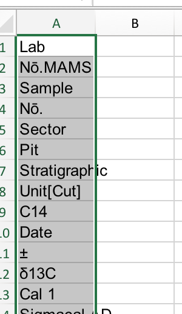

# 2.7 Veri Kazıma (Scraping)

[İngilizce Metin](https://o-date.github.io/draft/book/scraping-data.html)

🔧 [Launch the Scraping binder](https://mybinder.org/v2/gh/o-date/scraping/master).

Scraping Binder’ı Başlatın. 

Arkeolojik verileri elde etmenin ve manipüle etmenin çeşitli yollarını tartıştık. Bunlar, söz konusu verilerin sahiplerinin veya denetleyicilerinin, verilerin nasıl yapılandırılacağı ve web’e nasıl sunulacağı konusunda olumlu seçimler yapmasına bağlıdır. Ancak çoğu zaman, kolay ayıklamaya izin vermeyen şekillerde kullanıma sunulmuş verileri kullanmak istediğimiz durumlarla karşılaşacağız. Örneğin [Atlas of Roman Pottery](http://potsherd.net/atlas/) değerli bir kaynaktır – ancak bunu diğer veri kaynaklarıyla yeniden harmanlamak isterseniz ne olur? Peki ya sadece sitenizde bulunması muhtemel belirli mallar için kullanışlı bir çevrimdışı referans tablosu oluşturmak isterseniz? Bu web sitesinden böyle bir kullanıma izin verildiği hemen anlaşılmıyor, ancak birinin böyle bir şey yapabileceğini tahmin etmek zor değil. Sonuçta, bir sitede çeşitli referans eserlerin fotokopilerinin yığınlar halinde el altında bulundurulması (ki bu da muhtemelen bir telif hakkı ihlalidir) alışılmadık bir durum değildir.

Bu gri alanda web scraping (web kazıma) tekniklerini buluyoruz. Ziyaret ettiğiniz her web sayfası tarayıcınıza yerel olarak indirilir; sayfayı okuyabilmemiz için bilgileri işleyen tarayıcınızdır. Web scraping, ilgilendiğiniz verilerin tarayıcıdan sizin özel probleminiz için kullanılabilecek bir formata (genellikle bir txt veya csv dosyasına) dönüştürülmesini içerir. Bu, kopyalama ve yapıştırma yoluyla manuel olarak yapılabilmekle birlikte, otomatik teknikler daha kapsamlı, daha az hataya açık ve daha eksiksiz sonuçlar vermektedir. Tarayıcılar için bunu sizin için yarı otomatik hale getirecek eklentiler vardır; Chrome için yaygın olarak kullanılan bir eklenti [Scraper](https://chrome.google.com/webstore/detail/scraper/mbigbapnjcgaffohmbkdlecaccepngjd)’dır. Scraper’ı yüklediğinizde, ilgilendiğiniz bilgiye sağ tıklayabilir ve ‘scrape similar (benzerini kazıyın)’ seçeneğini seçebilirsiniz. Scraper, web sitesini oluşturan temel kodu inceleyerek ‘belge nesne modelinde’ benzer bir konumda görünen tüm bilgileri ayıklar. Scraper’ın kullanımıyla ilgili teknik ve yasal konular bu [[Kütüphane Marangozluğu (Library Carpentry)](https://resbazsql.github.io/lc-webscraping/01-introduction/)] atölyesinde mükemmel bir şekilde ele alınmaktadır ve zaman ayırmaya değerdir. Benzer bir şekilde çalışan (sitenin nasıl oluşturulduğuna dair kalıpları belirlemek ve bu kalıpların içinde yer alan verileri çekmek) kendi scraper’ınızı yazmak için bir başka mükemmel öğretici [[Programming Historian](https://programminghistorian.org/en/lessons/intro-to-beautiful-soup)]‘da mevcuttur.

Bazen de kendi çalışmamızı tamamlamak ya da karşılaştırmak için arkeolojik bir çalışmanın yayınlanmış verilerini yeniden kullanmak ya da birleştirmek isteriz. Örneğin, Lane, K., Pomeroy, E. & Davila, M. (2018). Kaya Üstü ve Taş Altı: Kipia, Ancash’ta Oyulmuş Kayalar ve Yeraltı Gömüleri, MS 1000 – 1532. Open Archaeology, 4(1), s. 299-321. [[doi:10.1515/opar-2018-0018](https://www.degruyter.com/downloadpdf/j/opar.2018.4.issue-1/opar-2018-0018/opar-2018-0018.pdf)] bir dizi veri tablosu bulunmaktadır. Örneğin Tablo 1, kalibrasyonu yapılmış tarihlerin bir listesidir. Bunları kendi çalışmalarımıza nasıl entegre edebiliriz? Birçok dergi pdf’sinde, düzenlenmiş ve dizilmiş sayfanın görüntüsünün üzerinde gizli bir metin katmanı vardır (1990’ların ortalarından veya daha öncesinden dergi makalelerinden yapılan pdf’ler genellikle yalnızca görüntüdür ve bu gizli katmanı içermez). Metni işaretleyip kopyalayıp yapıştırabilirseniz, bu gizli katmanı yakalamış olursunuz. Ancak bunu tablo bir ile yapalım – sonuçta elde ettiğimiz şey bu:

```
Lab Nō.MAMSSample Nō.SectorPitStratigraphic Unit[Cut]C14 Date±13C Cal 1 Sigmacal ADCal 2 Sigmacal AD15861Ca-8B234 [22]48922-21,31421-14381412-144415862Ca-21A32846923-24,21428-14441416-144915863Ca-22A328 [48]97622-18,71021-11461016-115315864Ca-23A33439423-20,21448-16071442-161815865Ca-25B272 [71]80222-19,01222-12561193-127215866Ca-27B41335818-17,11472-16181459-163015867Ca-28B6 (RF4)20 [19]48219-27,91424-14391415-144415868Ca-29B41335920-17,91470-16191456-1631T
```

Bu pek kullanışlı sayılmaz. Doğrudan bir elektronik tabloya yapıştırırsanız, daha da kötü bir şey elde edebilirsiniz:



Tablo 1’i (Lane vd.) excel’e yapıştır

Bu durumda çözüm ‘[[Tabula](https://tabula.technology/)]’ adı verilen özel bir araçtır. Bu araç, sayfada ilgilenilen verilerin bulunduğu alanı tanımlamanıza olanak sağlar; daha sonra metnin nasıl düzenlendiğini (özellikle beyaz boşlukla ilgili olarak) anlamaya çalışır ve bir elektronik tabloya veya belgeye düzgün bir şekilde yapıştırmanızı sağlar (pdf’nin gizli metin katmanına sahip olduğunu varsayarak). [[Bu bölüm için Jupyter Notebook](https://github.com/o-date/scraping)]‘ta Tabula’yı çağıran ve ardından sonucu bir veri çerçevesine aktararak verilerle hemen çalışmaya başlamanızı sağlayan bir R scriptimiz var. Bu scripti çalıştırmak için, binder’ı başlatın ve ardından ‘new -> RStudio session’ seçeneğine tıklayın. RStudio içinde ‘file – open’ seçeneğine tıklayın ve ‘Extracting data from pdfs using Tabulizr.R’ dosyasını açın. Bu script, her satırın ne işe yaradığını açıklayacak şekilde yorumlanmıştır; ‘çalıştır’ düğmesine basarak (veya klavye kısayolunu kullanarak) her satırı yukarıdan aşağıya doğru çalıştırabilirsiniz.

Bu script tablo verileriyle iyi çalışır; peki ya diğer grafik veya diyagram türlerinden bilgi veya veri kurtarmak istersek? Daniel Noble’ın R için ‘[[metaDigitise](https://github.com/daniel1noble/metaDigitise)]’ paketi burada devreye giriyor. Bu paket, grafiğin veya çizimin bir görüntüsünü rStudio’ya getirmenizi ve ardından paketin orijinal grafiğin çizdiği gerçek değerleri hesaplamasını sağlamak için ölçek çubukları ve eksenler gibi şeyleri izlemenizi sağlar! Sonuçlar daha sonra manipülasyon veya istatistiksel analiz için kullanılabilir. Pek çok arkeolojik çalışma kaynak verilerini yayınlamadığından (belki de bu çalışmalar tekrarlanabilirliğin ya da çoğaltılabilirliğin bugünkü kadar mümkün olduğu bir zamanda yazılmamıştır) bu araç, verileri bir araya getirmeye yönelik dijital arkeolojik yaklaşımın önemli bir unsurudur. Yukarıda sunulan dosyada ([[bağlantı burada](https://o-date.github.io/draft/book/(https://github.com/o-date/scraping))]) ‘metaDigitise-example.R’ adlı bir komut dosyası bulunmaktadır. Bunu rStudio’da açın ve neler yapılabileceğine dair bir fikir edinmek için adımları üzerinde çalışın.

Bu paketin (meta-analizler için yararlı olacağı düşünülen) tam bir incelemesi için orijinal [[belgelere](https://github.com/daniel1noble/metaDigitise#example-of-how-it-works-)] bakınız.

Son olarak, python için çok çeşitli sitelerde kullanmak üzere özel bir scraper oluşturmanıza olanak tanıyan son derece güçlü [[Scrapy](http://scrapy.org/)] çerçevesi vardır. Finds.org.uk verileri üzerinde sıfırdan bir scraper oluşturan bu rehberin bir incelemesini de ekliyoruz.

## 2.7.1 Alıştırmalar

1- Scrapy kılavuzunu tamamlayın. Ardından, başka bir müzenin koleksiyon sayfasında (örneğin,  [[Canadian Museum of History](https://www.historymuseum.ca/collections/search-results/?q=logging&per_page=25&view=list)] ‘nden alınan bu arama sonuçlarıyla) baştan tekrar deneyin. Verilerin düzenlenme şekli hakkında ne fark ettiniz? Takıldığınız noktalar neler? Her iki sitenin de hizmet şartlarını inceleyin. Scraping hangi etik ya da yasal sorunları ortaya çıkarabilir? Müzeler verileri hem insanların hem de makinelerin okuması için ne ölçüde sunmalıdır? Bunu yapmamamız için bir argüman var mı?
    
2- Christen’i ([[2012](https://o-date.github.io/draft/book/scraping-data.html#ref-IJoC1618)]) okuyun ve dijital kültürel mirasa erişim konularını bu bakış açısıyla değerlendirin. Dijital arkeoloji nerelerde kesişmelidir?

Referanslar

Christen, Kimberly A. 2012. “[[Does Information Really Want to Be Free? Indigenous Knowledge Systems and the Question of Openness.](http://ijoc.org/index.php/ijoc/article/view/1618)]” International Journal of Communication 6. .