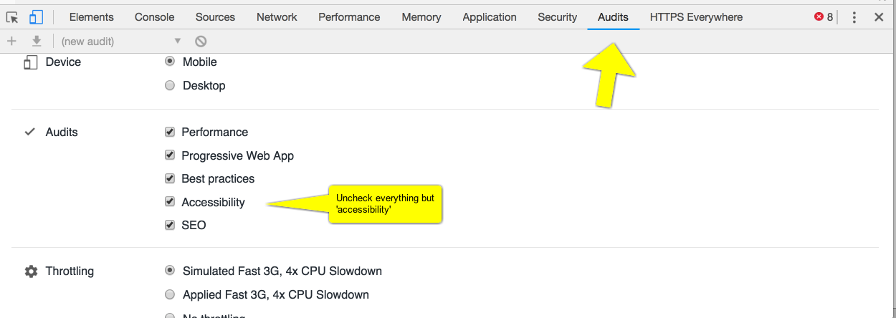

# 3.1 Erişilebilirlik için Tasarım

[[İngilizce Metin](https://o-date.github.io/draft/book/designing-for-accessibility.html)] 

## 3.1 Erişilebilirlik için Tasarım

Kütüphane raflarını düşünün. Bu, çok sayıda kitabın düzenlenmesine yönelik teknolojik bir çözümdür. Rafları belirli bir yükseklikte, koridorları belirli bir genişlikte yapmak için alınmış bir tasarım kararı vardır. Yüksek raflara ulaşamayan ya da sandalyesi koridorlarda gezinemeyen tekerlekli sandalyedeki bir kişiyi düşünün: kütüphaneyi erişilemez kılan bu kişinin durumu değildir. Engeli yaratan ‘ideal kullanıcılar’ hakkındaki tasarım seçimleri ve varsayımlardır.

Benzer şekilde, dijital medyadaki tasarım seçimlerimiz de potansiyel kullanıcılarımızı, izleyicilerimizi, araştırmacılarımızı güçsüzleştirme veya devre dışı bırakma işini yapmaktadır.

İlgi çekici bir hikayeyi anlatmak için bir web sitesi inşa etmek, ancak dışlayıcı tasarım tercihleriyle hedef kitlenin önemli bir bölümünü ihmal etmek iyi bir şey değildir. Dijital beşeri bilimlere katılan akademisyenler olarak, ‘açık erişim’ kaynaklarının kullanımını çevreleyen ve bazen erişilebilirlik ihtiyaçlarıyla uyuşmayan bir söylem vardır. Kaynakları, kodları, görselleri, yazılımları ve daha birçok kaynağı açık hale getirmekteyiz. Açık erişim ve açık kaynak, lügatımızın ayrılmaz bir parçasıdır. Pedagojik ortamı demokratikleştirmek için web siteleri ve dijital araçlar yaratıyoruz. Ancak, insanların dijital içeriğe farklı şekillerde eriştiğinin farkında olmayabiliriz. Ne kadar iyi niyetli olunursa olunsun, yalnızca materyalleri çevrimiçi olarak kullanıma sunmak öğrenmeyi demokratikleştirmek ya da gerçek erişim sağlamak için yeterli değildir. Ekran okuyucu kullanan biri, uygun başlıklarınız olmadığı için web sitenizde gezinemezse ne olur? Ya da metniniz ve arka planınız arasındaki kontrast birinin okuyamayacağı kadar düşükse?

Dijital arkeologlar erişilebilirlik ve evrensel tasarımı sonradan değil, en başından itibaren dikkate almalıdır.

Neyse ki, birçok açık kaynak platformu (örneğin GitBook) kullanıma hazır olarak erişilebilir veya çeşitli erişilebilirlik standartlarını karşılamak için küçük ayarlamalara ihtiyaç duyar. Genel olarak, erişilebilirlik yönergelerini karşılamak için temel HTML, CSS ve JavaScript’te yalnızca birkaç değişiklik yapmanız gerekir. Bu bölümde, dijital projenizi daha erişilebilir hale getirmek için çeşitli kaynaklar, yönergeler ve ipuçları sunacağız.

Erişilebilir web tasarımı hakkında bilgi edinmek için  [[W3 Web Content Accessibility Guidelines (WCAG)](https://www.w3.org/WAI/standards-guidelines/wcag/)] (W3 Web İçeriği Erişilebilirlik Yönergelerini) nceleyin. Dijital projenizde bu yönergeleri aşmasanız bile karşılamayı hedeflemelisiniz.

[[a11y Project](https://a11yproject.com/)] (a11y projesi) erişilebilirlik ipuçları, yaygın efsaneler ve farklı erişilebilirlik sorunlarına genel bir bakış için başka bir harika kaynaktır.

KhanAcademy, erişilebilir bir web sitesi oluşturan herkes için gerekli olan [[Tota11y](https://khan.github.io/tota11y/)] adlı açık kaynaklı bir araca sahiptir. Web sayfanızın altbilgisini kodlarken, bu kod satırını eklersiniz:

```
<script src="tota11y.min.js"></script>
```

ve tota11y.min.jsdosyasının html dosyanızla aynı dizinde olduğundan emin olun. Daha sonra web sitenizi sunduğunuzda, metin kontrastı, uygun başlıklar, etiketlerin uygun kullanımı, bağlantı ve alt metin vb. dahil olmak üzere web sitenizi farklı erişilebilirlik sorunları açısından test etmeye yardımcı olacak araçları içeren bir düğme görünecektir. Web sitenizi ya tüm dosyalarınızı bir web sunucusuna taşıyarak ya da bilgisayarınızda bir sunucu başlatarak sunabilirsiniz. Eğer python yüklüyse, terminalinizdenpython -m SimpleHTTPServer 8000 komutuyla  index.html dosyanızın bulunduğu dizinde olduğunuzdan emin olarak ve ardından tarayıcınızın adres çubuğunalocalhost:8000yazarak başlatabilirsiniz.

### 3.1.1 Ekran Okuyucular, Metin Tarayıcılar, HTML Etiketleri ve Başlıklar

Web sitenizi daha erişilebilir hale getirmeye başlamadan önce, bilgisayarınızın yerel ekran okuyucusunu indirin veya kullanın. Ekran okuyucu, kullanıcının klavyesiyle kontrol ettiği ve bilgisayar ekranındaki metni sesli olarak okuyan bir programdır. Mac OS’de yerel ekran okuyucuyu açmak için Cmd + Option + F5  tuşlarına basın; Windows’ta ise Narrator adlı bir uygulama vardır. Bir ekran okuyucu kullandığınızda, altta yatan kodun bir bilgisayar tarafından nasıl okunduğunu (kelimenin tam anlamıyla) anlamaya başlarsınız.

Metin tarayıcı, insanların web sitenizi nasıl kullanacağını anlamak için bir diğer önemli araçtır. [[Lynxlet](https://habilis.net/lynxlet/)] (Mac) veya [[Links’i](http://links.twibright.com/)] (Windows) indirin ve web sitenizin yalnızca metin olarak nasıl göründüğünü anlamak için web sitenize erişin.

Ekran okuyucular ve metin tarayıcıları, web sitenizdeki tüm köprülere, medyaya ve etkileşimli öğelere etiket eklemenin neden önemli olduğunu göstermektedir. Örneğin, web sayfanızda alternatif metin içermeyen bir resim varsa, aksi takdirde yalnızca görsel olarak mevcut olan önemli içeriği kaçırma riskiyle karşı karşıya kalırsınız. Özellikle ekran okuyucular, ekrandaki bilgileri ayrıştırmak için ARIA (Erişilebilir Zengin İnternet Uygulamaları) (Accessible Rich Internet Applications) etiketlerini kullanır. ARIA etiketleri, ekran okuyuculara bir öğenin amacını açıklamak için HTML öğelerine eklenmektedir. [[WCAG’ın ARIA hakkındaki sayfası](https://www.w3.org/TR/WCAG20-TECHS/ARIA6.html)]nı inceleyebilirsiniz.

Ekran okuyucular ve metin tarayıcıları da metni ayırmak için neden uygun azalan ve artan HTML başlıkları kullanmamız gerektiğini anlamamıza yardımcı olur. Mantıksal bir ilerleme izleyen başlıklar, ekran okuyucuların web sayfanızdaki farklı içerik seviyelerini anlamasını sağlar. Örneğin, bir  <h1> öğesinin ardından bir  <h2> öğesi gelmeli,  <h3>  veya <h4> gelmemelidir. Başlık ilerlemesi, kullanıcıların web sayfanızdaki içeriğin bölünme şeklini görsel olarak anlamalarına da yardımcı olur.

### 3.1.2 Kontrast ve Stiller

Web sayfanızdaki tüm metinlerin kolay okunabilir olmasını ve 4,5:1 kontrast oranını aşmasını sağlamak önemlidir. Neyse ki [[Tota11y](https://khan.github.io/tota11y/)], CSS dosyanızda kullanabileceğiniz bir onaltılık renk değeri önerisi sunmaktadır. [[WebAIM](https://webaim.org/resources/contrastchecker/)] ayrıca stil seçimlerini erişilebilir kılmak için kullanabileceğiniz bir kontrast kontrol aracına sahiptir.

### 3.1.3 Yazı Tipi

Yazı tipi seçiminiz, kullanıcıların web sitenizle etkileşim kurma şeklini de etkiler. Bazı yazı tiplerinin okunması diğerlerine göre daha kolaydır. Genel anlamda, sans-serif yazı tiplerinin okunması serif yazı tiplerine göre daha kolaydır; [[Open Sans](https://fonts.google.com/specimen/Open+Sans)] yazı tipinin okunması genellikle [[Lobster](https://fonts.google.com/specimen/Lobster)] yazı tipine göre daha kolaydır. Ancak bu, serifli yazı tiplerini elden çıkarmanız gerektiği anlamına gelmez. İçeriğiniz ve kullanıcılarınız için hangi yazı tipinin işe yaradığını anlamak en iyisidir. Kullanabileceğiniz çeşitli yazı tipleri vardır – örneğin [[Dyslexie](https://www.dyslexiefont.com/en/typeface/)], disleksili kişilerin okumasına yardımcı olmak için özel olarak tasarlanmış bir yazı tipidir. [[WebAIM’in](https://webaim.org/techniques/fonts/)] yazı tipleri hakkındaki makalesini inceleyin ve ardından web sitenize hangi yazı tiplerini eklemek istediğinize karar vermek için [[Typeconnection](http://www.typeconnection.com/index.php)] ve [[Google Fonts](https://fonts.google.com/)]‘u kullanın.

### 3.1.4 İleriye Dönük

Bu bölüm, erişilebilir tasarım konusunda kapsamlı bir kaynak olmaktan çok, sayısız tasarım konusunu ve insanların projelerimize erişim yollarını anlamanıza yardımcı olacak bir başlangıç noktasıdır. Erişilebilirlik her şeyi açık hale getirmekle bitmez, aksine başlar.

Erişilebilir tasarım dijital projenizi sınırlamamalıdır – erişilebilirlik için stilistik seçimlerden ödün vermeniz gerekmez. Aksine, erişilebilir tasarım bize herkesin dijital içeriğe farklı şekilde yaklaştığını göz önünde bulundurmayı öğretir. Erişilebilirlik bizi kısıtlı tasarım yapmaya değil, daha iyi tasarım yapmaya iter.

### 3.1.5 Alıştırmalar

1- Google’ın Chrome tarayıcısı artık yerleşik bir erişilebilirlik denetimi ile birlikte geliyor. Chrome’u kullanarak, ilgilendiğiniz bir kamu arkeoloji projesinin web sitesine gidin. Web sayfasına sağ tıklayın ve denetçi’yi seçin. Görüntülenen araç çubuğunda denetimleri seçin.



Chrome Inspector’daki denetimler araç çubuğu

Uncheck everything except for accessibility then scroll down and hit the blue run audits button. Chrome will test the page under a variety of conditions (including simulating serving it to a mobile device). The results will look like this:

Erişilebilirlik (Accessibility) hariç her şeyin işaretini kaldırın, ardından aşağı kaydırın (scroll down) ve mavi denetimleri çalıştır (blue run audits) düğmesine basın. Chrome sayfayı çeşitli koşullar altında test edecektir (bir mobil cihaza sunma simülasyonu dahil). Sonuçlar aşağıdaki gibi görünecektir:

.png)

Seçtiğiniz siteyle ilgili sorunlar nelerdir? Sitenin erişilebilirliğini iyileştirmek için bakımcıları ne yapmalı? Hangi sorunların tasarım tercihlerinden kaynaklandığını ve hangi sorunların platform seçiminden ortaya çıktığını belirleyebilir misiniz? Bazı platformlar erişilebilirliğe diğerlerinden daha mı uygun? Platformu yapan şirketi/grupları araştırın. Orada erişilebilirlik üzerinde etkisi olabilecek herhangi bir sorun görüyor musunuz?

### 3.1.6 İleri Okuma

An introduction to Universal Design in the context of the Digital Humanities ([[Williams (2012)](https://o-date.github.io/draft/book/designing-for-accessibility.html#ref-williams_2012_design)]).  Genel olarak kapsayıcı arkeoloji hakkında daha fazla bilgi için bkz. [[Enabled Archaeology Foundation](https://enabledarchaeologyfoundation.org/)]. Özel bir vaka çalışması için bkz. [[O’Mahoney (2016)](https://o-date.github.io/draft/book/designing-for-accessibility.html#ref-omahoney-2016)] ([[Figshare](https://figshare.com/articles/Empowering_Archaeology_What_model_of_disability_do_people_with_dyslexia_in_university_archaeology_courses_experience_/5394382/1)]’den indirilebilir.)

### Referanslar

Williams, George. 2012. “Disability, Universal Design, and the Digital Humanities.” In Debates in the Digital Humanities. The Graduate Center City University of New York. http://dhdebates.gc.cuny.edu/debates/text/44.

O’Mahoney, Theresa. 2016. “Empowering Archaeology What Model of Disability Do People with Dyslexia in University Archaeology Courses Experience?” Institute of Archaeology, University College London.
