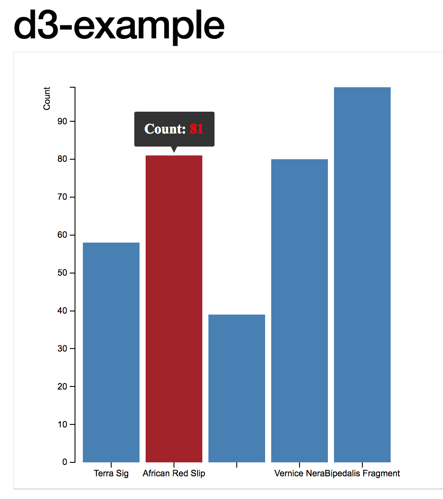

# 3.3 Veri Odaklı Dokümanlar

[[İngilizce Metin ](https://o-date.github.io/draft/book/data-driven-documents.html)]

Arkeolojik verilerin çoğunun bir API’den veya bir veritabanından aldığımızda JSON formatında temsil edildiği göz önüne alındığında, bu verileri web üzerinde yerel olarak temsil etmenin yollarını düşünmek için zaman ayırmaya değer. ‘Yerel olarak’ derken, çoğu web tasarımının temelini oluşturan belge nesne modeli yaklaşımının bir parçası olarak kastediyoruz. Verileri sitenin oluşturulma (ve manipüle edilme) yönteminin bir parçası haline getirerek verilerimizi ve görselleştirmelerimizi özgürleştiriyoruz. Bu, veriler güncellendikçe arkeolojik görselleştirmelerin (ve ilgi çekici anlatıların) anında üretilmesi olasılığının önünü açıyor. Verilerin yeniden karıştırılması veya başka verilere bağlanması olasılığının önünü açıyor.

Ancak Mike Bostock’un (New York Times’ın interaktif grafik editörü ve [[D3](https://o-date.github.io/draft/book/http//:d3js.org)]’ün yaratıcısının) işaret ettiği gibi, herhangi bir teknolojinin bilinmezliğinde kaybolma tehlikesi vardır;

Görselleştirmenin amacının resimler değil içgörü olduğunu her zaman aklımızda bulundurmalıyız.

    [Mike Bostock](https://medium.com/@mbostock/a-better-way-to-code-2b1d2876a3a0)

Bu bölümde veri odaklı belgelere iki yaklaşım tanıtıyoruz: D3.js ve İşleme dili.

## 3.3.1 D3

D3’ü kullanarak çömlek sayımlarına ilişkin etkileşimli bir çubuk grafik oluşturalım.



Nihai ürünün ekran görüntüsü

    D3.js, verilere dayalı olarak belgeleri manipüle etmeye yönelik bir JavaScript kütüphanesidir. D3; HTML, SVG ve CSS kullanarak verileri hayata geçirmenize yardımcı olur. D3’ün web standartlarına verdiği önem, güçlü görselleştirme bileşenlerini ve DOM manipülasyonuna veri odaklı bir yaklaşımı birleştirerek kendinizi özel bir taslağa bağlamadan modern tarayıcıların tüm yeteneklerini elde etmenizi sağlar.

Bunun anlamı, D3’ün bize JSON dosyamızı almak ve bu verilerin öğelerini bir web sayfasının html’indeki farklı grafik öğelerine nispeten basit bir şekilde bağlamak için önceden paketlenmiş bazı araçlar sağlamasıdır. Çeşitli görselleştirme türlerini (dinamik ve etkileşimli olanlar dahil) elde etmenin yollarını kodla gösteren [[örnek galeriyi](https://github.com/d3/d3/wiki/Gallery)] keşfetmek için birkaç dakikanızı ayırın.

D3.js’yi kullanmak için yapbozun üç özel bölümünü belirtmemiz gerekir: veri, stil ve bunları bir araya getiren html. Html içinde, görselleştirmenin farklı öğelerinin nasıl oluşturulacağını tanımlamak için SVG – ‘ölçeklenebilir vektör grafikleri’, yani raster grafiklerin renkli pikselleri yerine çizgilerin matematiksel tanımlarını- kullanıyoruz. Bu öğelerin boyutu ve yerleşimi verinin özelliklerine bağlıdır.

D3 ile deneme yapmanın bir yolu Mike Bostock’un [[bl.ocks.org](http://bl.ocks.org/)] hizmetini kullanmaktır. Bu site birçok farklı görselleştirme türünü gösterir. Bunu kendiniz kullanmak için html, css ve json dosyalarımızı bl.ocks.org’un bulabileceği bir yere koymamız gerekiyor – bu durumda bir Github [[gist](http://gist.github.com/)]’i kullanacağız. Gist, Github web sitesinin bir parçasıdır ve herkesin bir kod parçacığını paylaşmak için bir url ile çevrimiçi olarak hızlı bir şekilde yayınlamasına olanak tanır. Eğer oturum açtıysak, Gist anonim olmaktan çıkar; örneğin, Shawn’ın tüm gistleri [[buradadır](http://gist.github.com/shawngraham)] adresindedir . Bir gisti blo.ocks.org aracılığıyla çalıştırmak için, URL yolunu gist.github.com’dan sonra kopyalayıp blo.ocks.org’dan sonra yapıştırırız ; böylece Shawn’ın gistleri http://bl.ocks.org/shawngraham/<string-of-random-letters-and-numbers-identifying-the-exact-gist adresinde görselleştirilebilir. Bir Gist’in birden fazla dosyası olabilir.

Kendi web sunucunuzda bir index.html dosyanız, bir style.css dosyanız ve csv, tsv veya json formatında bir veri dosyanız olacaktır. Bazı çanak çömlek sayılarını görselleştiren etkileşimli bir araç ipucu içeren basit bir çubuk grafik oluşturalım.

Çömlek (ing. pottery) sayımı verilerimiz aşağıdaki .json dosyasıyla temsil edilir:

```
[
  {"PotteryType": "Terra Sig","Count": 58},
  {"PotteryType": "African Red Slip","Count": 81},
  {"PotteryTyp": "Dressel24","Count": 39},
  {"PotteryType": "Vernice Nera","Count": 80},
  {"PotteryType": "Bipedalis Fragment","Count": 99}
]
```

Bir sonraki adım stil sayfasını oluşturmaktır. Kullanacağımız sayfayı buradan inceleyebilirsiniz. Bir stil sayfası, html’de adı geçen her bir öğenin nasıl işlenmesi gerektiğini açıklar. Stil sayfasının hangi kısmının çubuk grafiğimizin rengini yönettiğini bulabilir misiniz? Hangi kısım eksenlerle ilgilenecek?

Son adım, her şeyi bir araya getirecek html’i oluşturmaktır. Tüm bunların nasıl çalıştığını kontrol etmek için D3 paketindeki araçları kullanacağımızdan, bunu html’e anlatmalıyız. HTML’imizin açılışı şöyle görünüyor – tarayıcıya css’imizin nerede olduğunu ve D3’ü nerede bulacağını nasıl söylediğimizi görüyor musunuz? D3, örneğin kendi sunucumuzdaki bir klasörde bulunabilir, ancak burada 3djs.org’da bulunan en güncel sürümü kullanacağız:

```
<!DOCTYPE html>

<meta charset="utf-8">
<head>
<link rel="stylesheet" type="text/css" href="barchart.css">
</head>
<body>
    <script src="https://d3js.org/d3.v3.min.js"></script>
     <script src="d3.tip.v0.6.3.js"></script>
<script>
```

Daha sonra, verilerin nasıl görüntülenmesini istediğimizi ve grafiğimizin sahip olacağı etkileşim türünü kontrol edecek veya açıklayacak bir dizi değişken tanımlayacağız . Yukarıdaki html kodundaki ikinci komut dosyası, Justin Palmer’ın yazdığı ‘d3.tip’ adlı ilgili paketi çağırır. Bu, görselleştirmemizdeki öğeler üzerinde fareyle gösterilen araç ipuçlarını etkinleştiren küçük bir pakettir. Bunu web üzerinde başka bir yerden değil, index.html dosyasının bulunabileceği yerden yüklüyor.

Aşağıdaki değişkenlerin tanımında d3 ile başlayanlar <script> tarafından yüklenen D3 paketine atıf yapmaktadır. D3’ün yapabileceği çok çeşitli şeyler hakkında daha fazla bilgi için sizi D3 eğitimlerine göz atmaya davet ediyoruz.

```
var margin = {top: 40, right: 20, bottom: 30, left: 70},

    width = 460 - margin.left - margin.right,
    height = 500 - margin.top - margin.bottom;

var x = d3.scale.ordinal()
    .rangeRoundBands([0, width], .1);

var y = d3.scale.linear()
    .range([height, 0]);

var xAxis = d3.svg.axis()
    .scale(x)
    .orient("bottom");

var yAxis = d3.svg.axis()
    .scale(y)
    .orient("left")
    .ticks(10, "");
```

Bu sonraki değişken, kullanıcının grafiğimizdeki çubuklardan birinin üzerine gelmesi durumunda tarayıcıya ne yapması gerektiğini söyleyen bilgileri içerir. Bu olduğunda, tarayıcı çubuğu kırmızıya çevirecek ve o çubuk için değeri görüntüleyecektir (d.Count’ta tutulur – JSON’a tekrar bakın. ‘Count’ verilerini görüyor musunuz? Bu grafiği çanak çömleklerin ağırlıklarını gösterecek şekilde uyarlamak isteseydiniz, neleri değiştirmeniz gerekebilirdi?)

```
var tip = d3.tip()

  .attr('class', 'd3-tip')
  .offset([-10, 0])
  .html(function(d) {
    return "<strong>Count:</strong> <span style='color:red'>" + d.Count + "</span>";
  })
var svg = d3.select("body").append("svg")
    .attr("width", width + margin.left + margin.right)
    .attr("height", height + margin.top + margin.bottom)
  .append("g")
    .attr("transform", "translate(" + margin.left + "," + margin.top + ")");

svg.call(tip);
```

Şimdi gerçek verileri ekliyoruz:
```
d3.json("pottery.json", function(error, data) {

  if (error) throw error;

  x.domain(data.map(function(d) { return d.PotteryType; }));
  y.domain([0, d3.max(data, function(d) { return d.Count; })]);
```

Sadece json verilerinin pottery.json dosyasında olduğunu söylüyoruz. Eğer bu json dosyası internette bir yerde olsaydı, URL’yi sağlayabilirdik (json dosyasıyla bittiği sürece!). Daha sonra json dosyasındaki verileri x ve y eksenlerimiz olan PotteryType ve Count ile eşleştiririz. Bu eşleme, bu verileri d.PotteryType ve d.Count’a iter; bu verilere ne zaman ihtiyaç duysak artık sadece bu değişkenlere başvurabiliriz.

Hepsini bir araya getirerek bitiriyoruz:

```
svg.append(“g”)

      .attr("class", "x axis")
      .attr("transform", "translate(0," + height + ")")
      .call(xAxis);

  svg.append("g")
      .attr("class", "y axis")
      .call(yAxis)
    .append("text")
      .attr("transform", "rotate(-90)")
      .attr("y", -36)
      .attr("dy", ".71em")
      .style("text-anchor", "end")
      .text("Count");

  svg.selectAll(".bar")
      .data(data)
    .enter().append("rect")
      .attr("class", "bar")
      .attr("x", function(d) { return x(d.PotteryType); })
      .attr("width", x.rangeBand())
      .attr("y", function(d) { return y(d.Count); })
      .attr("height", function(d) { return height - y(d.Count); })
      .on('mouseover', tip.show)
      .on('mouseout', tip.hide);
});

```

Etkileşimli çubuk grafiğimizi içeren gistimizi https://gist.github.com/shawngraham/dc506c6be872625101a1163ad59e4d68 adresinde görebilirsiniz (ilginç bir şekilde, gist’imizdeki tüm dosyalar alfabetik olarak listelenmiştir. Tüm dosyaları görmek için aşağı kaydırın). Bu görselleştirmeyi canlı hale getirelim – bitmiş sonucu görmek için dosya yolunu https://bl.ocks.org/ adresine iletin!

(Yani, Gist.github.com/’dan sonraki biti kopyalayın ve tarayıcınızın adres çubuğuna https://bl.ocks.org/‘dan sonra gelecek şekilde yapıştırın).

## 3.3.2 Tartışma

Bu özel görselleştirme size bu ‘site’ hakkında ne anlatıyor olabilir? Etkileyici bir hikaye anlatmak için bu görselleştirmeyi diğer görselleştirme türleriyle (ilham almak için [[örnek galeri](https://github.com/d3/d3/wiki/Gallery)]ye bakın) nasıl entegre edebilirsiniz?

Bu kılavuz, D3’ün yapabileceklerinin sadece yüzeysel olarak özetledi. Ancak artık farklı parçaların birbirine nasıl uyduğunu bildiğinize göre, kendi verilerinizi başkalarının yaptığı görselleştirmelere uydurmayı deneyebilirsiniz. Bu sinir bozucu olabilir – verilerinizin nasıl yapılandırıldığını gerçekten bilmeniz gerekir ve kodun verileri doğru şekilde çağırdığından emin olmak için yeniden kullanmak istediğiniz görselleştirmenin index.html dosyalarını dikkatle okumalısınız. Örneğin, yukarıdaki örneğimizde Graham, çubukların kendilerinin görüntülenmediği bir hata almaya devam etti. Çubuk grafiğe sağ tıklayıp ‘öğeyi denetle’yi’ seçerek bu hatanın peşine düştü. Bu, tarayıcının denetçi aracını açar ve html’imizde hangi hataların oluştuğunu görmemizi sağlar. Graham’ın durumunda hata mesajı, error invalid value for rect attribute height NaN şeklindedir.

Hata mesajları genellikle anlaşılması zordur. Hatayı bir Google aramasına kopyalamak genellikle aynı hata ile karşılaşan ve sorunlarını bir kodlama soru-cevap sitesi olan [[Stack Overflow](http://stackoverflow.com/)] gibi sitelere gönderen diğer insanları bulur. Yanıtları okuyan Graham, [[bu kılavuz](http://www.knowstack.com/different-ways-of-loading-a-d3js-data/)]daki örneği yeniden düzenlerken aşağıdaki hatayı yaptığını fark etti. Bunu fark edebilir misiniz?

Orijinal kod:

```
svg.selectAll(“.bar”)
.data(data)
.enter().append("rect")
.attr("class", "bar")
.attr("x", function(d) { return x(d.Employee); })
.attr("width", x.rangeBand())
.attr("y", function(d) { return y(d.Salary); })
.attr("height", function(d) { return height - y(d.Salary); })
.on('mouseover', tip.show)
.on('mouseout', tip.hide);
```

Graham’in hatası:
```
  svg.selectAll(".bar")
      .data(data)
    .enter().append("rect")
      .attr("class", "bar")
      .attr("x", function(d) { return x(d.PotteryType); })
      .attr("width", x.rangeBand())
      .attr("y", function(d) { return y(d.PotteryType); })
      .attr("height", function(d) { return height - y(d.Count); })
      .on('mouseover', tip.show)
      .on('mouseout', tip.hide);
``` 

Çok sinir bozucuydu! Ancak bir ara verip koda yeniden baktığında fark etti. Siz de fark ettiniz mi?

3.3.3 Alıştırmalar

1- Ben Christensen’in http://bl.ocks.org/2579599 adresinde D3 kullanan çok basit bir çizgi grafiği ve https://gist.github.com/2579599 adresinde kaynak kodu bulunmaktadır. Github’a giriş yapın ve ardından kaynak kodunun bir çatalını (bir kopyasını) alın. Kodu inceleyin ve mevcut verilerle bu grafiği arkeolojik verilerin bir gösterimine dönüştürmek için değiştirmeniz gereken her satırın bir listesini yapın.
    
2- Şimdi bunu yapmaya çalışın: Gist’inizdeki ‘düzenle’ düğmesine tıklayın ve değişikliklerinizi yapın. Değişikliklerinizi kaydetmek için sayfanın altındaki yeşil ‘commit’ düğmesine basmanız gerekir. Değişikliklerinizi bl.ocks.org adresini kullanarak görüntüleyin. Nb Değişikliklerinizin görünmesi birkaç dakika sürebilir – web üzerinde yayılması zaman alır. Grafiğinizin önbelleğe alınmış (eski) sürümünü görüntülememek için bl.ocks.org adresinizi gizli modda görüntüleyin. Değişiklikleriniz görünüyorsa – harika! Görünmüyorsa denetçiyi kullanın. Hatalarınız size ne söylüyor?
    
3- Verilerinizi bir .json dosyasında göstermeyi deneyin. Size rehberlik etmesi için bu sayfanın üst kısmındaki örnekleri kullanın. Alacağınız hata mesajlarını arayın ve ne yaptığınızı ve nerede yardım aradığınızı takip edin. Bu daha zor ve sinir bozucu olacaktır, ancak süreç boyunca öğrendiğinizi keşfedeceksiniz.

4- Veri Görselleştirme Kataloğu ([[Data Visualization Catalogue](https://datavizcatalogue.com/)]), en uygun kullanım durumları için önerilerle birlikte farklı grafik türlerinin çok çeşitli örneklerine sahiptir. Hepsi için kod örnekleri verilmiştir ve birçoğu D3 kullanmaktadır. Arkeoloji için faydalı olabilecek bir örnek seçin ve kodunu inceleyin. Çalışmasını sağlayabilir misiniz? Nerede engellerle karşılaşıyorsunuz: engeli kaldırmak için ne tür sorular kullanırdınız? Buradaki amaç, doğru soruları sormaya başlayabilmeniz için neleri bilmediğinizi ortaya koymaktır.
