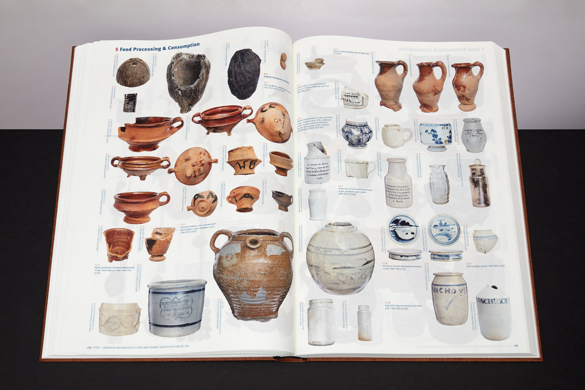
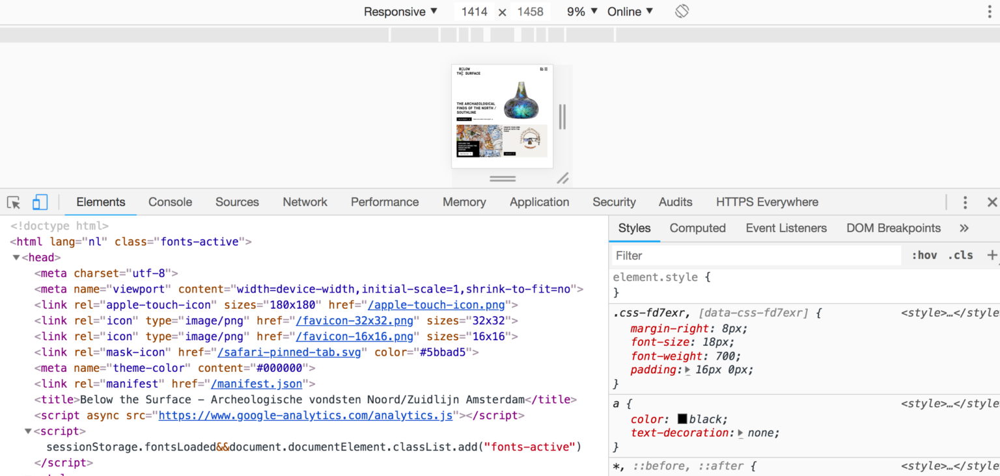

# 3.4 Hikaye Anlatımı ve Arkeolojik İçerik Yönetimi Sistemi (CMS): Omeka, Kora ve Mukurtu

[[İngilizce Metin](https://o-date.github.io/draft/book/storytelling-and-the-archaeological-cms-omeka-kora-and-mukurtu.html)]

Amersterdam Şehri, Amstel Nehri’nin altında yeni bir kuzey – güney metro hattı inşa ediyor. Bu devasa altyapı projesi elbette e[[tkileyici miktarda arkeolojik araştırmanın yapılmasını da gerekli kılmaktadır](https://belowthesurface.amsterdam/en/pagina/de-opgravingen-0)]. 

*Şehirlerdeki nehirler muhtemelen arkeolojik alanlar değildir. Bir nehir yatağının, bırakın bir şehrin ortasında yer almayı, boşaltılarak kurutulmasına ve sistematik olarak incelenebilmesine sık rastlanmaz. Amstel’deki kazılar, toplamda yaklaşık 700.000 buluntunun ortaya çıkarılmasıyla sonuçlandı: bazıları kırık, bazıları bütün, birbirine karışmış çok çeşitli nesneler. Damrak ve Rokin, yüzyıllardır nehre atılan atıklar ve yanlışlıkla suda kaybolan nesnelerin sonucu olarak son derece zengin arkeolojik alanlar olduklarını kanıtladılar.*

([[Archaeology Monuments, City of Amsterdam, and Chief Technology Office (CTO) 2018](https://o-date.github.io/draft/book/storytelling-and-the-archaeological-cms-omeka-kora-and-mukurtu.html#ref-below_the_surface)])

Amsterdam Şehri Arkeoloji Departmanı, 700.000 ‘den fazla buluntuyu sergileyen etkileyici bir web sitesi oluşturdu, ancak bunu ilgi çekici bir şekilde yaptılar.  Stuff -‘şeyler’- adında güzel bir fotoğraf kataloğu oluşturulmuş ([[detaylar burada](https://belowthesurface.amsterdam/en/pagina/spul)]) ve bir [[belgesel](https://belowthesurface.amsterdam/en/pagina/documentaire)] haline getirilmiş.

Ayrıca tüm verilerini indirilebilir hale getirme aşamasındalar ([[veri seti sayfaları](https://belowthesurface.amsterdam/en/pagina/publicaties-en-datasets)]na göz atın). Ancak temelde, zorlu çalışmalarının  kamusal iletişim için önemli olanın yanı, sitelerine interaktif bir bileşeni dahil etmeleri. Siteleri, ziyaretçinin kendi görüntüsünü ve anlatısını düzenlemesine olanak tanıyor.

.png)

Below the surface adlı web sitesini oluşturan etkileşimli bölümün ekran görüntüsü

Her nesnenin yüksek çözünürlüklü fotoğrafları ve üst verileri ilişkilendirilmiş şekilde bulunuyor. Arayüz ise, ziyaretçinin ilginç öğeleri bir hikaye anlatacak şekilde konumlandırmasına olanak tanıyor – örneğin,  ‘[[useless versus re-usable](https://belowthesurface.amsterdam/en/vitrine/a9c3cbada3)]’  (‘işe yaramaz ve yeniden kullanılabilir’) nesnelerin hikayesi.

Ziyaretçilere küratör rolünü kolay ve ilgi çekici bir şekilde benimsemeye teşvik eden site, Amstel Nehri’nin sadece bir arkeolojik alan değil, aynı zamanda bir insan çöplüğü olmasıyla gerçekten ilgilenmeye başlayan bir ‘tavşan deliğinin’ mükemmel bir örneği. Ziyaretçiyi, biz insanların çevremizi kullanma ve suistimal etme yolları ve insanlığın çevre üzerindeki etkisinin uzun süreli yansımalarını ifade etmeye davet ediyor.

## 3.4.1 The Content Management System

Bu siteyi nasıl kurdular? Hangi tarayıcıyı kullanırsanız kullanın siteye sağ tıklarsanız açılır menüdeki seçeneklerden biri ‘incele’ (ing. inspector) gibi bir şey olacaktır. İnceleme aracı, temel kodu keşfetmenize (ve isterseniz değiştirmenize) olanak tanır. Bu bize belirli bir siteyi neyin yönlendirdiği ve inşa ettiği konusunda temel bir bilgi veriyor.

‘incele’ ekran görüntüsü

Görünüşe göre, Below the surface web sitesi özel olarak kodlanmış. Bunu yapabilir miyiz? Evet…. belirli bir ‘evet’ değeri için. Modern web siteleri çoğunlukla html, css ve js  birleşimidir. Bir site geliştirirken, bir geliştirici, bir web sitesinin farklı bölümlerini programlı olarak temsil eden bir ‘belge nesnesi modeli’ (Digital Object Model) oluşturacaktır. Css – basamaklı stil sayfası – tarayıcıda oluşturulduklarında DOM’un farklı öğelerinin nasıl görüneceğini açıklar ve JS – javascript – siteyi oluşturmak için DOM’a eklenen içeriği getirmeyi üstlenir. Arkeologlar olarak bizler ‘Below the surface’ bir siteyi tasarlama ve inşa etme lüksüne nadiren sahip olacağız. Ancak neyse ki, bu halka açık siteleri minimum yaygara ile oluşturmamıza izin veren ‘İçerik Yönetim Sistemleri’ var.[[ WordPress.com](http://wordpress.com/)]‘u kullanarak blog yazdıysanız veya  ücretsiz bir web sitesi tarayıcı kullanarak bir sınıf için bir web sitesi oluşturduysanız, bir içerik yönetim sistemi kullanmışsınız demektir.

Örneğin WordPress, kullanıcıların blog gönderileri veya sayfaları yazmaya odaklanmalarını sağlayan bir ‘back-end’ oluşturmak için bir komut dosyası dili olan [[PHP](https://secure.php.net/manual/en/intro-whatis.php)]‘yi kullanır. Bir kullanıcı yeni bir blog gönderisi gönderdiğinde, bu gönderinin metni bir SQL veritabanından alınır ve tarayıcıda bu PHP komut dosyaları aracılığıyla oluşturulur. WordPress, çok çeşitli temalara veya önceden oluşturulmuş CSS ve PHP şablonlarına sahiptir. Gönderiler çeşitli şekillerde etiketlenebilir veya kategorize edilebilir ve şablon sayfaları yalnızca belirli etiketleri veya kategorileri karşılayan materyalleri gösterecek şekilde ayarlanabilir.

Birçok iyi-geliştirilmiş arkeolojik proje, içeriklerini yönetmek için bir sistem olarak WordPress’i kullanmaktadır.  [[Day of Archaeology](http://www.dayofarchaeology.com/)] WordPress’i kullandı; bu arada,  [[Day of Archaeology](http://www.dayofarchaeology.com/)] tarafından kullanılan belirli temanın çalışma şekli nedeniyle, içeriği sayfa yolları açısından mantıklı ve düzenli bir şekilde düzenleyen (tüm temalar bunu yapmaz!) Ben Marwick, [[arkeologların çalışmaları hakkında konuştukları](https://github.com/benmarwick/dayofarchaeology)]nda ne konuştuklarını anlamak için R kullanarak bir dizi analiz yazabildi.

## 3.4.2 Omeka

Omeka, malları sergilemek veya düzenlemek; konuşmak; yaymak; açmak anlamına gelen Svahili bir kelimedir; Roy Rosenzweig Tarih ve Yeni Medya Merkezi, George Mason Üniversitesi’ndeki ekip tarafından projelerini tanımlamak için seçildi. Oluşturulduğu sırada, kültürel miras materyallerini yöneten bir CMS eksikliği vardı. Omeka, arşiv ve o arşivdeki bir öğe metaforu etrafında inşa edilmiştir. Omeka, etiketlenmiş veya kategorize edilmiş blog gönderileri oluşturmak için bir editör yerine, bir koleksiyondaki öğeleri tek tek tanımlamak için [[Dublin Core](http://dublincore.org/)] üst verilerini kullanır. Daha sonra, kullanıcı bu öğeleri sergilemek, web sayfaları oluşturmak veya göz atılabilir koleksiyonlar yaratmak için birleştirebilir. Materyalleri göstermenin materyalleri sergilemekle aynı şey olmadığını unutmamak gerekir;  sergide bir anlatı unsuruna yer verilir. Omeka’nın back-end yapısı sergileri ve bu sergilerdeki öğeleri veya koleksiyonları (WordPress’in aksine) son derece keşfedilebilir ve alıntı yapılabilir hale getirir .[[Programming Historian](https://programminghistorian.org/)] şu anda Omeka ile çalışma konusunda [[üç derse](https://programminghistorian.org/en/lessons/)] yer vermektedir. Omeka çok çeşitli temalarla özelleştirilebilir; açık kaynak olduğu için, [[görsel etkisini](https://electricarchaeology.ca/2018/03/09/using-a-static-site-generator-to-make-a-nicer-omeka-front-page/)] artırmak için (nispeten) kolayca hacklenebilir.

## 3.4.3 Kora

Arkeologların ilgisini çeken bir diğer açık kaynaklı içerik yönetim sistemi, [[Michigan State Üniversitesi Antropoloji Bölümü](http://anthropology.msu.edu/)]‘nde M[[atrix: The Center for Digital Humanities & Social Sciences](http://www.matrix.msu.edu/)] tarafından geliştirilen KORA’dır.Kora, daha çeşitli üst veri şemalarına ve kültürel miras materyallerini tanımlamak için farklı ontolojilerin kullanılmasına izin verir. Kora’nın şu anda ‘açık beta‘ (yani, kullanabilirsiniz, ancak hatalarla karşılaşacaksınız) olarak adlandırılan ve koleksiyonunuzda mobil (ve coğrafi olarak konumlandırılmış) deneyimler oluşturmanızı sağlayan [[mbira](http://mbira.matrix.msu.edu/)] adlı başka bir kolu daha var.

## 3.4.4 Mukurtu

[[Mukurtu](http://mukurtu.org/)], yerli ontolojileri ve sınıflandırma şemalarını ön plana çıkarmak için açıkça tasarlanmış bir içerik yönetim sistemidir. [[Washington State Üniversitesi](http://wsu.edu/)], [[the Center for Digital Scholarship and Curation](http://cdsc.libraries.wsu.edu/)] tarafından yönetilmektedir. Aynı zamanda açık kaynaklıdır.

2007 ‘de Warumungu topluluğu üyeleri, Mukurtu Wumpurrarni – kari Arşivi’ni üretmek için Kim Christen ve Craig Dietrich ile işbirliği yaptı. Mukurtu, ‘dilly bag‘ veya kutsal malzemeler için güvenli bir saklama yeri anlamına gelen bir Warumungu kelimesidir. Warumungu’nun yaşlılarından Michael Jampin Jones, kullanıcılara arşivin de Warumungu halkının kendi protokollerini kullanarak hikayelerini, bilgilerini ve kültürel materyallerini doğru bir şekilde paylaşabilecekleri güvenli bir yer olduğunu hatırlatmak için topluluk arşivinin adı olarak Mukurtu’yu seçti. Bu topluluk ihtiyacından büyüyen Mukurtu CMS, artık dijital kültürel miraslarını kendi yollarıyla, kendi şartlarıyla yönetmek ve paylaşmak isteyen çeşitli toplulukların ihtiyaçlarını karşılayacak kadar esnek bir açık kaynak platformudur. – ([[Mukurtu, ‘Hakkında ‘](http://mukurtu.org/about/)])

Mukurtu, ‘[[3cs](http://support.mukurtu.org/customer/en/portal/articles/2794448-getting-started-with-mukurtu-cms)] ‘,‘dijital miras öğeleri oluşturmak için gerekli olan üç yapısal unsur ‘olarak adlandırdığı şeye vurgu yapıyor. İçerikle çalışmaya başlamadan önce en az bir topluluğa, o topluluk içinde bir kültürel protokole ve bir kategoriye ihtiyacınız olacak ‘. CMS’yi topluluklar etrafında tanımlayarak ve inşa ederek, Mukurtu, daha sonra [[kültürel protokolleri](http://support.mukurtu.org/customer/en/portal/articles/2430071-what-is-a-cultural-protocol-)] tanımlayan bu grupların ihtiyaçları çerçevesinde kontrol ve bilgi-korumayı sağlar.

*İki tür kültürel protokol vardır: açık ve katı. Açık bir protokol içindeki dijital miras öğeleri herkes tarafından (anonim site ziyaretçileri dahil) görüntülenebilirken, katı bir protokol içindeki öğeler yalnızca bu protokolün üyeleri tarafından görüntülenebilir. Kullanıcıların yalnızca kendileri için uygun öğeleri görüntüleyebilmelerini sağlamak ve çok ayrıntılı erişim sağlamak için birden fazla protokol katmanlanabilir. Örneğin, bir öğe ‘Yalnızca Kadınlar‘ ve ‘Yalnızca Yaşlılar’ adlı iki katı protokolün bir parçasıysa, yalnızca ’Yalnızca Kadınlar‘ ve ‘Yalnızca Yaşlılar‘ protokollerinin üyesi olan kullanıcılar bu öğeyi görüntüleyebilir.*

*Kültürel protokollerin bazı örnekleri cinsiyete dayalı (yalnızca erkek, yalnızca kadın), yaşa dayalı (yalnızca yaşlılar, gençlik yok), yalnızca mevsimsel erişim, klan veya kabile üyeliği, gizli/kutsal, yalnızca topluluk veya kamu erişimi’ne açık olabilir.*

## 3.4.5 Alıştırmalar

İçerik yönetim sistemleri, materyalleri saklama ve sergileme görevlerini anlatı veya erişim sorularından ayırarak kültürel miras materyallerini çevrimiçi olarak çeşitli şekillerde sunmayı çok daha kolay hale getirir.

1- WordPress, Omeka, Kora ve Mukurtu’yu kullanarak arkeolojik, antropolojik veya kültürel miras projelerinin örneklerini araştırın. Platformların erişim, kontrol ve anlatıyı kısıtlama veya etkinleştirme yollarını karşılaştırın ve karşılaştırın.

2- Miriam Posner’ın Programming Historian’da bir sergiyi sunmak için [[Omeka.net](http://omeka.net/)]‘i  kullanma konusunda iki dersi var (Omeka.net, Omeka’nın ücretsiz, barındırılan bir sürümüdür). Şu anda oturduğunuz odada maddi kültür üzerine bir sergi açmak için bu iki dersi ([[birinci](https://programminghistorian.org/en/lessons/up-and-running-with-omeka)];[[ikinci](https://programminghistorian.org/en/lessons/creating-an-omeka-exhibit)]) izleyin. Meta veri kategorileri ve sergi şablonları hangi hikayeyi anlatabileceğinizi nasıl kısıtlıyor? Hikayenizi belirli anlatılara nasıl yönlendiriyorlar?

3-Kendi web alanınıza erişiminiz varsa, bu içerik yönetim sistemlerinden herhangi birini kendiniz kurabilirsiniz. (Kendi web alanınıza erişiminiz yoksa, iyi bir seçenek, birçok ‘dir). Bu CMS’lerden birini seçin ve kurun, web ile ilgili arka plan bilginizle ilgili açıkça belirtilmemiş varsayımlar hakkında dikkatli notlar tutun. Gizli ‘beklenmedik sorunlar‘ nerede? Bunlar, farklı grupların web’deki kendi kültürel miraslarını kontrol altına alma yeteneği ile ilgili ne anlama geliyor?

# Referanslar

Archaeology Monuments, Department of, Archaeology (MenA) City of Amsterdam, and City of Amsterdam. the Chief Technology Office (CTO). 2018. “Below the Surface – the Archaeological Finds of the North/South Line.” https://belowthesurface.amsterdam/en/pagina/de-opgravingen-0.

