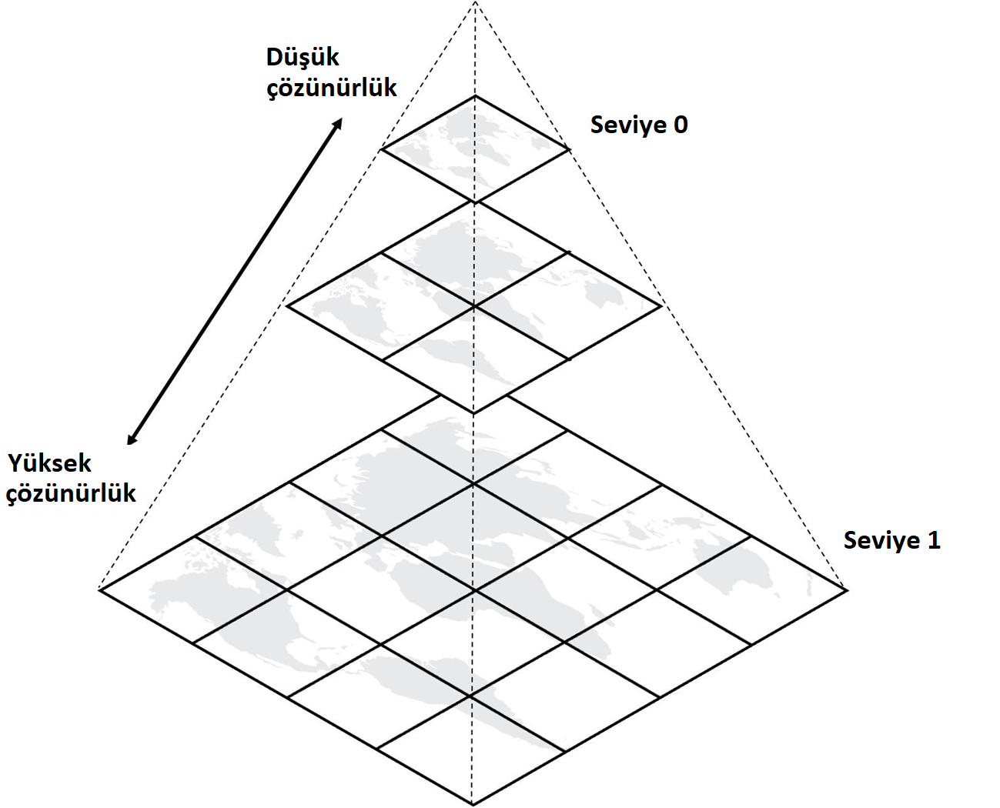
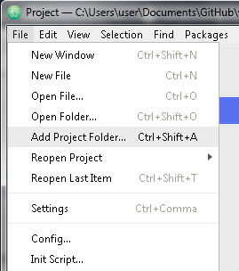
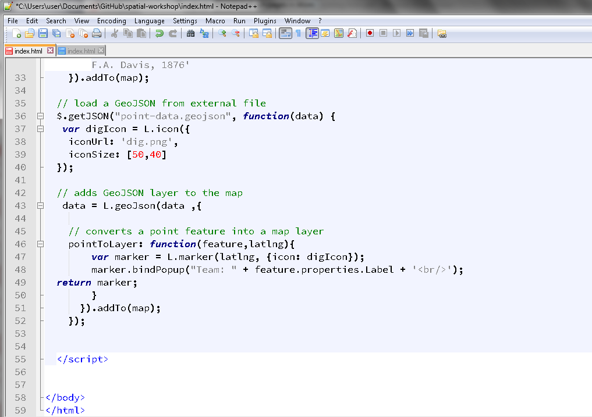

# 3.5 Web Haritalama Nedir?

[[İngilizce Metin](https://o-date.github.io/draft/book/what-is-web-mapping.html)]

🔧 Ayrıca [[Working with Spatial Data Binder](https://mybinder.org/v2/gh/shawngraham/spatialarchaeology/master)]’a da bakınız.

🔧 Ayrıca [[LIDAR Binder](https://mybinder.org/v2/gh/o-date/lidar/master)]’a da bakınız. 

Web haritası, bilgisayarlı altyapılar tarafından desteklenen coğrafi görselleştirmedir. Bu haritalama biçimi temel olarak Web ([[Axismap, 2018](http://www.axismaps.com/guide/web/what-is-a-web-map/)]) tarafından desteklenmektedir. Web haritalarının yaygınlığının, internetle ilişki kurmamızı sağlayan ve bir dönüşüm olan Web 2.0’ın gelişimiyle bağlantılı olması şaşırtıcı değildir ([[Aced 2013](https://o-date.github.io/draft/book/what-is-web-mapping.html#ref-Aced2013)]).

Darcy DiNucci’nin 1999’da belirttiği gibi, içeriğin tarayıcıya yüklendiği statik ekranlar, gelecek Web’in yalnızca bir embriyosudur ([[DiNucci 1999](https://o-date.github.io/draft/book/what-is-web-mapping.html#ref-DiNucci1999)]). Web 2.0, bu nedenle ‘etkileşim’, genellikle ‘İnternet özellikli’ cihazlar aracılığıyla ‘iki yönlü iletişim’ ve geliştiriciler arasında ‘kullanıcı deneyimi’ ve ‘arayüz’ konusunda daha fazla farkındalık ile karakterize edilir. Bu özellikler, tümü yanıt verebilirlik, boyut için uygun ölçeklendirme ve öncelikle dokunma ve kaydırma yoluyla etkileşim gerektiren akıllı telefon, tablet, dizüstü bilgisayar gibi mobil el cihazlarındaki ekran boyutlarının çeşitliliği ile bağlantılıdır. Web’in ilk sürümleri bir web sitesi oluşturmak için ileri düzeyde eğitim gerektirirken, genellikle ifade edildiği gibi Web 2.0, bir web sitesi, blog veya Wiki gibi Web’de hazır bir ‘şey’ yapmak için çok az uzman bilgisi gerektirir veya hiç gerektirmez. Bu, web haritalamanın, yani coğrafi bilginin Web tabanlı görselleştirilmesinin popüler hale geldiği bağlamdır.

Web haritalarının profesyonel harita üreticileriyle uzman olmayan üreticiler arasındaki mesafeyi daralttığı iddia edilebilir; ancak bazı akademisyenler Web üzerinde sıkça ve yaygın olarak paylaşılan coğrafi verilerin kalitesine ilişkin endişelerini dile getirmişlerdir [[(M. van Exel 2010](https://o-date.github.io/draft/book/what-is-web-mapping.html#ref-Exel2010)]. Örneğin [[OpenStreetMap](https://www.openstreetmap.org/)] gibi işbirliğine dayalı çevrimiçi platformlar, bilgi üretiminin sosyal boyutuna dikkat çekmiştir; meslekten olmayan bir kişinin veya belirli bir ilgi alanı topluluğunun yüklediği bilgi ne kadar doğrudur? Bu verilere dayanarak gerçek dünyada kararlar alabilir miyiz? Begin ve diğerleri, gönüllülerce üretilen coğrafi bilgilerin, haritalanan alanların belirlenmesinin ve haritalanan nesnelerin seçiminin gönüllülerin motivasyonlarını ve bireysel tercihlerini yansıttığını, bunun bilim insanları bu verilerin kalitesini incelemelerine ve değerlendirmelerine olanak tanıyan bir durum olduğunu öne sürüyor. ([[Daniel Bégin 2013](https://o-date.github.io/draft/book/what-is-web-mapping.html#ref-Begin2013)]).

Arkeologlar için web haritaları ve coğrafi bilgilerin yayınlanması zorluklar ve fırsatlar sunmaktadır. Arkeologlar, saha çalışmaları yoluyla topladıkları verilerin genellikle hassas konum bilgileri içerdiğinin farkındadır. Bu kaygılar bazen arkeologlar ile yerel topluluklar veya o toplumda sosyal, siyasi ve ekonomik olarak ötekileştirilmiş olabilecek etnik ve dilsel azınlıklar arasında gerilimlerin olduğu bağlamlarda daha da artar. Arkeologlar sıklıkla, arkeolojik ve tarihi ilgi alanlarına ilişkin konum bilgilerinin yayınlanmasının, bu alanların yağmalanarak tahrip edilmesini kolaylaştırabileceği, hatta bununla sonuçlanabileceği yönündeki endişelerini dile getirmektedir. Arkeolojik eserlerin ve insan kemiklerinin yağmalanması ve yasadışı ticareti pek çok yerde gözlemlenen bir sorundur ([[Neil Brodie 2001](https://o-date.github.io/draft/book/what-is-web-mapping.html#ref-Brodie2001)], [[Huffer ve Graham (2017)](https://o-date.github.io/draft/book/what-is-web-mapping.
html#ref-Huffer2017)]).

Verilerdeki mekânsal boyuttan yararlanan jeo-görsel analitikteki son gelişmeler, akademisyenlerin hassas konum bilgileri içerdiklerinde bile bu verilerle çalışabileceklerini ve anlamlı bir şekilde analiz edebileceklerini göstermektedir ([[G. Andrienko ve diğerleri 2007](https://o-date.github.io/draft/book/what-is-web-mapping.html#ref-Andrienko2007)]). Bu durum, arkeologların arkeolojik verilerin anlamlı bir şekilde analiz edilmesi ve yayınlanmasına uygun araçlar geliştirmeleri için muazzam fırsatlar sunmaktadır. Bir sonraki bölümde, ‘açıklık’ ilkesini temel alarak harita hizmetlerine genel bir bakış sunacağız ve ardından Leaflet kütüphanesi ile etkileşimli bir web haritası oluşturmaya yönelik bir kılavuz sunacağız. Bir Leaflet web haritası örneği için [[Open Context](https://o-date.github.io/draft/book/www.opencontext.org)]’e göz atın.

## 3.5.1 Harita Servislerine Genel Bakış

Karo Harita Servisi (Tiled Map Service-TMS) ve Web Harita Servisi ([[Web Map Service-WMS](http://www.opengeospatial.org/standards/wms)]), web tabanlı haritalama biçimlerinden ikisidir. WMS, bize (istemciye) coğrafi bilgiyi veritabanından çağırarak görsel temsiller olarak sunan belirli haritaları sağlayan arayüzdür. WMS sunucusu, internete bağlı masaüstü CBS ortamına Evrensel Kaynak Bağlantısı (Universal Resource Link-URL) aracılığıyla çağrılır. İstek, genellikle coğrafi katman (örn. tema) ve ilgilenilen coğrafi alandan oluşur. İsteğe verilen yanıt, tarayıcıda görüntülenen ve sorgulanan coğrafi referanslı harita görüntüleriyle sonuçlanır. Harita istek üzerine dinamik olarak çizildiğinden ve sunucu coğrafi veritabanındaki çeşitli katmanlardan en güncel bilgileri kullandığından, WMS haritaları yavaş yüklenme eğilimindedir. [[Toporama](https://natural-resources.canada.ca/earth-sciences/geography/atlas-canada/explore-our-maps/16836#toporama)], Kanada topografik temalarını sunan bir WMS sunucusu örneğidir. 

[[TillMill Projesi](http://tilemill-project.github.io/tilemill/docs/crashcourse/introduction/)], [[OpenStreetMap](https://www.openstreetmap.org/)], [[CartoDB](https://o-date.github.io/draft/book/www.carto.com)] ve [[Stamen](http://maps.stamen.com/)] gibi karo harita servislerinin tümü, görüntü olarak rasterleştirilmiş bir veya daha fazla vektör katmanı kullanır. Bu rasterleştirilmiş görüntü 256 x 256 bitişik piksel görüntülerine veya ‘karolara’ bölünür. Bu genellikle bir web haritasındaki temel katmandır (basemap).

Her karo Web’de bir görüntüdür, bu da ona bağlantı verebileceğiniz anlamına gelir. Örneğin, aşağıdaki URL Web üzerindeki belirli bir karoya işaret eder:

https://tile.openstreetmap.org/7/63/42.png

URL’deki üç öğe şunlardır: 1. tile.openstreetmap.org, karo sunucusu adı; 2. 7, karonun yakınlaştırma seviyesi veya z değeri; ve son olarak 3. 63/42, karonun bulunduğu griddeki x ve y değerleri

z değeri 0 ile 21 arasında bir aralığa sahiptir; 21 değeri en fazla ayrıntıya sahip (ve en küçük boyutlu) karoyu verir.



‘Görüntü Karosu Piramidi, (Image Tile Pyramid) https://www.azavea.com/blog/2018/08/06/generating-pyramided-tiles-from-a-geotiff-using-geotrellis/tilepyramid/’

Karo seti oluşturulduktan sonra diskte depolanır ve çok sayıda eşzamanlı talebe hızlı bir şekilde dağıtılmaya hazır hale gelir. Karolanmış haritalar önceden oluşturuldukları için hızlı yüklenirler. Katman sırası, harita ölçeği ve projeksiyon gibi işlevlerden ödün vererek harita görünümüne ve akıcı harita navigasyonuna önem verirler. [[Alex Urquhart](http://alexurquhart.github.io/free-tiles/)] karo servislerinin bir listesini tutmaktadır.

Veri katmanları tipik olarak altlık katmanın (base layer) üzerine eklenir. Veri katmanları nokta, çizgi ve çokgen olabilir. Bu veri katmanları, coğrafi özelliklerin mekansal olmayan nitelikleriyle Web’de temsil edilebilmesi için tasarlanmış bir format olan [[GeoJSON](http://geojson.org/)] olarak kaydedilir. 

## 3.5.2 Leaflet ile Web Haritası Oluşturma

[[Leaflet](http://leafletjs.com/)], karolanmış haritalarla kullanılmak üzere [[Vladimir Agafonkin](https://vimeo.com/106112939)] tarafından geliştirilen bir JavaScript kütüphanesidir. 2008’de piyasaya sürülen Leaflet, kütüphanesinin düşük kısıtlamalı özelleştirmesi, harita öğeleriyle etkileşimi ve WMS biçiminde sunulan haritayla karşılaştırıldığında basitleştirilmiş yapısı nedeniyle karo web haritalamalarında yaygın olarak kullanılmıştır. Üstelik Leaflet’in diğer Web 2.0 teknolojileri ve [[GitHub](https://o-date.github.io/draft/book/www.github.com)] gibi kod paylaşım platformlarıyla uyumluluğu, aktif bir ‘yapımcılar’ topluluğunu teşvik etmiştir.

Bu e-kitabın ‘açıklık’ ilkesine uygun olarak ve düşük maliyetli ve düşük kısıtlamalı web haritalamayı teşvik etme motivasyonuyla, aşağıda Leaflet ile kendi interaktif web haritamıza başlamak için bir taslak sunulmaktadır. İhtiyacımız olanlar:

1- Nokta verileri, ideal olarak coğrafi kodlanmış (enlem/boylam) CSV olarak kaydedilmiş veriler;

2- Atom gibi yerel bilgisayarda yüklü metin editörü;

3- GitHub gibi bir barındırma hizmeti (genel hesap);

4- OpenStreetMap, MapBox (ücretsiz hesap) veya başka bir karo harita hizmeti

5- Meraklı bir sen

## 3.5.3 Alıştırmalar

‘Dijital bir şey’ yapmak heyecan verici ve göz korkutucu olabilir ancak kendi yaratımınızı İnternet’te görmek tatmin edici olabilir. Bunun gerçekleşmesi için yapılan çalışmanın büyük bir kısmının yerel bir makinede gerçekleştiğini unutmamak önemlidir. Bu nedenle, ihtiyacımız olan araçlarla bir yerel ortam kurmak son derece teşvik edilir. Düzenli kullanım için Mac için [[MAMP](https://www.mamp.info/en/)] veya Windows için [[WampServer](http://www.wampserver.com/en/)] gibi bir yerel web sunucusu kurmanızı öneriyoruz.

Bu alıştırma için, HTML dosyamızda değişiklikler yaptıkça yerel tarayıcımızı yeniden yükleyen ve özel bir web sunucusu kurmaksızın neler olduğunu görmemizi sağlayan geçici bir ön işlemci uygulaması olan [[Prepros](https://prepros.io/)]‘u kullanacağız.

### 3.5.3.1 Basit bir Leaflet Web Haritası

1- [[web-map](https://github.com/dngupta/web-map)]’i indirin ve bilinen bir konuma çıkarın. Hangi dosyaları ve klasörleri görüyorsunuz? Düzenleme işlemine başlamadan önce, dosyaları ve alt klasörleri hiyerarşik yapısı içinde görmek faydalıdır. Web haritası klasörünü Atom’a getirin. Bunu ‘Bir Proje Klasörü Ekle (Add a Project Folder)’ seçeneği ile yaparız.



Atom’da Proje Ekle

2- index.html adlı dosyayı bulun ve açın. Dosyada ne görüyorsunuz? İlk satır, bu belgenin web sayfaları oluşturmak için kullanılan bir dil olan html dilinde yazılmış olduğunu belirtir.

Devam edin ve başlığı değiştirin

```
<title>sekmenin üzerine geldiğinizde başlık</title>
```

3- Klasöre sağ tıklayarak ‘Canlı Önizlemeyi Etkinleştir (Enable Live Preview)’ seçeneğini seçin. Ardından tarayıcıda web sayfasını görmek için dünya simgesine tıklayın. Şimdi web sayfamızı yerel bir tarayıcıda görmek istiyoruz. Önizlemek için Prepros’u başlatın (bu birkaç dakika sürebilir). Sürükleyip bırakarak ya da Prepros penceresinin sol altındaki + simgesini kullanarak Web haritası klasörünü proje olarak ekleyin.

Klasöre sağ tıklayarak ‘Canlı Önizlemeyi Etkinleştir (Enable Live Preview)’ seçeneğini seçin. Ardından tarayıcıda web sayfasını görmek için dünya simgesine tıklayın.

4- index.html dosyasında <head> ve <body> etiketlerini bulun. Bir web sayfasının anatomisinde, bu bölümler içerik oluşturmak ve yüklemek için en önemli olanlardır.

<head> bölümümüze Leaflet kütüphanesine<link> ve <script> olmak üzere iki etiket ekledik. URL’nin bir CDN veya İçerik Dağıtım Ağı’na (Content Delivery Network) işaret ettiğini göreceksiniz. Bunlar, coğrafi konumumuza dayalı olarak web içeriği barındıran sunuculardır. Bu durumda, Leaflet için özel bir barındırılan CSS veya Cascading Style Sheet ve web haritasına etkileşim ekleyen Leaflet scriptini istek yolluyoruz.

CSS, bir web sayfasının içeriğini biçimlendirmek için bize önceden tanımlanmış stiller ve öğeler sağlar, yani bir Leaflet haritasının görünümünü ve hissini elde ederiz. Yazı tipleri, boyutu, rengi, satır aralığı, yakınlaştırma için simge ve harita gibi Leaflet öğelerini içerir.

**CSS’nin komut dosyasından önce yüklenmesi ve her ikisinin de<head></head> etiketlerinin içinde olması çok önemlidir.**

Dosyanız bu aşamada şu şekilde okunmalıdır:

.png)

Başlık ve css eklenmiş

5- Ardından, web sayfamızın <body> bölümüne map adlı bir şey içerecek bir <div>öğesi ekliyoruz.

```
<div id="map"></div>
```

Daha sonra <script>‘i çağırıyoruz ve haritamızı L.map kullanarak başlatıyoruz.

Kodu inceleyin
```
<script>
var map = L.map('map').setView([40.5931,-75.5265], 12);
``` 

.setView web haritamızı belirli koordinatlarda ve belirli bir yakınlaştırma düzeyinde ortalar. Koordinatları değiştirin ve kaydet düğmesine basın. Canlı önizlemeye bir göz atın. Ne görüyorsunuz?

6- Şimdi L.tileLayer kullanarak temel haritamız için bir karo sunucusu yüklemek istiyoruz.

```
L.tileLayer('https://{s}.tile.openstreetmap.org/{z}/{x}/{y}.png', {
    maxZoom: 19,
    attribution: '&copy; <a href="http://www.openstreetmap.org/copyright">OpenStreetMap</a>'
    }).addTo(map);
</script>
```

Bu kod bize şu bilgileri verir: 1. https://{s}.tile.openstreetmap.org, istediğimiz karo sunucusu, 2. 19,maksimum yakınlaştırma seviyesi ve 3.'&copy; <a href="http://www.openstreetmap.org/copyright">OpenStreetMap</a>'  o karo sağlayıcısının öznitelikleri 

Katmanı web haritamıza ekleyen.addTo(map); ve bu özel kodu kapatan </script>’e dikkat edin. Ek katmanlar veya öznitelik verilerini yüklemek için, kodumuzu bir sonraki alt bölümde ana hatlarıyla açıkladığımız <script></script>etiketleri içine ekleriz.

Bu aşamada html’iniz şu şekilde görünür:

.png)

Eklenmiş karo servisi

Tebrikler! İlk Leaflet haritamıza sahibiz. Haritayı Prepros önizleme penceresinde inceleyebilirsiniz.

### 3.5.3.2 Nokta verilerini Leaflet haritasına yükleme

Artık bir temel altlık haritamız olduğuna göre, üzerine noktalar, çizgiler, çokgenler gibi bazı nesne verilerini yükleyebiliriz. Nesne verilerini eklemek için birkaç farklı yol bulunmaktadır. Bunlar Virgülle Ayrılmış Değer (CSV) dosyası veya GeoJSON olarak yüklenebilir. 

Bu alıştırmada, yaklaşık 20 potansiyel kazı alanını içeren küçük bir dosya (point-data.geojson) olan GeoJSON ile çalışacağız. Orijinal CSV’de dört öznitelik alanı vardı ve bunların tümü [[buradaki](http://www.convertcsv.com/csv-to-geojson.htm/)] çevrimiçi bir araç kullanılarak GeoJSON’a dönüştürüldü.

1- Bir metin düzenleyici çalıştırın ve point-data.geojson dosyasının içeriğini inceleyin. Ne görüyorsunuz? **Tip**, **geometri** ve **özelliklere** dikkat edin. Kaç tane özellik veya öznitelik var, bunlar neler?

2- Ardından, index.html dosyasını açın. Şimdi GeoJSON verilerimizi almamızı, yüklememizi ve işaretçi olarak temsil etmemizi sağlayan birkaç kod satırı ekleyeceğiz..

Leaflet’i yüklemek için <head> etiketini ve komut dosyasını bulun. Altına jQuery adlı komut dosyasını ekleyin. Bu Javascript kütüphanesi, etkileşimi, animasyonları, eklentileri ve widget’ları etkinleştirmek için yaygın olarak kullanılır. Leaflet.js’den sonra aşağıdaki kodu kullanarak jQuery’yi web sayfamıza yüklüyoruz:
```

  <!-- loads Leaflet.js -->
  <script src="http://cdn.leafletjs.com/leaflet-0.7.3/leaflet.js"></script>
  <!-- loads jQuery -->
  <script src="https://ajax.googleapis.com/ajax/libs/jquery/1.11.1/jquery.min.js"></script>
```

3- Artık GeoJSON’umuzu (point-data.geojson) almak için birkaç satır eklemeye hazırız. <body> bölümünde, karo katmanınızın altına aşağıdaki kodu ekleyelim:

```
// load a tile layer
  L.tileLayer('https://{s}.tile.openstreetmap.org/{z}/{x}/{y}.png', {
    maxZoom: 19,
    attribution: '&copy; <a href="http://www.openstreetmap.org/copyright">OpenStreetMap</a>'
    }).addTo(map);

// load GeoJSON and save it as a thing called `data`
  $.getJSON("point-data.geojson", function(data) {
```
bunu takiben:

```
// adds GeoJSON objects to layer
   data = L.geoJson(data  ,{

// converts point feature into a map layer
    pointToLayer: function(feature,latlng){
      return L.marker(latlng);
      }
    }).addTo(map);
  });
```

4- Dosyayı kaydedin ve tarayıcıda önizleyin. Tebrikler! Kendi nokta nesne verimizi Leaflet haritasına ekledik.

5- Web haritamızda kaydırma ve yakınlaştırmanın ötesinde etkileşime sahip olmak harika olurdu. Bunun bir yolu, işaretleyicilerimizin her birine tıklayabileceğimiz açılır pencereler eklemektir.

pointToLayer‘ı bulun. İşaretleyici (Marker) adı verilen bir değişken oluşturacağız ve her işaretçiye bir açılır pencere bağlayacağız:

```
// creates a variable called marker
pointToLayer: function(feature,latlng){
var marker = L.marker(latlng);

// binds a popup to marker, assigns properties to display
  marker.bindPopup(feature.properties.Label + '<br/>');
  return marker;
}
}).addTo(map);
    });
```

Bu aşamada, html’iniz buna benzer görünecektir:



Noktalar ve açılır pencereler eklendi.

6- İşte bu kadar! Kendi nokta verilerimizle bir web haritası oluşturduk ve üzerine tıklayabileceğimiz açılır pencereli işaretçilerimiz var.

## 3.5.4 Kaynaklar

Aşağıda, Leaflet kullanan ve kendi projeleriniz için çatallayabileceğiniz veri depolarına sahip arkeoloji ile ilgili örnekler yer almaktadır:

1. Michigan Eyalet Üniversitesi Antropoloji Bölümü tarafından geliştirilen Antik Mısır Dijital Atlası (The Digital Atlas of Ancient Egypt): https://msu-anthropology.github.io/daea/

Veri deposu: https://github.com/msu-anthropology/daea

2. TOMB: Lisa Bright (Michigan Devlet Üniversitesi) tarafından geliştirilen Online Biyoarkeoloji Haritası (The Online Map of Bioarchaeology): http://brightl1.github.io/TOMB/

Veri deposu: https://github.com/brightl1/TOMB/

3. MINA: Dr Neha Gupta (Memorial University of Newfoundland) tarafından geliştirilen Hint Arkeoloji Haritası (Map Indian Archaeology): http://dngupta.github.io/mina.github.io/

Veri deposu: https://github.com/dngupta/mina.github.io

# Kaynaklar

Aced, Cristina. 2013. “Web 2.0: The Origin of the Word That Has Changed the Way We Understand Public Relations.” International PR 2013 Conference. Images of Public Relations. https://www.researchgate.net/publication/266672416_Web_20_the_origin_of_the_word_that_has_changed_the_way_we_understand_public_relations.

DiNucci, Darcy. 1999. “Fragmented Future.” Print Magazine. http://darcyd.com/fragmented_future.pdf.

M. van Exel, S. Fruijtier, E. Dias. 2010. “The Impact of Crowdsourcing on Spatial Data Quality Indicators.” In Proceedings of Giscience 2011, Zurich, Switzerland, 14–17 September 2010. https://www.researchgate.net/publication/267398729_The_impact_of_crowdsourcing_on_spatial_data_quality_indicators.

Daniel Bégin, Stéphane Roche, Rodolphe Devillers. 2013. “Assessing Volunteered Geographic Information (Vgi) Quality Based on Contributors’ Mapping Behaviours.” International Archives of the Photogrammetry, Remote Sensing and Spatial Information Sciences. https://www.int-arch-photogramm-remote-sens-spatial-inf-sci.net/XL-2-W1/149/2013/isprsarchives-XL-2-W1-149-2013.pdf.

Neil Brodie, Colin Renfrew, Jennifer Doole, ed. 2001. Trade in Illicit Antiquities: The Destruction of the World’s Archaeological Heritage. Cambridge: McDonald Institute for Archaeological Research.

Huffer, Damien, and Shawn Graham. 2017. “The Insta-Dead: The Rhetoric of the Human Remains Trade on Instagram.” Internet Archaeology. doi:https://doi.org/10.11141/ia.45.5.

Andrienko, Gennady, Natalia Andrienko, Piotr Jankowski, Menno-Jan Kraak, Daniel A. Keim, Alan MacEachren, and Stefan Wrobel. 2007. “Geovisual Analytics for Spatial Decision Support: Setting the Research Agenda.” International Journal of Geographical Information Science 21 (8): 839–57.

İneç, Z., İneç, Z. F., & Akpınar, E. (2013). [[WEB HARİTALAMA HİZMETLERİ (WMS) UYGULAMALARININ TEKNİK ve PERFORMANS BAKIMINDAN İNCELENMESİ](https://dergipark.org.tr/tr/download/article-file/3269)]. Marmara Coğrafya Dergisi(24), 403-432.https://dergipark.org.tr/tr/download/article-file/3269 
