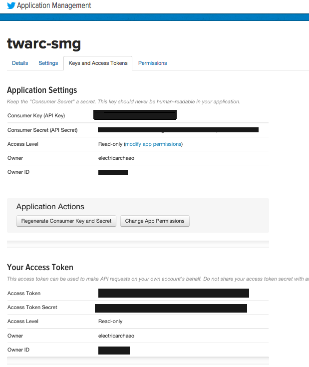
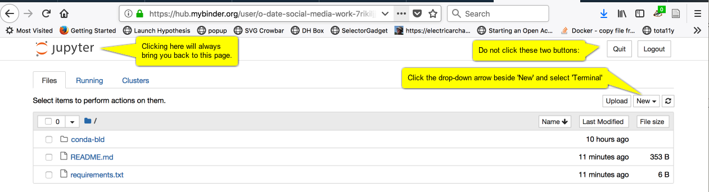
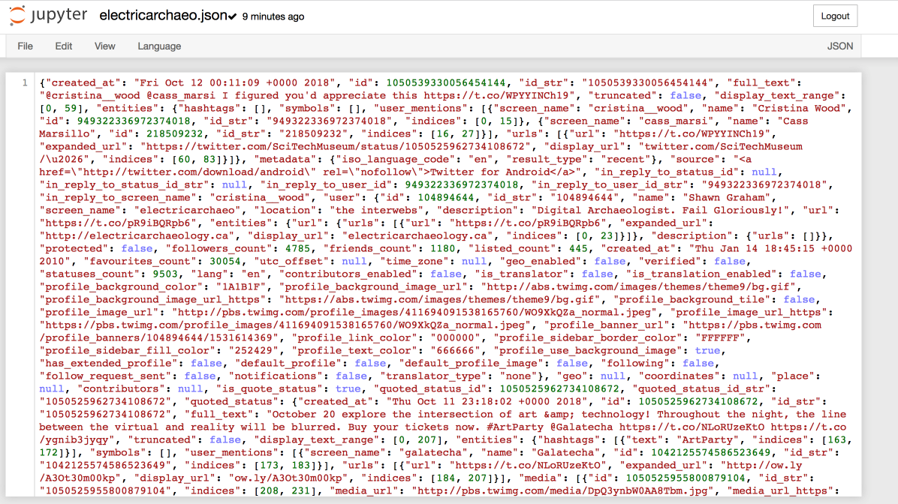
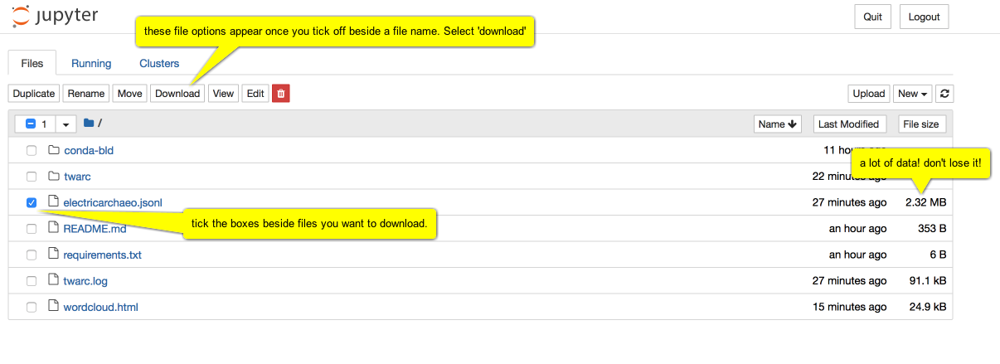

# 3.8 Arkeolojide Halk Katılımı ve Bilimsel İletişim Perspektifinden Sosyal Medya

[[İngilizce Metin](https://o-date.github.io/draft/book/social-media-as-public-engagement-scholarly-communication-in-archaeology.html)] 

❗Bu bölüm geliştirilme aşamasındadır. 

🔧 [[TWARC Binder](https://mybinder.org/v2/gh/o-date/social-media-work/master)]’ı başlatınız. 

Sosyal medya – yani, diğer kullanıcıların ileti akışlarına gönderilen hızlı iletileri kolaylaştıran ( bu sebeple ’blogları’da dahil edebileceğimiz) web siteleri – normalde arkeolojide arkeoloji hakkında bilgi yaymak için bir taşıyıcı olarak düşünülür. Bununla birlikte, sosyal medyanın yaratıcı kullanımı, sosyal medyayı bir arkeoloji yapma alanına dönüştürebilir sağlayabilir. Bazı tartışma ortamlarında, otonom ajanlar insanları taklit etme, fikirleri şekillendirmeye müdahil olma veya bakış açılarını geliştirme / teşvik etme gibi özellikleriyle ele alınır ve bu nedenle kodları ve eylemleri arkeolojinin konusu olmaya oldukça uygundur. Gerçekten de, bu platformu platformun olanaklarının bizi doğal olarak insanlığımızdan uzaklaştırdığı ve daha fazla bot benzeri etkileşimler gerçekleştirmemize neden olduğu argümanı ortaya atılabilir (ki bunu, bir meta – arkeoloji eylemi olan ilk [[Public Archaeology Twitter Conference](https://shawngraham.github.io/talk/bots-of-archaeology/)] (Kamu Arkeolojisi Twitter Konferansı’nda) tartıştık).

Bu bölümde, sosyal medyayı bir kamu erişimi stratejisi olarak nasıl etkili bir şekilde kullanacağınızı; araştırmalarınız konusunda güncel kalmak için sosyal medyayı kullanmanın yollarını; ve bir gönderinin olası doğruluk içeriğini nasıl belirleyeceğinizi tartışacağız. [[Computational creativity](https://o-date.github.io/draft/book/computational-creativity.html)]  (Hesaplamalı yaratıcılıkla) ilgili bir sonraki bölümde size kendi otomatik sosyal medya botlarınızı oluşturmanın bir yolunu göstereceğiz.

## 3.8.1 Outreach Olarak Sosyal Medya

day of archaeology makalesi

lorna richardson body of work çalışması

mapping the blogosphere;

Internet Archaeology Özel sayısı 

    Sosyal Medyada nasıl profesyonel olunur?
    sara perry makalesi

Richardson, L.-J., 2019. Using Social Media as a Source for Understanding Public Perceptions of Archaeology: Research Challenges and Methodological Pitfalls. Journal of Computer Applications in Archaeology, 2(1), p.151–162.DOI: https://doi.org/10.5334/jcaa.39

https://intarch.ac.uk/journal/issue46/index.html

Richardson, LJ; (2014) The Day of Archaeology: blogging and online archaeological communities. European Journal of Post-Classical Archaeologies , 4 (2014) 421 – 446. https://discovery.ucl.ac.uk/id/eprint/1431013/

Perry, Sara and Beale, Nicole. “The Social Web and Archaeology’s Restructuring: Impact, Exploitation, Disciplinary Change” Open Archaeology, vol. 1, no. 1, 2015. https://doi.org/10.1515/opar-2015-0009 

## 3.8.2 Güncel Araştırma Takibinde Sosyal Medya
## 3.8.3 Dört Hamle, veya, Gerçeğe Ulaşmak

Her gün o kadar çok bilgi bizi bataklığa sürüklüyor ki. ‘Bilgi denetimi’ ( ‘Fact checking’ ) bir yalanın üstesinden gelemez, çünkü -bir yalanı- çürütme eylemi yalanın kendisine daha fazla dikkat çeker ve onu kamu bilincinin derinliklerine yerleştirir. Yalanlar, ne kadar çok tekrarlanırsa, o kadar çok -bir tür- gerçekliğe bürünür. Sosyal medyada yeni bir bilgi ile karşı karşıya kaldığımızda ne yapabiliriz? Bir iddianın doğruluğunu kendimiz belirledikten sonra, sosyal medyadaki dezenformasyon veya yalanlara karşı ne yapabiliriz?

Mükemmel bir kaynak olan açık erişimli “[[Öğrenci Bilgi Denetleyicileri için Web Okur yazarlığı](https://webliteracy.pressbooks.com/)]” (Web Literacy for Student Fact Checkers) kitabında Michael A. Caulfield, ‘dört hamle‘ veya ’gerçeğe yaklaşmak için yapabilecekleri şeyler‘ olarak adlandırdığı şeyi ortaya koyuyor. Bu kaynakta tanımlanan dört hamle şunlardır:

1- Daha önce yayınlanmış çalışmaları kontrol edin: Başka birinin iddiayı zaten doğrulayıp doğrulamadığını veya bir araştırma sentezi sağlayıp sağlamadığını görmek için etrafınıza bakının.

2- Kaynağa gidin: İddianın kaynağına doğru “akıntıya ters yönde” hareket edin. Çoğu web içeriği orijinal değildir. Bilgilerin güvenilirliğini anlamak için orijinal kaynağa bulmaya çalışın.
    
3- Lateral olarak okuyun: Bir iddianın kaynağına ulaştığınızda, diğer insanların kaynak hakkında söylediklerini okuyun (yayın, yazar vb.). Gerçek, bilgi ağının içindedir.

4- Tekrar daire içine alın: Kaybolursanız, çıkmaza girerseniz veya kendinizi giderek daha kafa karıştırıcı hale gelen bir tavşan deliğinde bulursanız, geri dönün ve ne bildiğinizi değerlendirerek baştan başlayın. Farklı arama terimleri ve daha iyi kararlarla daha bilinçli bir yol izlemeniz muhtemeldir.

[[Caulfield 2017](https://webliteracy.pressbooks.com/chapter/four-strategies/)]

Caulfield’ın paylaştığı en kritik tavsiyelerden biri, ‘duygularınızı kontrol etmek’, güçlü bir duygusal tepkiyi tetikleyen bir sosyal medya iletisiyle karşılaştığınızda durma alışkanlığı geliştirmektir. Onun da belirttiği gibi, çevrim-içi propagandacıların bilincinde oldukları şey, izi duygusal olarak vuran içeriklerin sorgulanma olasılığının daha düşük olduğudur. Bazı uyaranlar bizi savunmaya geçirip dikkatimizden kaçmayı başarır. Kendinizi bir iletiye karşı güçlü bir duygusal tepki verirken bulursanız, bu, dört hamlenin en gerekli olduğu zamandır: “Duygularınızı bir hatırlatma olarak kullanın. Güçlü duygular, yeni doğrulama alışkanlığınız için bir tetikleyici haline gelmelidir. Paylaşmak istediğiniz her içerik öfke, kahkaha, alay ve hatta sadece rahatsız edici bir vızıltı bile hissetmenize neden olduğunda, tepki vermeden önce 30 saniye bekleyip doğruluk kontrolü yapın. Bu size iyi gelecektir.” ([[Caulfield 2017, Bölüm 3](https://o-date.github.io/draft/book/social-media-as-public-engagement-scholarly-communication-in-archaeology.html#ref-caulfield_2017)])

Caulfield’ın kitabında, bir iddianın doğruluğunu anlamak için ayrıntılı tavsiyeler ve gidilecek yerler, kullanılacak araçlar içeren dört hamlenin her biri için bölümler vardır. Bu kitabı okumak için zaman ayırmanızı şiddetle tavsiye ederiz. Ardından, [[Dört Hamle Blog](https://fourmoves.blog/)]’una ([[Four Moves Blog](https://fourmoves.blog/)]) bir göz atın. Her gönderi bir tweet, Facebook gönderisi, meme veya başka bir dijital mecra’nın ekran görüntüsünü içerir. Bunlar, özellikle bir veya daha fazla harekete özellikle dikkat ederek dört hareketinizi uygulamanızı sağlamak için bir araya getirilir. Bazılarının doğruluğunu kontrol etmeye çalışın.

Bu noktada, bulduklarınızı nasıl ileteceğiniz gibi bir sorunla karşılaşacaksınız. Sadece bir yalanı çürütmek, yalanı gücünden yoksun bırakmaz; aslında onun gücünü artırabilir. Henüz, bu duruma karşı geliştirilmiş iyi bir karşılık veya yöntem yoktur (ve bu gerçekleşene kadar, hepimiz tehlikedeyiz), ancak bir yaklaşım, yanlışı beslemeyi reddetmek için önerilen bir ‘[[doğruluk sandviçi](https://www.washingtonpost.com/lifestyle/style/instead-of-trumps-propaganda-how-about-a-nice-truth-sandwich/2018/06/15/80df8c36-70af-11e8-bf86-a2351b5ece99_story.html)]’dir ( ‘truth sandwich’ ). Gerçeği söyleyerek başlayın; yalanı tartışın; gerçeği yeniden söyleyerek bitirin. Yalanı bir gönderi başlığında, tweet’te veya başlıkta tekrarlamayın.

Arkeoloji, şu anda dünyada iş başında olan ‘büyük yalanlar’ dalgasına karşı bağışık değildir; ırkla ilgili yalanlar, tiksindirici iddialarını desteklemek için ‘antik Greko – Romen dönemden kalma görüntüleri kullanmaya devam ediyor. Yalanları tekrarlamayın, ancak gerçeği bulmak ve onlara bir ‘doğruluk sandviçi’yle ( ‘[[truth sandwich](https://www.washingtonpost.com/lifestyle/style/instead-of-trumps-propaganda-how-about-a-nice-truth-sandwich/2018/06/15/80df8c36-70af-11e8-bf86-a2351b5ece99_story.html)]’ ) karşı koymak için bu dört hamleyi kullanabilirsiniz.

## 3.8.4 Alıştırmalar

Dijital arkeolojiyle bağlantılı tweetler, fotoğraflar vb. için Twitter’da madencilik yapacağız.

Bu iki şey gerektirir:

1- Bir Twitter Hesabı
2- Makinenizde yüklü python

Ancak Python ve Twarc (TWitter ARChiver) paketi zaten  yüklü olan sanal bir bilgisayar kullanacağız. Twarc, medyamızın gerçeği yaydığı (ve çarpıttığı!) tüm  yolları takip etmek için gerekli araçları oluşturmak amacıyla [[Documenting the Now](https://www.docnow.io/)] (Şimdi’yi Belgeleme) (https://www.docnow.io/) adlı bir projeye başkanlık eden Ed Summers tarafından yaratıldı. Twarc olayları olduğu gibi yakalamak için hızlı yanıt veren bir araç paketidir.

Yapacağımız şey, Twitter ile tweet’lerin altında yatan verilere erişmenizi sağlayan bazı kimlik bilgileri oluşturmaktır. Ardından, Twarc paketleri, tweet’leri aramanıza ve arşivlemenize olanak tanıyan yerleşik bir dizi işleve sahiptir.

### 3.8.4.1 Birinci Bölüm: Eğitmenler: Twitterı kurma

:::uyarı güncelleme 12 Ekim Profesörünüzün veya eğitmeninizin önce eğitim için Twitter ile kendilerini geliştirici olarak ayarlaması gerekecektir. :::

ÖNCE BAŞTAN SONA OKUYUN, SONRA BAŞLAYIN

1- Her şeyden önce, henüz bir Twitter hesabınız yoksa, bir Twitter hesabı oluşturmanız gerekir twitter.com adresine gidin. Bunu yapın, ancak verdiğiniz kişisel bilgileri en aza indirdiğinizden emin olun. Örneğin, tanıtıcınızı gerçek adınızla aynı yapmayın.

o   Coğrafi konumu kapatın. Profilde gerçek konumunuzu vermeyin.

o   Ayarları görüntüleyin ve tüm gizlilik ayarlarının kapalı olduğundan emin olun. Şimdilik, bir cep telefonu numarasını hesabınızla ilişkilendirmeniz gerekiyor. Bir sonraki adımı tamamladıktan sonra bunu silebilirsiniz.

2- Profesörünüzün kendisini Twitter’da bir ‘geliştirici‘ olarak ayarlaması gerekecek. [[Twitter uygulamaları](https://developer.twitter.com/)] sayfasına gitmeli – https://developer.twitter.com/ ve başvurmalıdırlar. Bu süreç, neden geliştirici olmak istedikleri hakkında bilgi vermeyi içerecektir. Twitter, [[Eğitim için Twitter](https://developer.twitter.com/en/docs/basics/developer-portal/guides/twitter-for-education.html)]’da bunun nasıl yapılacağı konusunda rehberlik yapıyor. Yeni bir geliştirici hesabının işlenmesi ve kurulması yaklaşık 24 saat sürecektir.
  
3- Yeni bir ‘uygulama‘ oluşturmak için yeni uygulama sayfasına gidin. Uygulamaya my-twarc veya benzeri  bir ad verin. Web sitesi için, kendi kontrol ettiğiniz bir web sitesi etki alanı (domain) kullanın.

4- Bir sonraki sayfaya geçin (geliştirici davranış kurallarını (developer code of behaviour) okuduğunuzu söyleyen kutuyu işaretleyin). Bir sonraki sayfada yeni başvurunuzla ilgili tüm ayrıntılar gösterilmektedir.
  
5- ‘Anahtarlar ve Erişim Belirteçleri’ (key and Access Tokens) sekmesine tıklayın.

6- Tüketici anahtarını (consumer key), tüketici sırrını (consumer secret) bir metin dosyasına kopyalayın.

7- Sayfanın altındaki ‘erişim belirteçleri oluştur’ (create access tokens) düğmesine tıklayın. Bu, bir erişim belirteci (access token) ve bir erişim sırrı (access secret) oluşturur.

8- Bunları metin dosyanıza kopyalayın, kaydedin. Bu dosyayı deponuza koymayın veya herhangi bir yere çevrimiçi bırakmayın. Aksi takdirde, bir kişi sizin kimliğinizi kullanabilir!

Tüketici anahtarını (consumer key) ve tüketici sırrını (consumer secret)  sınıftaki öğrencilerinizle paylaşın.

### 3.8.4.2 Öğrenciler İçin İkinci Bölüm: Sanal Bilgisayarınızı Çalıştırma

1- Buna sağ tıklayın ve ‘yeni sekmede aç’ı seçin:  

2- Bekleyin. Yeni sanal bilgisayarınızı kuruyor. Yüklendiğinde, şu şekilde görünecektir:

3- Yeni‘ (new) düğmesine tıklayın ve ‘Terminal’i seçin. Şunu görmelisiniz: 

.png)

UYARI Sanal bilgisayarla etkileşimde kalmanız gerekir – bir komut yazın, bir şeye tıklayın – aksi taktirde on dakika içinde kapanır ve her şeyi kaybedersiniz.

Profesyonel ipucu, bir şeyi canlı tutmanın bir yolu olarak terminale her zaman ‘pwd’ yazabilirsiniz. Bu komut Çalışma Dizinini yazdırır, örneğin hangi klasörde olduğunuzu söyler.

4- Komutu yazın:  twarc configure

.png)

Ve bir sonraki ekran görüntüsünde, ek açıklamaları (annotations) yukarıdan aşağıya okuyun:

.png)

Peki bu ‘görüntülenen PIN’ (displayed pin)nerede? Bu, tarayıcınızın ‘Twitter kimliğini doğrula?’ (authenticate twitter) penceresindedir. diyalog görüntülendi. Twitter sayfası yerine, profesörün 3. adımda uygulama için girdiği URL şimdi yüklendi ve ihtiyacınız olan bilgiler oauth_token = ile belirtildi. = işaretinden sonra ‘bit’e ihtiyacınız var .

.png)

Şöyle bir şeye benzemesi gerekiyor: -bBafl42aabB... vb, uzun bir sayı ve harf dizisi. Bunu kopyalayın.

Ardından şuraya yapıştırın: 

.png)

Artık Twitter’da veri madenciliği yapmaya hazırsın!

Çevirenin Notu: Twitter 2023 yılında X olarak adını değiştirmiş olup faaliyetlerine devam etmektedir. X’den veri çekmek için https://developer.twitter.com/en adresindeki gelişmeleri takip etmeniz önerilir. 

### 3.8.4.3 Bölüm Üç: Bazı Veriler Bulun

Twarc benioku sayfasında ([[Twarc readme page](https://github.com/DocNow/twarc)]), bilgi aramak için twarc’ın nasıl kullanılacağına dair örnekler bulunmaktadır.

twarc search digiarch yazıp return tuşuna basarsanız, terminal penceresi tweet meta verileri ve verileriyle dolar ([[İşte ‘electricarchaeo‘ kullanıcısını ararken bunun bir videosu](https://screencast-o-matic.com/watch/cF6lVjY05K)]). Ama bu sadece son bir hafta ya da öylesine bir bilgi! Bu bilgileri terminal pencereniz yerine aşağıdaki gibi bir dosyaya kaydedebilirsiniz:

twarc search digiarch > digiarch.jsonl (that’s an ‘el’ at the end of .json, meaing ‘javascript object notation lines’ format.)

Daha sonra ekranın üst kısmındaki ‘jupyter’ logosuna sağ tıklayıp bağlantıyı yeni bir pencerede açarsanız, dosya gezginine geri dönersiniz. Listelenen dosyalardan biri yaptığınız yeni digiarch.jsonldosyası olacaktır:

Peki bu bilgilerle ne yapabiliriz? Oldukça fazla, ama şimdilik, tweet’lerin metninin temel bir kelime bulutunu oluşturalım.

Ed Summer’ın yazdığı bazı yardımcı programlara, bu bilgilerle çalışabilecek bazı ekstra python programlarına ihtiyacımız olacak. Terminal penceresine geri dönerek aşağıdakileri yazın:

git clone https://github.com/DocNow/twarc

Bu, zaten yüklü olan git programına github’a gitmesini ve Twarc’ın kaynak kodunu almasını söyler. Yakalayacağı (grab) klasörlerden birine utils denir ve kullanacağımız bir kelime bulutu yapmak için yardımcı programa sahiptir.

Bu nedenle, kullanmak istediğimiz programın konumunu ve adını, ardından üzerinde çalışılacak verileri ve ardından oluşturmak istediğimiz çıktı dosyasının adını şu şekilde yazacağız:

twarc/utils/wordcloud.py digiarch.jsonl > wordcloud.html

Enter’a bastığında hiçbir şey olmuyor gibi görünür. Ancak dosya listesine geri dönün (jupyter logosuna sağ tıklayın, yeni sekmede açın) ve listelenen dosyalardan biri wordcloud.html olacaktır. Bu butona tıklayın.

(Sayfayı yeniden yüklerseniz, kelime bulutu farklı renklerle ve kelimeler yerlerinde yeniden oluşacaktır.)

### 3.8.4.4 Topladığınız verileri indirin

Bu sanal bilgisayar kapandığında, topladığınız tüm veriler kaybolacaktır. Jupyter logosuna tıklayın, saklamak istediğiniz dosyaları seçin ve indir tuşuna basın:

Tarayıcına bağlı olarak, indirmek istediğinden emin olup olmadığını soran bir uyarı alabilirsin. Evet’e (yes) basın?

### 3.8.4.5 Yapabileceğiniz Diğer Şeyler

Diğer yardımcı programların ne yaptığına dair açıklamalar [[twarc sayfası](https://github.com/DocNow/twarc)]nda bulunabilir.

Oynamaya devam et. Bu jsonl dosyasını aldıktan sonra, onu csv’ye dönüştürebilir ve ardından bir e – tablo dosyasına içe aktarabilirsiniz. [[Bu web sitesi](https://json-csv.com/)] bunu sizin için yapabilir. Uyarı: Bu aracı kullanmak için 1 mb sınırı vardır. Verileriniz çok büyükse, komut satırında kullanabileceğiniz bir şey – biraz kod, bir yardımcı program – bulmanız gerekir ([[belki bu](https://medium.com/@gabrielpires/how-to-convert-a-json-file-to-csv-python-script-a9ff0a3f906e)]). Biraz çabayla, kimin kime yanıt verdiğine dair bir ağ grafiği oluşturabilirsiniz. Ya da cinsiyete göre tweet atmayı keşfedin. Veya harita tweetleri. Veya… veya… veya.

Muhtemelen csv’ye geçtikten sonra yapabileceğiniz en kolay şey (yine, [[bu site](https://json-csv.com/)] bunu yapabilir), tweet metni sütununun kendisini [[Voyant](http://voyant-tools.org/)]‘a kopyalamaktır . Neden bunu denemiyorsun?

Gerçekten ne yaptığınız, ne tür soruları cevaplamayı umduğunuza bağlıdır. Artık Twitter’ın itfaiye hortumuna erişebildiğinize göre, ne tür şeyler bilmek istersiniz? İnsanlar arkeolojiden nasıl bahsediyor?
Referanslar

Caulfield, Michael A. 2017. Web Literacy for Student Fact-Checkers. Pressbooks. https://webliteracy.pressbooks.com/.