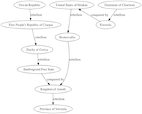

# 3.9 Bilgisayımsal Yaratıcılık

[İngilizce Metin](https://o-date.github.io/draft/book/computational-creativity.html)

🔧[[Creativity Binder](https://mybinder.org/v2/gh/o-date/creativity/master)]’ı başlatınız. 

🔧[[Sonification Binder](https://mybinder.org/v2/gh/o-date/sonification/master)]’ı başlatınız. 

Arkeolojik veriler dijital hale geldiğinde bilimsel ve akademik katılımın dar görüş alanından kurtulabilir. Yapmalı mı? Bir kez dünyaya yayıldığında, onun üzerindeki akademik otoritemizi kaybederiz çünkü yeniden karıştırılabilir, yeniden bir araya getirilebilir ve çeşitli amaçlar için parçalara ayrılabilir; bunların hepsi politik, etik veya ahlaki açıdan geçerli değildir. Ancak arkeolojinin büyük bir kısmının kamu tarafından finanse edildiği göz önüne alındığında, bu tür şeylerin olacağının farkında olmalıyız ve okuyucularımızı, halklarımızı bu materyallerle geçmişin insanlarının hakkını ve ayrıca geleceğin ihtiyaçlarını verecek şekilde etkileşime geçmeleri için donatmamız gerekir. Bunu başarmanın bir yolu, bu arkeolojinin sanat veya aktivist esinli çalışmalar için ham madde (malzeme) olabilmesi için veri ve araçlar sağlamaktır.

Bu, açık erişimli [[Epoiesen: A Journal for Creative Engagement in History and Archaeology](https://epoiesen.library.carleton.ca/about/)] dergisinin mantığının bir parçasıdır. Hakkında sayfasından şunu öğreniyoruz:


    Arkeoloji arkeologların, tarih ise tarihçilerin işidir diye bir algı var. Bizim tarafımızda, belki de uzman olmayan kitlelere konuşmanın daha düşük bir görev olduğu, her zaman yaptığımıza benzemeyen şeyler yazan/yaratan insanların gerçekten ‘ciddi’ olmadığı gibi bir algı var. Bu algı boşluklarında, geçmişin karmaşıklığını anlatmakta başarısız oluyoruz ve geçmişin özellikle popülist siyasi amaçlar için kullanılmasına, istismar edilmesine veya görmezden gelinmesine izin veriyoruz. “Hiç bir şey bilmeyenler” yürüyüşe geçti. Buna seyirci kalmamalıyız.

    Böyle bir boşlukta, geçmişle eleştirel ve yaratıcı bir etkileşime ihtiyaç vardır. Bill White, Succinct Research’ de toplumun arkeologların varlığına neden izin verdiğini hatırlatıyor: ‘geçmişin fısıltılarını bugün de duyulabilmeleri için kendimize özgü bir şekilde güçlendirmek’. Bu görevi yerine getirebileceğimiz yolları sınırlandırarak bu konuda başarısız oluyoruz.

Bu bölümde, arkeolojik verileri çeşitli şekillerde – tuhaf bir arkeolojik Twitterbot’tan sonifikasyona, glitch fotoğrafına ve dünya inşasına kadar –  yeniden karıştırmak için üretken bilişimsel yaklaşımları kullanmanın yollarını keşfediyoruz 

Yaratıcı katılım konusuna giriş niteliğindeki bu çalışmayı tamamlamak üzere son sözü James Ryan’a bırakıyoruz. Ryan, California Santa Cruz Üniversitesi’nde ‘Sheldon County’deki hayali bir kasabanın hikayesini anlatan bir podcast oluşturmak için benzer yöntemler kullanan bir doktora öğrencisi.  Projesiyle ilgili iyi bir tartışma [[eurogamer.net](https://www.eurogamer.net/articles/2018-07-14-the-us-town-ruled-by-an-ai-storyteller)]. adresinde bulunabilir. Ryan diyor ki,

    “Kodlamayı normal okuryazarlık gibi işleyen bir tür okuryazarlık olarak görüyorum: yazı nasıl sıkıcı, sıradan, işlevsel olandan yaratıcı, şiirsel, derin olana kadar uzanan insan ifade biçimlerini mümkün kılıyorsa, kodlama da öyle. Yani bana göre, yaratıcı yazarlık yazmak için neyse, yaratıcı kodlama da kodlama için odur. Bir simülasyon üzerinde çalışarak geçirdiğim her günün, o gün çalışmayı bıraktığımda ilginç yeni olasılıkların üretilebilir olmasına yol açtığından emin olmaya çalışıyorum. Yine, tüm süreç bana, örneğin çalışmanın daha doğrusal olduğu yazarlığın aksine, bir tür heykeltraşlık gibi geliyor. Sanatçı basitçe farklı bir malzeme bağlamında çalışıyor. Yağlı boyayla çalışmak kille çalışmaktan çok farklı, bu da daktiloyla çalışmaktan çok farklı ve bunların hepsi kodla çalışmaktan farklı. Ancak bunların hepsi birer ifade aracıdır.”

Dijital arkeolojik verilerle yaratıcı etkileşim ve kodlamanın anlamlı kullanımı, halkın arkeoloji hakkında bilgi edinme yolları açısından ne olabilir? Ya da dünyaya arkeolojik bir mercekten nasıl bakılır?

## 3.9.1 Tracery’li Twitterbot’lar

Bu bölüm Graham’ın Tracery hakkındaki Programming Historian’daki dersinin ([[Programming Historian lesson on Tracery](https://programminghistorian.org/en/lessons/intro-to-twitterbots)])  bazı kısımlarını yeniden kullanır, benimser ve değiştirir

Açıkça söylemek gerekirse, bir twitter botu, bir Twitter hesabını otomatik olarak kontrol etmek için kullanılan bir yazılım parçasıdır. Bunlardan binlercesi oluşturulduğunda ve aşağı yukarı aynı mesajı tweetlediklerinde, Twitter’daki söylemi şekillendirme yeteneğine sahip olurlar ve bu da diğer medya söylemlerini etkileyebilir. Bu tür botlar [[güvenilir bilgi kaynakları olarak bile görülebilirler](http://www.sciencedirect.com/science/article/pii/S0747563213003129)]. [[Documenting the Now](http://www.docnow.io/)] gibi projeler, araştırmacıların güncel olaylarla ilgili sosyal medya arşivleri oluşturmasına ve sorgulamasına olanak tanıyan ve doğal olarak bot tarafından oluşturulan birçok gönderiyi içerecek araçlar yaratıyor.  Burada tracery.io generative grammar ([[tracery.io generative grammar](http://tracery.io/)]) ve [[Cheap Bots Done Quick](http://cheapbotsdonequick.com/)] hizmetini kullanarak basit bir twitterbotunun nasıl oluşturulabileceğini gösteriyoruz. Tracery birden fazla dilde mevcuttur ve web sitelerine, oyunlara, botlara entegre edilebilir. Buradan[[github](https://github.com/galaxykate/tracery/tree/tracery2)]’a ayrılabilirsiniz.

Bir Twitterbot’u (ya da herhangi bir sosyal medya otomasyonunu) bu şekilde oluşturmanın itici gücü, bizi harekete geçirecek, bize ilham verecek, bize meydan okuyacak başka türlü var olamayacak şeyler yaratmaktır. Örneğin arkeolog Sara Perry, bu tür amaçlar için botlardan yararlanan ‘Duygusal: Kültürel miras için hikaye anlatımı’ (‘E[[motive: Storytelling for cultural heritage](https://www.emotiveproject.eu/)]’)  projesine liderlik ediyor.  Bu tür otomatların kullanımında hiciv için yer vardır; yorum için yer vardır.  Mark Sample ile ‘inanç botlarına’ (‘[[bots of conviction](https://medium.com/@samplereality/a-protest-bot-is-a-bot-so-specific-you-cant-mistake-it-for-bullshit-90fe10b7fbaa)]’) ihtiyaç olduğuna inanıyoruz.

Bunlar protesto botları, o kadar güncel ve yerinde botlar ki başka bir şeyle karıştırılamazlar. Örneğe göre, bu tür botlar şöyle olmalıdır

topical (güncel) – Bunlar Sabah haberleri ve haberlere yansımayan kötü şeylerle (daily horrors) ilgilidirler.

data-based (veriye dayalı) – Bunlar araştırmalardan, istatistiklerden, elektronik tablolardan, veri tabanlarından yararlanırlar. Botların bilinçaltı yoktur, bu nedenle kullandıkları tüm görsel harfi harfine alınmalıdır. 

cumulative (kümülatif)–  Tekrar kendi üzerine oluşuyor, bot temasını durmaksızın tekrarlıyor, inatçı ve ezici, ekranlarımızda bir enkaz yığını.

oppositional (muhalif) – protesto botları bir duruş sergiliyor. Toplum ne olursa olsun, bu duruş muhtemelen popüler olmayacak, hatta belki de sinir bozucu olacaktır.

uncanny (tekinsiz)– Gizli tutmaya çalıştığımız şeyin görünüşü.

Bu tür protesto robotları arkeolojik açıdan nasıl görünürdü? Tarihçi Caleb McDaniel’in [[her 3 dakikada](https://translate.google.com/website?sl=auto&tl=tr&hl=tr&u=https://twitter.com/Every3Minutes)] ([[every 3 minutes](https://twitter.com/Every3Minutes)] ) bir botu, Antebellum South’da her üç dakikada bir bir insanın köle olarak satıldığını acımasızca hatırlatmasıyla bizi utandırıyor.

Twitter’da arkeolojiye yönelik inanç botlarının neye benzeyebileceğine dair bir soruya yanıt veren kişiler bazı fikirler önerdi:

    @electricarchaeo a bot tweeting full-resolution images of cultural heritage locked behind tile viewers and fraudulent copyright claims by their holding inst? — Ryan Baumann (@ryanfb) April 22, 2017

    @electricarchaeo, karo görüntüleyicilerinin arkasında kilitlenmiş kültürel mirasın tam çözünürlüklü görüntülerini ve holding kurumları tarafından yapılan hileli telif hakkı iddialarını tweetleyen bir bot mu? – Ryan Baumann (@ryanfb) 22 Nisan 2017

    @electricarchaeo A bot tweeting pictures of Native American sacred places that have been desecrated in the name of corporate greed. — Cory Taylor (@CoryTaylor_) April 22, 2017

    @electricarchaeo Şirketlerin açgözlülüğü uğruna kirletilen (saygsızlığa uğrayan) Kızılderili kutsal mekanlarının fotoğraflarını tweetleyen bir bot. – Cory Taylor (@CoryTaylor_) 22 Nisan 2017

    @electricarchaeo A bot tweeting the identities of historical assets given inheritance #tax exemption because they are “available” to public view — Sarah Saunders (@Tick_Tax) April 22, 2017

    @electricarchaeo Kamuya “açık” oldukları için miras #vergi muafiyeti tanınan tarihi varlıkların kimliklerini tweetleyen bir bot – Sarah Saunders (@Tick_Tax) 22 Nisan 2017

    @electricarchaeo Every time someone says “since the beginning of time, humans have” automatically responding BULLSHIT — Colleen Morgan (@clmorgan) April 22, 2017

    @electricarchaeo Ne zaman biri “zamanın başlangıcından beri insanlar bunu yaptı” dese otomatik olarak SAÇMALIK cevabı veriliyor – Colleen Morgan (@clmorgan) April 22, 2017

Web’de çok fazla tarihi veya arkeolojik verinin [[JSON](http://json.org/)]olarak ifade edildiği göz önüne alındığında, biraz araştırma yaparak kendi botunuza katabileceğiniz veriler bulabilirsiniz. Graham farklı hizmetler tarafından desteklenen birkaç bot inşa etti. Kendisi şöyle yazıyor,

    En başarılı botum, korkunç, işlevsiz bir arkeolojik kazı projesinin sahnelerini tweetleyen bir bot olan [http://twitter.com/tinyarchae] oldu. Her arkeolojik proje cinsiyetçilik, istismar ve kötü niyet sorunlarıyla ilgilenir; @tinyarchae konferans fısıltılarını gülünç bir uç noktaya taşıyor. Bu, içinde rahatsız edici bir gerçeklik barındıran bir karikatür. Yaptığım diğer botlar arkeolojik fotoğrafçılıkta ([https://twitter.com/archaeoglitch]) hata veriyor; bir tanesi [https://twitter.com/botarchaeo] ([https://twitter.com/botarchaeo] ) ve böylece bir araştırma asistanı olarak hizmet ettiği için aslında yararlı. (Botların kamusal arkeolojide oynadığı rol hakkında daha fazla bilgi için [https://publicarchaeologyconference.wordpress.com/]‘ndaki bu [https://electricarchaeology.ca/2017/04/27/bots-of-archaeology-machines-writing-public-archaeology/]na bakabilirsiniz).


### 3.9.1.1 Planlama: Botunuz ne yapacak?

Kağıt ve defterle başlıyoruz. İlkokulda bir çocuk olarak, İngilizce dilbilgisinin temellerini öğrenmek için sık sık yaptığımız bir etkinliğe ‘mad-libs’ (‘silly – mad – ad libs’ gibi) denirdi. Bu aktiviteyi yapan öğretmen sınıftan, diyelim ki, bir isim, sonra bir zarf, sonra bir fiil ve sonra başka bir zarf listelemelerini isterdi. Sonra kağıdın diğer tarafında aşağıdaki gibi boşluklar olan bir hikaye olurdu:

“Susie the _noun_ was _adverb_ _verb_ the _noun_.” (“Susie _ isim_ zamir_ zaerf_fiil_tanım edatı_ isim_.”)

ve öğrenciler boşlukları uygun şekilde doldururlardı. Aptalcaydı; ve eğlenceliydi. Spor arabalar at arabaları için neyse, Twitter robotları da madlibs’ler (madlibs: isim, şehir ve hayvan tarzı bir oyun) için odur. Doldurabileceğimiz boşluklar svg vektör grafiklerindeki değerler olabilir. Sayısal dosya adlarındaki sayılar olabilir (ve böylece örneğin açık bir veritabanına rastgele bağlantılar tweetlenebilir). Evet, isimler ve zarflar bile olabilirler. Twitterbot’lar web üzerinde yaşadıkları için, bir araya getirdiğimiz yapı taşları metinden daha fazlası olabilir (ancak şimdilik metinle çalışmak en kolayı olacaktır).

Bir yedek gramer taslağı çizerek başlayacağız. Bu gramerin kuralları Kate Compton (Twitter’da ([[@galaxykate](https://twitter.com/galaxykate)] ) tarafından geliştirilmiştir; adı [[Tracery.io](http://tracery.io/)]‘dur. Web sayfalarında, oyunlarda ve botlarda bir javascript kütüphanesi olarak kullanılabilir. Bir yedek gramer, çocukken hatırlayabileceğiniz madlib’lere oldukça benzer şekilde çalışır.

Dilbilgisinin ne yaptığını netleştirmek için şimdilik çalışan bir bot oluşturmayacağız. Önce gramerin ne yaptığını netleştireceğiz ve böylece gramerin nasıl çalıştığını ortaya çıkarmak için gerçeküstü bir şey inşa edeceğiz.

Saksıdaki bir bitkinin sesiyle konuşan bir bot yaratmak istediğinizi hayal edelim – buna plantpotbot diyelim. Plantpotbot ne tür şeyler söyleyebilir? Bazı fikirleri not edin-

    I am a plant in a pot. How boring it is!
    Please water me. I’m begging you.
    This pot. It’s so small. My roots, so cramped!
    I turned towards the sun. But it was just a lightbulb
    I’m so lonely. Where are all the bees?
            Ben saksıda bir bitkiyim. Ne kadar sıkıcı!
            Lütfen beni sula. Sana yalvarıyorum.
            Bu saksı. Çok küçük. Köklerim, çok sıkışık!
            Güneşe doğru döndüm. Ama o sadece bir ampuldü.
            Çok yalnızım. Arılar nerede?

Şimdi bu cümlelerin nasıl kurulduğuna bakalım. Kelimeleri ve cümleleri sembollerle değiştireceğiz böylece orijinal cümleleri yeniden oluşturabiliriz.. ‘Ben’ ile birlikte olan birçok cümle var. Bir ‘varlık’ sembolü düşünmeye başlayabiliriz :

```
"being": "am a plant","am begging you","am so lonely","turned towards the sun"
```

Bu gösterim bize “varlık” sembolünün “ben bir bitkiyim”, “sana yalvarıyorum” ve benzeri ifadelerle değiştirilebileceğini (veya bunlara eşdeğer olduğunu) söylüyor.

Botumuzda sembolleri ve metinleri karıştırabiliriz. Eğer bota “ben” kelimesiyle başlamasını söylersek, ondan sonra “olmak” sembolünü ekleyebilir ve ifadeyi “bir bitkiyim” veya “güneşe doğru döndüm” ile tamamlayabiliriz ve cümle dilbilgisi açısından anlamlı olacaktır. Başka bir sembol oluşturalım; belki buna ‘yer’ adını veririz:

```
"placewhere": "in a pot","on the windowsill","fallen over"
```

(“placewhere” is the symbol and “in a pot” and so on are the rules that replace it)

(“yer” semboldür ve “bir saksıda” vb. onun yerine geçen kurallardır )

Şimdi, beyin fırtınamızdaki cümlelerde ‘pencere kenarında’ ifadesini hiç kullanmadık, ancak ‘bir saksıda’ ifadesini bir kez tanımladığımızda, başka potansiyel eşdeğer fikirler de ortaya çıkıyor. Botumuz sonunda bu sembolleri cümleler oluşturmak için kullanacaktır. ‘Varlık’, ‘yer’ gibi semboller, madlib’lerimizin isimler, zarflar ve benzerlerinden oluşan bir liste istemelerine benziyor. Sonra aşağıdakileri botumuza ilettiğimizi hayal edin:

```
"I #being# #placewhere#"
```

Olası sonuçlar şöyle olacaktır:

    I am so lonely on the windowsill
    I am so lonely in a pot
    I turned toward the sun fallen over
            Pencere kenarında çok yalnızım
            Bir saksıda çok yalnızım
            Üzerine düşen güneşe doğru döndüm.

İnce ayar yaparak ve ifade birimlerini daha küçük sembollere bölerek, herhangi bir ifade yetersizliğini düzeltebiliriz (ya da sesi daha ‘otantik’ hale getirmek için onları bırakmaya karar verebiliriz).

### 3.9.1.2 Tracery düzenleyicisi ile prototip oluşturma

[[www.brightspiral.com/tracery/](http://www.brightspiral.com/tracery)] adresinde bir Tracery editörü var. Plantpotbot’taki karışıklıkları gidermek için bunu kullanacağız. Editör, gramerin sembollerinin ve kurallarının etkileşim şeklini (nasıl iç içe geçtiklerini ve gramerinizin ne tür çıktılar üreteceğini) görselleştirir. Düzenleyiciyi yeni bir pencerede açın.

Sol üstteki ‘tinygrammar’ olarak işaretlenmiş açılır menüde, keşfedebilecek başka örnek gramerler vardır; bunlar Tracery’nin ne kadar karmaşık hale gelebileceğini gösterirler. Şimdilik, ‘tinygrammar’ ile kalın. Bu düzenleyicinin güzel yanlarından biri de ‘renkleri göster’ düğmesine basarak her bir sembolü ve kurallarını renklerle kodlayabilmeniz ve oluşturulan metni renklerle kodlayarak hangi öğenin hangi sembole ait olduğunu görebilmenizdir.

Varsayılan dilbilgisinde bir sembole (name or occupation) çift tıklar ve silme tuşuna basarsanız, sembolü dilbilgisinden kaldırırsınız. Bunu ‘isim’ ‘name’ ve ‘meslek’ ‘occupation’ için de yapın, geriye sadece ‘köken’ ‘origin’ kalsın. Şimdi, ‘yeni sembol’ düğmesine tıklayarak yeni bir sembol ekleyin. İsme (symbol1) tıklayın ve ismini being olarak değiştirin.  +  işaretine tıklayın ve yukarıdaki kurallarımızdan bazılarını ekleyin.  placewhere adında yeni bir sembol için tekrarlayın.

As you do that, the editor will flash an error message at the top right, ‘ERROR: symbol ’name’ not found in tinygrammar’. This is because we deleted name, but the symbol origin has as one of its rules the symbol name! This is interesting: it shows us that we can nest symbols within rules. Right? We could have a symbol called ‘character’, and character could have sub-symbols called ‘first name’, ‘last name’ and ‘occupation’ (and each of these containing an appropriate list of first names and last names and occupations). Each time the grammar was run, you’d get e.g. ‘Shawn Graham Archaeologist’ and stored in the ‘character’ symbol

Bunu yaptığınızda, editör sağ üstte bir hata mesajı gösterecektir,  ‘ERROR: symbol ’name’ not found in tinygrammar’ (‘HATA: tinygrammar’da ‘name’ sembolü bulunamadı’). Bunun nedeni, name yani ismi silmiş olmamız, ancak sembol kökeninin (origin) kurallarından biri olarak sembol ismine (name!) sahip olmasıdır! Bu ilginçtir: bize sembolleri kurallar içinde yerleştirebileceğimiz gösterir. Değil mi? ‘Karakter’ (character) adında bir sembolümüz olabilir ve karakterin ‘ad’, ‘soyad’ ve ‘meslek’ (‘first name’, ‘last name’, ‘occupation’) adında alt sembolleri olabilir (ve bunların her biri uygun bir ad, soyad ve meslek listesi içerir). Gramer her çalıştırıldığında, örneğin ‘Shawn Graham Arkeolog’ adını alır ve ‘karakter’ sembolünde saklanır.

Burada ilginç olan bir diğer şey de kökenin (origin) özel bir sembol olmasıdır. Metnin nihai olarak üretildiği semboldür (the grammar is flattened here). O halde plantpotbot’un konuşabilmesi için origin  sembolünün kuralını değiştirelim. (Bir kural içinde başka bir sembole referans verdiğinizde, onu #  işaretleriyle sararsınız, bu yüzden bu okunmalıdır: #being# #placewhere#

It still is missing something – the word ‘I’. You can mix ordinary text into the rules. Go ahead and do that now – press the + beside the rule for the origin symbol, and add the word ‘I’ so that the origin now reads I #being# #placewhere#. Perhaps your plantbot speaks with a poetic diction by reversing #placewhere# #being#.

Hala bir şey eksik – ‘ben’ (‘I’) kelimesi. Sıradan bir metni kuralların içine karıştırabilirsiniz. Devam edin ve şimdi bunu yapın – origin sembolü kuralının yanındaki + işaretine basın ve ‘Ben (I)’ kelimesini ekleyin, böylece orijin şimdi I #being# #placewhere# şeklinde okunur. Belki de plantbotunuz #placewhere# #being# kelimelerini tersine çevirerek şiirsel bir diksiyonla konuşuyordur.

Editörde ‘kaydet’ (save) tuşuna basarsanız, grameriniz zaman damgalı olacak ve gramerlerin açılır listesinde görünecektir. Tarayıcınızın önbelleğine kaydedilir; Eğer önbelleği temizlerseniz bunu kaybedersiniz.

Devam etmeden önce, incelememiz gereken son bir şey var. Editördeki JSON düğmesine basın. Şuna benzer bir şey görmelisiniz:
```
{
    "origin": [
        "I #being# #placewhere#"
    ],
    "being": [
        "am so lonely",
        "am so lonely",
        "am begging you",
        "am turned towards the sun"
    ],
    "placewhere": [
        "in a pot",
        "in a windowsill",
        "fallen over"
    ]
}
```

Her Tracery grameri aslında Tracery’nin semboller ve kurallar olarak adlandırdığı anahtar/değer çiftlerinden oluşan bir JSON nesnesidir. (JSON manipülasyonu hakkında daha fazla bilgi için lütfen[[ Matthew Lincoln tarafından hazırlanan bu eğitim](https://o-date.github.io/lessons/json-and-jq)]e bakın). Bu, botumuzu tweet atmaya başlamak için gerçekten ayarladığımızda kullanacağımız formattır. JSON titizdir. Sembollerin kurallar gibi ” içine nasıl sarıldığına dikkat edin, ancak kurallar da [ and ] içinde virgüllerle listelenir. Unutmayın:

```
{
  "symbol": ["rule","rule","rule"],
  "anothersymbol": ["rule,","rule","rule"]
}
```

(elbette sembollerin ve kuralların sayısı önemli değildir, ancak virgüllerin doğru olduğundan emin olun!)

JSON’u bir metin editörüne kopyalamak ve başka bir kopyasını güvenli bir yere kaydetmek iyi bir uygulamadır.

### 3.9.1.3 Alıştırma

1- Yukarıdaki sırayı takip ederek botunuz için bir dilbilgisi oluşturun. Botunuzu ifade eden .json dosyasını kaydedin. Twitterbot’ların gücünün bir kısmının , zaman çizelgenizdeki diğer tweet’lerle ve diğer tweet’lerle tesadüfen yerleştirilmelerinden kaynaklandığını unutmayın . Botunuzun mesaj(lar)ının diğer insanların tweet’leriyle yan yana gelme potansiyeli de botun göreceli başarısını etkileyecektir. Bu çatışmaları nasıl planlayabilirsiniz?

2- Botunuz için bir Twitter hesabı edinin ve onu Cheap Bots Done Quick’e bağlayın

Bir botu kendi mevcut hesabınıza bağlayabilirsiniz, ancak muhtemelen bir botun sizin gibi veya sizin için tweet atmasını istemezsiniz. Bu durumda, yeni bir Twitter hesabı oluşturmanız gerekir. Yeni bir Twitter hesabı oluşturduğunuzda, Twitter sizden bir e-posta adresi isteyecektir. Yepyeni bir e-posta adresi kullanabilir veya bir Gmail hesabınız varsa +etiket (+tag ) hilesini kullanabilirsiniz, yani gmail’de ‘johndoe’ yerine gmail’de johndoe+twitterbot at gmail kullanabilirsiniz. Twitter bunu normal e-postanızdan farklı bir e-posta olarak kabul edecektir.

Normalde, bir Twitterbot oluştururken, twitter’da (apps.twitter.com adresinde) bir uygulama oluşturmak, tüketici sırrı ve anahtarı ile erişim belirteci ve anahtarını almak gerekir. Ardından, Twitter’ın platforma erişmeye çalışan programın izinli olduğunu bilmesi için kimlik doğrulama programlamanız gerekir.

Neyse ki George Buckenham ‘[[Cheap Bots Done Quick](http://cheapbotsdonequick.com/)]‘ adlı bot barındırma sitesini kurduğundan beri bunu yapmak zorunda değiliz. (Bu web sitesi aynı zamanda ilham kaynağı olabilecek bir dizi farklı bot için JSON kaynak gramerini de göstermektedir). Botunuzun Twitter hesabını oluşturduktan sonra – ve Twitter’da bot hesabı olarak oturum açtığınızda – Cheap Bots Done Quick’e gidin ve ‘Twitter ile oturum aç’ düğmesine basın. Site, yetkilendirmeyi onaylamak için sizi Twitter’a yönlendirecek ve ardından sizi Cheap Bots Done Quick’e geri getirecektir.

Botunuzu tanımlayan JSON ana beyaz kutuya yazılabilir veya yapıştırılabilir. JSON’u editörden alın ve ana beyaz kutuya yapıştırın. JSON’unuzda herhangi bir hata varsa, alttaki çıktı kutusu kırmızıya dönecek ve site size işlerin nerede yanlış gittiğine dair bir gösterge vermeye çalışacaktır. Çoğu durumda, bunun nedeni hatalı bir virgül veya tırnak işareti olacaktır. Çıktı kutusunun sağındaki yenileme düğmesine basarsanız (tarayıcı yenileme düğmesine DEĞİL!), site dilbilginizden yeni bir metin oluşturacaktır.

JSON kutusunun altında, botunuzun ne sıklıkta tweet atacağını, kaynak gramerinizin başkaları tarafından görülüp görülmeyeceğini ve botunuzun mesajlara veya bahsedenlere yanıt verip vermeyeceğini yöneten bazı ayarlar vardır:

Botunuzun ne sıklıkta tweet atmasını istediğinize ve kaynak dilbilgisinin görünür olmasını isteyip istemediğinize karar verin. Sonra… gerçek an. ‘Tweetle’ düğmesine basın, ardından botunuzun twitter akışını kontrol edin. ‘Kaydet’e tıklayın.

Tebrikler, bir Twitterbot oluşturdunuz!

    Tracery botlardan daha fazla güç sağlayabilir. https://lovecraftian-archaeology.glitch.me/ sitesi Tracery’yi lovecraftian etkisiyle arkeolojik alan raporları oluşturmak için kullanıyor. Kaynak kodu https://glitch.com/edit/#!/lovecraftian-archaeology adresindedir. Burada, gramer grammar.js dosyasındadır. Bu gramerde, oluşturulan hikayede yeniden kullanmak istediğimiz site adlarını ve diğer adları oluşturuyoruz. Kaynaktan (origin) başlayarak, site raporunu oluşturmak için öğelerin birbiriyle nasıl ilişkili olduğunu şemalaştırın. Ardından, dilbilgisinin nasıl çalıştığını gördükten sonra, kodu kendi kurgu-arkeolojiyle buluşuyor eserinizi yaratmak için uyarlayın.

## 3.9.1.4 İyi Bot Vatandaşlığı

Cheap Bots Done Quick, George Buckenham tarafından iyi niyet ruhuyla sunulan bir hizmet olduğundan, bu hizmeti saldırgan veya küfürlü veya diğer herkes için hizmeti bozacak botlar oluşturmak için kullanmayın. Kendisinin de yazdığı gibi,

    If you create a bot I deem abusive or otherwise unpleasant (for example, @mentioning people who have not consented, posting insults or using slurs) I will take it down

    Küfürlü veya başka bir şekilde nahoş olduğunu düşündüğüm bir bot oluşturursanız (örneğin, rızası olmayan kişilerden @bahsetmek, hakaret göndermek veya hakaret kullanmak) onu kaldırırım.

İyi bir bot vatandaşlığı için diğer ipuçları, büyük bot sanatçılarından biri olan Darius Kazemi tarafından sağlanmıştır ve [[burada](http://tinysubversions.com/2013/03/basic-twitter-bot-etiquette/)] tartışılmaktadır.

## 3.9.2 Chatbots (Sohbet Botları)

Sohbet botları, insan etkileşimini taklit etmek için tasarlanmış, farklı derecelerde başarıya sahip konuşma botlarıdır. York Üniversitesi’ndeki [[EMOTIVE](https://www.emotiveproject.eu/)] projesi, hikaye anlatımı ve kültürel miras amacıyla bu tür sohbet botlarını araştırıyor. New York Üniversitesi’nden şair ve programcı Allison Parish, bu tür sohbet botları da dahil olmak üzere çeşitli algoritmik dil araştırmaları tasarlamakta ve oluşturmaktadır. [[creativity binder](https://github.com/o-date/creativity)] ‘da Parrish’in bir not defteri var (“semantic_similarity_chatbot”), film diyaloglarından oluşan bir veritabanı üzerinde eğiterek böyle bir sohbet botu programlama konusunda size yol gösteriyor. Yazdıklarınız ile benzer yanıtlardan oluşan veritabanında bulunanlar arasındaki ‘anlamsal benzerliği’ hesaplayarak çalışıyor.

Not defteri çok iyi yorumlanmış ve sizi kavramların üzerinden detaylı bir şekilde geçiriyor. Not defterinin sonunda Parrish, bir sonraki adımda ne yapılabileceğine dair bazı önerilerde bulunuyor

    Yalnızca belirli bir film türünden replikler kullanan bir sohbet botu yapmak için Cornell derlemiyle birlikte gelen meta veri dosyasını kullanın. (Komedi sohbet botunun aksiyon sohbet botundan farkı nedir?) Tamamen farklı bir konuşma derlemi kullanın. Kendi sohbet kayıtlarınız mı? Bir romandaki karşılıklı konuşmalar mı? Haber programlarındaki röportajların transkriptleri mi?

### 3.9.2.1 Alıştırma

    Sohbet botunu ‘arkeolojik’ filmler üzerinde eğitin. Bu, arkeolojinin kamusal bilinci hakkında ne söylüyor?
     Sohbet botunu belirli bir arkeoloğun yazılarından oluşan bir külliyat üzerinde eğitin. Yanıtları keşfedin – sanal arkeoloğunuz uygulamaları hakkında ne ortaya koyuyor?

## 3.9.3 Sonification (Sonifikasyon)

Bu bölüm [[Graham’ın Programming Historian](https://programminghistorian.org/en/lessons/sonification)]’daki the sound of data adlı dersinin yani verinin sesi ile ilgili bölümlerini yeniden kullanır, benimser ve değiştirir

Arkeo-akustik üzerine pek çok araştırma olmasına rağmen (bunların çoğu ses dosyalarının dijital manipülasyonunu içerir), bu bölümde tam tersi bir yol izlemek istiyoruz – verilerimizin işitsel temsillerini oluşturmak.

Verilerden elde edilen hoş ya da uyumsuz sesler, bir şeylerin yanlış gittiğine dair uyarı tonlarından [[çevresel bozulmaya](https://datadrivendj.com/tracks/louisiana/)] dikkat çekmeyi amaçlayan sanatsal müdahalelere ve [[mekan üzerindeki](https://datadrivendj.com/tracks/subway/)] ekonomik eşitsizliğe kadar pek çok farklı şeyi işaret etmek için kullanılabilir.

Başlangıç olarak, sonifikasyon verilerinizi tekrar tanıdık hale getirmek için yararlı bir keşif tekniğidir. Onu tercüme ederek, kodlarını dönüştürerek, [[iyileştirerek](http://blog.taracopplestone.co.uk/making-things-photobashing-as-archaeological-remediation/)], görsel ifade biçimlerine olan aşinalığımızın bizi kör ettiği veri unsurlarını görmeye başlarız. Bu bozulma bu deformasyon, örneğin Mark Sample’ın [[breaking things](http://www.samplereality.com/2012/05/02/notes-towards-a-deformed-humanities/)] ya da Bethany Nowviskie’nin  ‘[[resistance in the materials](http://nowviskie.org/2013/resistance-in-the-materials/)]’ tarafından öne sürülen argümanlarla uyumludur. Sonifikasyon bizi veriden capta’ya, sosyal bilimden sanata, [[glitch’ten estetiğe](http://nooart.org/post/73353953758/temkin-glitchhumancomputerinteraction)] ( glitch to aesthetic) uzanan bir süreklilik içinde hareket ettiriyor. Bakalım tüm bunlar kulağa nasıl geliyor.

Sonifikasyon, ses sinyalleri üretmek için verilerin yönlerini haritalama uygulamasıdır. Genel olarak, bir teknik belirli koşulları karşılıyorsa ‘sonifikasyon’ olarak adlandırılabilir. Bunlar arasında tekrarlanabilirlik (aynı verilerin diğer araştırmacılar tarafından aynı yollarla dönüştürülebilmesi ve aynı sonuçları vermesi) ve anlaşılabilirlik – orijinal verilerin ‘nesnel’ unsurlarının ortaya çıkan sese sistematik olarak yansıtılması – sayılabilir (sonifikasyon taksonomisi için [[Hermann](https://o-date.github.io/draft/book/computational-creativity.html#Hermann)] [[2008](http://www.icad.org/Proceedings/2008/Hermann2008.pdf)]‘e bakınız). [[Last and Usyskin](https://o-date.github.io/draft/book/computational-creativity.html#Last)] ([[2015](https://www.researchgate.net/publication/282504359_Listen_to_the_Sound_of_Data)]), veriler seslendirildiğinde ne tür veri analizi görevlerinin gerçekleştirilebileceğini belirlemek için bir dizi deney tasarlamıştır. Deneysel sonuçları (Last ve Usyskin 2015), eğitimsiz dinleyicilerin (müzik konusunda resmi eğitimi olmayan dinleyiciler) bile verilerde faydalı ayrımlar yapabildiğini göstermiştir. Onlar, dinleyicilerin seslendirilmiş verilerde sınıflandırma ve kümeleme gibi yaygın veri keşif görevlerini ayırt edebildiklerini buldular. (Seslendirilmiş çıktıları, altta yatan verileri Batı müzikal skalasıyla eşleştirdi).

Last ve Usyskin zaman serisi verilerine odaklanmıştır. Zaman serisi verilerinin sonifikasyon için özellikle uygun olduğunu çünkü müzikal ses ile doğal paralellikler olduğunu savunmaktadırlar. Müzik sıralıdır, süresi vardır ve zaman içinde gelişir; zaman serisi verileri de öyledir ([[Last and Usyskin 2015: 424](https://www.researchgate.net/publication/282504359_Listen_to_the_Sound_of_Data)]). Bu, verileri uygun sonik çıktılarla eşleştirme sorunu haline gelir. Birçok sonifikasyon uygulamasında, [[saha](https://o-date.github.io/draft/book/computational-creativity.html#pitch)], varyasyon, mükemmellik ve başlangıç gibi çeşitli işitsel boyutlar boyunca verilerin yönlerini birleştirmek için ‘parametre eşleme’ adı verilen bir teknik kullanılır. Bu yaklaşımla ilgili sorun, orijinal veri noktaları arasında zamansal bir ilişki (ya da daha doğrusu doğrusal olmayan bir ilişki) olmadığında, ortaya çıkan sesin ‘kafa karıştırıcı’ olabilmesidir (2015: 422).

[[Sonification notebook](https://translate.google.com/website?sl=auto&tl=tr&hl=tr&u=https://mybinder.org/v2/gh/o-date/sonification/master)] içinde, zaman serisi verilerini 88 tuşlu klavyeyle eşleme sürecini inceliyoruz. Kodda kullanılabilecek bir dizi farklı yöntem göreceksiniz.

Veriler json’da temsil edilir:

```
my_data = [
    {'event_date': datetime(1792,6,8), 'magnitude': 3.4},
    {'event_date': datetime(1800,3,4), 'magnitude': 3.2},
    {'event_date': datetime(1810,1,16), 'magnitude': 3.6},
    {'event_date': datetime(1812,8,23), 'magnitude': 3.0},
    {'event_date': datetime(1813,10,10), 'magnitude': 5.6},
    {'event_date': datetime(1824,1,5), 'magnitude': 4.0}
]
```

Buradaki ikinci değerin adı ‘büyüklük’ (‘magnitude’), ancak herhangi bir şey olabilir – sayılar, yüzde, ortalamalar. Örnek koddaki ilk değer python’un datetime formatını kullanır ve bu nedenle örnekteki gibi yazılmalıdır. Ne yazık ki, datetime yalnızca MS 1’den sonraki tarihler için çalışır. Bu da birçok arkeoloğu ilgilendiren tarihler için bu yaklaşımın ya kullanışlı olmayacağı ya da tarihleri doğru bir şekilde ifade etmek için çok fazla çaba gerektireceği anlamına gelir.

Bu ilk bakışta göründüğü kadar büyük bir sorun değildir. Gerçek takvim tarihi önemli değildir; önemli olan iç ilişkidir. Yani, biz dinlerken sonifikasyonun evrimiyle temsil edilen zaman içindeki evrimle ilgileniyoruz. Bu durumda, seslendirmek istediğimiz aşağıdaki verilere sahip olduğumuzu varsayalım:

```
Phase 1: 234 sherds of pottery A
Phase 2a: 120 sherds of pottery A
Phase 2b: 45 sherds of pottery A
Phase 3: 47 sherds of pottery A
Phase 1: 120 sherds of pottery B
Phase 1: 34 sherds of pottery B
Phase 2a: 200 sherds of pottery B
Phase 2b: 180 sherds of pottery B
Phase 3: 87 sherds of pottery B
```

ve 1. ve 3. Aşamalar arasında yaklaşık 20 yıl olduğunu bildiğimize göre, A çömleği için bunu şu şekilde ifade edebiliriz:
```
my_data = [
    {'event_date': datetime(1010,1,1), 'magnitude': 234},
    {'event_date': datetime(1020,1,1), 'magnitude': 120},
    {'event_date': datetime(1025,1,1), 'magnitude': 45},
    {'event_date': datetime(1030,1,1), 'magnitude': 47}
]
```

…kodu çalıştırın, çıktıyı kaydedin ve ardından aynı şeyi çömlek B için tekrar yapın.

### 3.9.3.1 Alıştırma

1- Seslendirmek istediğiniz bazı verileri toplayın. Nihai kompozisyonunuzdaki her bir potansiyel ‘sesi’ ifade etmek için yukarıdaki gibi bir dizi oluşturun. Ne ‘duyabileceğinizi’ düşünüyorsunuz?

2- Bu verileri temsil etmek için Programming Historian’daki sonification eğitimini Musicalgorithms kullanarak deneyin. Bu yaklaşım ile burada miditime kullanılarak detaylandırılan yaklaşım arasındaki temel fark nedir? Nasıl farklılaşıyor ve bu neye benziyor? Bu farklılıkları arkeolojideki temel kavramları halka açık bir kitleye açıklamak için nasıl kullanabileceğinizi taslak olarak çizmeye çalışın.
    
3- miditime’ın zaman serisi verilerini seslendirme yaklaşımını keşfetmek için [[jupyter notebook](https://mybinder.org/v2/gh/o-date/sonification/master)] başlatın. Çoklu sesler oluşturun ve Garageband veya [[Audacity](https://www.audacityteam.org/)] kullanarak bunları birbirine karıştırın. Bu işi yapmak için ne gibi yaratıcı kararlar almanız gerekiyor? Bunlar verileri ya da duyabildiklerinizi nasıl değiştiriyor? Ne duyuyorsunuz – ve bunun anlamı ne olabilir?

## 3.9.4 Dünya İnşası

🔧 [[Binder’daki World-Building](https://mybinder.org/v2/gh/o-date/creativity2/master)]’i başlatın. 

Video oyunlarında ‘prosedürel içerik üretimi’ adı verilen ve oyunun dünyasını, oynadığınızda her zaman benzersiz olacak şekilde yaratan bir yaklaşım vardır. Minecraft, prosedürel içerik üretimini kullanan bir oyundur; No Man’s Sky ise bir diğeridir.[[ creativity2 binder](https://github.com/o-date/creativity2)] klasöründe ‘WorldBuilding’ adında bir alt klasör vardır ve ‘model demo’ adında bir not defteri içerir. Bu not defteri, M[[artin O’Leary](https://twitter.com/mewo2)]‘ nin  [[Creating Fantasy Maps](http://mewo2.com/notes/terrain/)] dersinden sonra, arazinin yükseklik ve kenarlar boyunca simüle edilmiş su erozyonu ile bir dizi Voronoi çokgeni olarak modellendiği belirli çevresel süreçleri simüle ederek bir dünya oluşturur. Göçebeler bu arazide hareket eder ve etrafından dolaşarak hareket yollarının ve şehirlerin ortaya çıkmasını sağlar. Bu şehirler daha sonra iyi bilinen [[Axelrod Tribute Model](http://www-personal.umich.edu/~axe/research/Building.pdf)] izleyerek etkileşime girer. Bu gösterimin son unsurları, bu dünyanın ‘tarihini’ anlatan bir tür tarih oluşturur.

Prosedürel geçmiş oluşturucunun başka bir türü, aynı klasörde ‘history generator’ klasöründe bulunabilir; bu aynı zamanda ‘history’ görselleştirilmesine de izin verir:


Scriptin çıktısı

Bu senaryo çok basit bir durumun oluşumu, füzyon ve fizyon modeli içermektedir. Ayrıca ortaya çıkan kroniği ‘canlandırmak’ (‘liven up’ ) için bir Tracery dilbilgisi de içermektedir. Son bir özellik olarak, zaman içindeki ilişkileri görselleştirmek için graphviz kütüphanesini kullanır.

### 3.9.4.1 Alıştırmalar

1- Etkileşimin altında yatan modelleri inceleyin. Bunların teorik temelleri nelerdir? Bu üretken dünyaları/tarihleri daha ‘gerçek’ kılmak için neyin değiştirilmesi gerekir?

2- Bu tür üretken tarihler kamusal arkeoloji için nasıl kullanılabilir?
