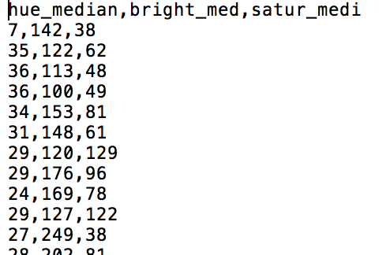
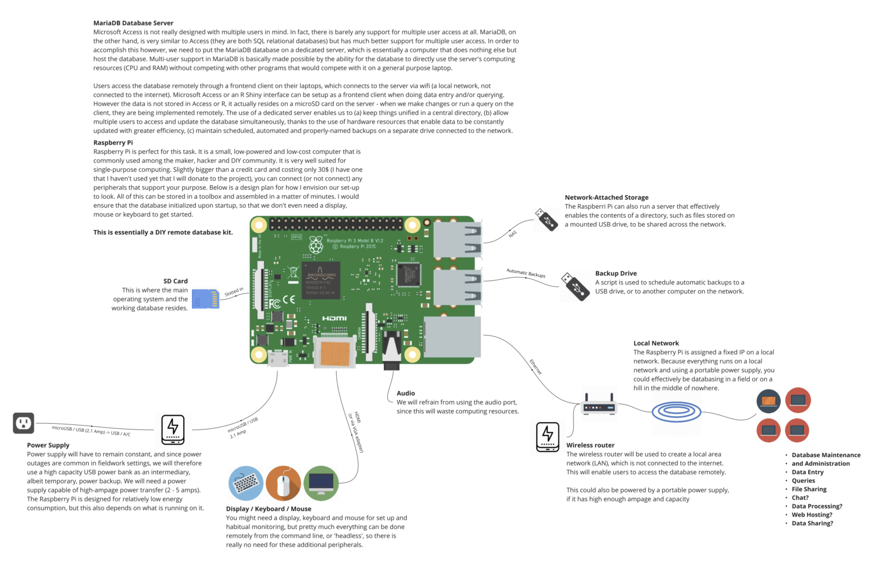
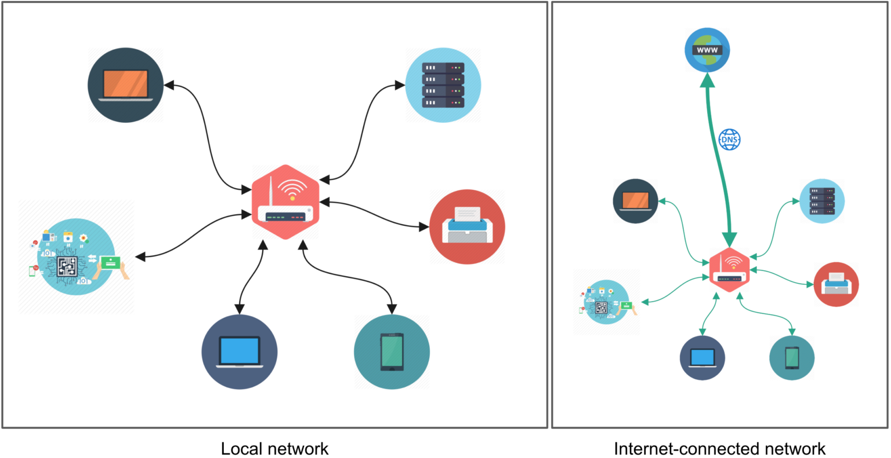
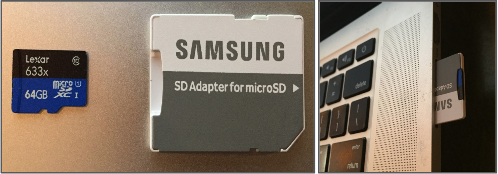

# 4.2 3B Baskı, Raspberry Pi ve “Maker” Arkeolojisi

[[İngilizce Metin](https://o-date.github.io/draft/book/d-printing-raspberry-pi-and-maker-archaeology.html)] 

Bu bölüm geliştirme aşamasındadır.

## 4.2.1 Genel Bakış

Genel olarak bir ‘maker’ yaklaşımı, anlık zanaat çalışmasının yaratıcı bir sürecidir ve düzenli şeylerin gelişimine öğrenme ve katkıda bulunmayı içerir. Bu, herkesin herhangi bir şeyi (ama her şeyi değil!) öğrenme veya yapma yeteneklerini tanıyan, kapsayıcı, topluluk odaklı bir harekettir. Yapıcılar -makers- araçlarını ve deneyimlerini doğrudan diyalog yoluyla ve başkalarıyla birlikte çalışarak, kodları ve kaynakları erişilebilir formatlarda çevrimiçi olarak yayınlayarak, açık ve destekleyici bilgi alışverişi ekosistemlerini büyüterek paylaşırlar. Başarısız olmak, sunduğu benzersiz fırsatlar ile öğrenmeyi sağlayarak yapma -yaratma- eyleminin bir parçası olarak kabul edilir.
Her ne kadar ‘yapım’ genellikle dijital teknolojiyi içerse de, son derece açık uçludur. Çömlekçilik, iğne işi, mantar toplama, kuş gözlemciliği, ağaç işleme, doğaçlama eğlence ve hatta arkeolojik kazı gibi el sanatları da benzer ilkelere dayanır ve bazen bilgisayar teknolojisiyle eğlenceli ve işlevsel şekillerde etkileşebilir. Bu bölümde, okuyucuyu 3D baskı ve Raspberry Pi mikrobilgisayarlarının kullanımıyla ilerlemelerine olanak tanıyan açık uçlu bir şekilde rehberlik ediyoruz, böylece bu çalışmayı kendi başınıza sürdürebilir ve öğrendiklerinizi çeşitli durumlarda uygulayabilirsiniz.

## 4.2.2 3b Baskı – Bir İş Akışı

Aşağıda açıklanan iş akışında, katı bir şekilde ‘3 boyutlu’ olarak gerçek dünyada üç boyutta var olmayan çeşitli verileri 3D olarak bastırmak tamamen mümkündür. Örneğin, bir arkeolojik alan fotoğraf koleksiyonunun ton, renk ve doygunluk değerleri çıkartılabilir ve x = renk tonu, y = renk ve z = doygunluk olarak temsil edilen bir nesneyi 3D olarak bastırılabilir.


İnstagram’dan toplanan, 9000 adet insan kalıntılarını satan görsellerin renk tonu, renk ve doygunluk değerleri

Kullanıcılar x, y, z değerlerini elde edecek ve bu değerleri x, y değerlerini kullanarak noktalar olarak temsil edeceklerdir. Z değeri öznitelik tablosunda kalacak ve daha sonra kullanılacaktır. Noktalar x, y uzayında temsil edildikten sonra dijital yükseklik modeli (DEM) oluşturulacaktır.  Bu, x, y noktalarını alacak ve z öznitelik tablosundan her konuma piksel değeri atarken noktalar arasındaki tüm değerleri enterpolasyona tabi tutacak veya matematiksel olarak tahmin edecektir. Genellikle bu z değeri yüksekliği temsil eder (dolayısıyla DEM’in adı), ancak bu genellikle gri/siyah/beyazın çeşitli tonlarında renk kodludur. Son adım, DEM’i bir STL dosyasına dönüştürmek için QGIS’teki bir aracı kullanmaktır; bu, makerbot için kullanılan standart bir 3B nesne dosya formatıdır. Bu, 3B nesneyi oluşturacak ve ardından 3B yazıcı kullanılarak bastırılabilecektir.

Süreci adım adım geçelim.

3B uzayda temsil etmek istediğiniz veri değerleriniz var. Değerleri 3B uzayda görüntülemek için x, y ve z değerlerine ihtiyacınız olacaktır. x,y verilerinizi 2 boyutlu uzayda temsil edecek, z değerinin eklenmesi ise 3. boyutu ekleyecektir. Aşağıda özetlenen yöntem genellikle coğrafi verileri görüntülemek için kullanılır ancak diğer veri türleriyle de kullanılabilir. Aşağıdaki yöntem coğrafi olmayan verileri kullanarak bir 3B nesne dosyası oluşturacaktır.

Bu iş akışında kullanılan yazılım QGIS’tir. QGIS, kullanıcıların coğrafi bilgileri görüntülemesine, düzenlemesine ve analiz etmesine olanak tanıyan ücretsiz bir açık kaynaklı masaüstü coğrafi bilgi sistemleri (GIS) uygulamasıdır. Kullanıcılar bu aracı [[Windows, MAC OS X veya Linux için aşağıdaki web sitesinden](http://www.qgis.org/en/site/forusers/download.html)] indirebilirler. Aşağıdaki iş akışı QGIS 2.14 kullanılarak gerçekleştirilmiştir.

### 4.2.2.1 Nokta shapefile dosyası oluşturma

1. x, y, z değerlerine sahip bir virgülle ayrılmış dosyanızın (.csv) olduğundan emin olun veya bu dosyayı toplayın. Bu bir metin düzenleyicide görüntülenir, ancak aynı zamanda tablo verileri olarak da görüntülenebilir.



2. QGIS’i açın ve menüde Katman (Layer) > Katman Ekle (Add Layer) > Sınırlandırılmış metin katmanı ekle (Add delimited text layer)… seçeneğine tıklayın. Bu, .csv dosyamızı QGIS’e eklememize izin verecektir.

.png)

Şimdi QGIS’te bazı noktaların göründüğünü görmelisiniz. Soldaki katmanlar panelinde bir nokta dosyası olduğunu fark edeceksiniz. Bu nokta dosyası, geometrisi bir nokta olarak temsil edilen bir vektör özelliği olarak kabul edilir. Katmanlar Panelini göremiyorsanız, menüde Görünüm (View)> Paneller (Panels) > Katmanlar Paneli (Layers Panel)’i seçin. Katmanlar Panelinde, katmanı açıp kapamak için yanındaki kutuya tıklayın. Bu nokta dosyasının geçici olduğunu ve şimdi düzgün bir şekilde kaydedilmesi gerektiğini unutmayın.

3. Katmanlar Panelinde dosyanın üzerine sağ tıklayın ve Farklı kaydet… seçeneğini seçin ve ekran görüntüsünde belirtilen ayarlara değiştirin. CRS’yi EPSG 3857 WGS 84 / Pseudo Mercator olarak değiştirdiğinizden emin olun.

4. Katmanlar Panelinde, dosyaya sağ tıklayıp kaldır öğesine tıklayarak geçici nokta dosyasını kaldırın. Katmanlar Panelinde yalnızca pointfilepseudo’nun olmasını isteyeceksiniz.

Verileriniz artık 2 boyutlu uzayda görüntüleniyor ve noktalar halinde temsil ediliyor. Biz göremesek bile her (x,y) noktasının kendisiyle ilişkilendirilmiş bir az değeri vardır.Her noktanın (x, y) görsel olarak görünmese de bir z değeri vardır. Bu z değerini QGIS’deki sorgulama (identify) aracına tıklayarak ve ardından bir noktaya tıklayarak görebilirsiniz. İlişkili öznitelik tablosu açılacak ve x, y ve daha önemlisi z değeri gösterilecektir.

### 4.2.2.2 Sayısal Yükseklik Modeli (DEM) Oluşturma

Bir sonraki adımımız, noktalar arasındaki boşlukları doldurmaktır. Bu işlem için QGIS’deki interpolasyon araçlarını kullanarak vektör nokta geometrisini raster piksellere dönüştüreceğiz. Bu, kullanıcıların nokta yükseklik bilgilerinden enterpolasyonla bölgenin yüksekliğini hesaplayabildiği CBS yazılımlarında oldukça yaygındır. Bu işlemden elde edilen çıktı ürününe sayısal yükseklik modeli (DEM) adı verilir.

1- QGIS’te Görünüm > Paneller > Araç Kutusu’na tıklayın. Bu, sağdaki İşlem Araç Kutusu penceresini açacaktır. Dijital Yükseklik Modelimizi (DEM) oluşturmak için bu araç kutusundaki enterpolasyon araçlarından birini kullanacağız.
    
2- Arama kutusuna v.surf yazın. Bu, GRASS araçlarıyla enterpolasyon yapmak için kullanılabilecek çeşitli araçları getirecektir. GRASS (Coğrafi Kaynak Analizi Destek Sistemi), QGIS’te veya bağımsız bir uygulama olarak kullanılabilen açık kaynaklı araçlardır. Bu durumda QGIS’teki GRASS araçlarını kullanıyoruz.

3- v.surf.idw – surface interpolation by… üzerine çift tıklayın. Bu durumda idw, Ters Mesafe Ağırlıklı enterpolasyon yöntemini ifade eder. Bu yöntem esas olarak, değerleri enterpolasyona tabi tutarken en uzaktaki bilinen noktalara daha az ağırlık verir.

4- Bilgileri ekran görüntüsünde görüldüğü gibi doldurun. Algoritma işlemi gerçekleştirilecek ve çıktınız Katmanlar Paneline eklenecektir.

QGIS’te DEM raster’ını incelediğinizde gri/siyah/beyaz tonlarında farklı bölümleri göreceksiniz. Her gri ton, farklı bir z değerini temsil eder.

### 4.2.2.3 3B nesne oluşturma (.stl)

3B baskı için kullanıcıların belirli dosya formatlarına ihtiyacı vardır. .obj veya .stl, 3B modeller oluşturmak için kullanılabilen yaygın formatlardan bazılarıdır. Meshlab, birden fazla 3B nesne formatı arasında görüntüleme ve dönüştürme yapmak için kullanılabilen ücretsiz bir araçtır. Bu özel durumda, nihai 3B nesnemizi bir makerbot yazıcısında bastıracağız. Dosya formatının .stl olması gerekecektir. Neyse ki QGIS, DEM’den doğrudan STL dosyasına dönüşüm yapabilir.

1- QGIS’te eklentiler > Eklentileri Yönet ve Yükle… öğesine tıklayın.
    
2- Arama kutusuna DEMto3d yazın. Bu, dönüşüm için gerekli olan eklentiyi getirmelidir. Eklentiye tıklayın ve yükleyin. Tamamlandığında eklentiler menüsünden çıkın.

3- QGIS menüsünde Raster > DEMto3D > DEM 3D Printing’e tıklayın. Aşağıdaki ekran görüntüsünde belirtildiği gibi InterpolateIDW katmanını seçin ve aşağıdaki ekran görüntüsünde belirtilen diğer ayarları yapın. Tamamlandığında Export to STL’ye tıklayın. Dosyayı kaydetmek için uyarıldığınızda uygun dizini seçin.

### 4.2.2.4 3B nesneyi yazdırma veya AG oluşturma

Bu, oldukça büyük bir dosya boyutuna sahip bir stl dosyasını dışa aktaracaktır. Bu stl dosyası, modelin 3B temsilini bastırmak veya modeli artırılmış gerçeklik (AG) nesnesi olarak görüntülemek için kullanılabilir.

## 4.2.3 Raspberry Pi’nin Sahada Kullanımı

Arkeoloji, çeşitli yerlerde eş zamanlı olarak gerçekleşen, doğası gereği işbirliğine dayalı bir süreçtir. Bu nedenle, çeşitli yöntem ve uygulamalar yoluyla elde edilen birbiriyle ilişkili bilgilerin depolanmasına ve düzenlenmesine hizmet eden arkeolojik veritabanlarının güncel tutulmasını ve araştırma ortamları arasında senkronize edilmesini sağlamak çoğu zaman zordur. Bu zorlukların üstesinden gelmek için, bir ağ üzerinde barındırılan bir veritabanı kurmak gerekli olabilir; bu, birden fazla kullanıcının aynı anda veritabanıyla etkileşime girmesini sağlarken verilerin düzenli ve eksiksiz kalmasını sağlar.

Böyle bir sistemi hayata geçirmek için bir ağ kurmamız, bir sunucu kurmamız, kullanıcı dostu arayüzlerle birlikte bir veri tabanı kurmamız ve sistemin projenin hedeflerine uygun olmasını ve olumlu katkıda bulunmasını sağlamamız gerekmektedir.

Kuracağımız sistem şu şekilde görünecektir:



Şunlardan oluşur:

-kablosuz yönlendirici tarafından oluşturulan ve yönetilen yerel ağ
-veritabanının üzerinde bulunacağı ve ağ üzerindeki diğer cihazlara sunulacağı bir Raspberri Pi mini bilgisayar
-veritabanının barındırılması ve verilerin güvenliğinin ve yedeklenmesinin sağlanması için yapılandırılmış yazılım
-veritabanıyla konuşan ve istenen kullanıcı davranışını teşvik eden kullanıcı arayüzleri
-dosya paylaşım sunucusu ve veri görselleştirme portalı gibi işbirliğini ve bilinçli araştırmayı teşvik etmeye yardımcı olabilecek diğer faydalı hizmetler

Kuracağımız sistem bazıları için uygun olabilir, ancak bazıları için uygun olmayabilir. Bu nedenle, yaptığınız şeyin katkıda bulunduğunuz projenin genel hedeflerine uyması için tüm bunların bir dereceye kadar esneklik gerektirdiğini unutmamak önemlidir. Bu nedenle, bu talimatları doğrudan kopyalayabilir veya ihtiyaçlarınıza uyacak şekilde değiştirebilirsiniz!

**Donanım Hakkında Bazı Notlar:** Bunun, taşınabilir, düşük enerji kullanımlı ve uygun maliyetli bir kurulum olması amaçlanmaktadır. Birincil bir sunucu kullanmanızı öneririm – yalnızca veritabanı sunucusunu çalıştırmak üzere yapılandırılmış bir bilgisayar – aslında veritabanını, aynı zamanda istemci olarak hizmet veren bir normal dizüstü bilgisayarda barındırabilirsiniz. Bunun tek bir cihazda çalışması için nasıl yapılandırılacağına dair notları dahil edeceğim, ancak bunu sadece eğitim ve test amaçları için kullanmanızı öneririm, üretim ortamında kullanmayın. 

Raspberry Pi çevrimiçi olarak https://www.raspberrypi.org/products/ adresinden yaklaşık 45$ CAD karşılığında temin edilebilir, ancak yerel kütüphaneniz ya da makerspace’iniz muhtemelen size oynamanız için bir tane ödünç vermekten mutluluk duyacaktır. Ayrıca en az 8GB kapasiteli ve yeterli okuma/yazma hızına sahip bir SD karta (daha fazla bilgi için https://www.raspberrypi.org/documentation/installation/sd-cards.md adresine bakın), bir kablosuz yönlendiriciye (bu 40$ ve küçük – taşınabilirlik için mükemmel! https://amzn.to/2HoOM6W), en az 2. 4A yüksek amper çıkış kapasitesine sahip bir güç kaynağına ihtiyacınız olacak. 4A (bir duvar prizi yeterli olacaktır, ancak sahada daha fazla taşınabilirlik sağlamak ve elektrik kesintilerine karşı bir koruma sağlamak için harici bir pil paketinin kullanılmasını tavsiye ederim – bunu 43 $’da kullanıyorum: https://amzn.to/2Ht8quv) ve ve ihtiyaçlarınıza uygun değişen depolama kapasitesine sahip birkaç USB flaş sürücüsü gerekecek.

Bu kılavuz unix kullanıcıları – yani MacOS veya Linux kullananlar – düşünülerek tasarlanmıştır. Üzgünüm Windows kullanıcıları 🙁

### 4.2.3.1 Ağ Kurma Temelleri

Bu projenin amacı, birden fazla bilgisayarın merkezi bir sunucudaki bir veritabanı ile iletişim kurmasını sağlamaktır. Bunu başarmak için öncelikle bu iletişimin gerçekleşmesini sağlayan bir ağ kurmamız gerekiyor. Bir ağ, birbirleriyle kablo veya kablosuz bağlantılar ve bağlantıları yöneten protokoller kullanarak iletişim kuran, birbirine bağlı bir dizi bilgisayardır.

İnternet, muazzam kablolama altyapısına ve küresel erişime sahip DNS protokollerine dayanan bir ağ türüdür (DNS veya Alan Adı Sunucuları, internetteki her bilgisayara telefon ağındaki telefon numaralarına benzeyen kodlar dağıtır). Ancak bizim durumumuzda sınırlı bir kapsam ve aralığa sahip yerel bir ağ (yerel alan ağı, LAN veya intranet olarak da bilinir) kuracağız. Yerel bir ağ, bağlı cihazlara birbirleriyle iletişim kurmalarını sağlayan IP adresleri dağıtır, ancak bu bilgisayarları internetin dış dünyasına bağlamak zorunda değildir. Yerel topluma hizmet eden kendi yolları ve yürüyüş yolları olan bir mahalle olarak düşünülebilir; mahalle bölgesel veya ulusal bir otoyol aracılığıyla dünyanın geri kalanına bağlanabilir. Yerel ağ, yerel IP adreslerini atayan ve aynı zamanda daha geniş internete giden ve gelen trafiği yönlendirmeye yardımcı olan özel bir bilgisayar olan bir yönlendirici tarafından yönetilir. Yönlendiriciyi, kasabaya yönlendirilen postaları alan ve postaları her eve dağıtan yerel bir postane olarak düşünebilirsiniz.



bilgisayar ağları

Şehirde başka türden özel binalar da bulunabilir. Evinizde yemek pişirmek, bahçeyi sulamak, köpeği yıkamak veya bir partiye ev sahipliği yapmak gibi her biri farklı derecelerde yiyecek ve su (bir miktar atık dahil) tüketen her türlü şeyi yapabilirsiniz, ancak bakkal veya su ıslah tesisleri gibi hizmetlerin, işlemeleri gereken malzeme giriş ve çıkışına ayak uydurmak için düzene sokulması ve odaklanması gerekir; bu, kasabadaki her bir hane ile etkileşime girdikleri için çok büyüktür. Bunlar, sunucu adı verilen (ana bilgisayarlar, kümeler veya ‘bulut’ olarak da adlandırılır) bir ağ üzerindeki özel bilgisayarları temsil eder. Sunucular, ağ üzerindeki istemcilere ve istemcilerden gelen bilgileri yöneten ve dağıtan merkezi bilgisayarlardır. Mümkün olduğunca hafif ve verimli olacak şekilde tasarlanırlar; örneğin, eldeki göreve yönelik bilgi işlem kaynaklarının daha etkin kullanımını sağlamak için kullanıcı arayüzlerindeki gösterişi en aza indirerek veya aşırı ısınma nedeniyle kapanmaları ve yavaşlamaları önlemek için sıcaklığı soğuk tutarak. Donanım, bir bilgisayarın ne kadar verimli çalışabileceği konusunda katı sınırlar koyar, ancak yazılımı yapılandırmak bir bilgisayarın yeteneklerini genişletmek için uzun bir yol kat edebilir.
Son olarak, bir kullanıcı (istemci, terminal veya iş istasyonu olarak da adlandırılır) ağ üzerinde bilgi sunulan veya başkalarına sunulmak üzere bilgi aktaran herhangi bir bilgisayardır. Kendi bilgisayarlarında yaptıkları şeyler ağdaki diğer bilgisayarlara göre yereldir. Bu nedenle ‘yerel’ ve ‘uzak’ terimleri, sırasıyla ana üsse yakın ve daha uzakta meydana gelen şeyleri belirtmek için yaygın olarak kullanılır.

### 4.2.3.2 Raspberry Pi ve Raspbian

Raspberry Pi, çok çeşitli yaratıcı şeyler yapmak için gereken tüm gerekli bileşenleri içeren açık kaynaklı, ucuz ve düşük güçlü bir mini bilgisayardır. Genişletilebilirliği ve kullanım esnekliği nedeniyle maker’lar ve DIY/DIWO hacker’lar arasında çok popülerdir. Raspberry Pi, hafif olması ve nispeten az güç tüketmesi için tasarlanmış Raspbian OS adlı kendi Linux dağıtımına sahiptir.

Raspberry Pi’ye bir ekran, klavye ve fare bağlayabilip doğrudan arayüz oluşturabilseniz de, aslında görsel bir kullanıcı arayüzü kullanmadan bir ağ üzerinden komut satırı veya terminal aracılığıyla komutlar çalıştırarak ‘başsız (kullanıcı arabirimi olmaksızın çalışan)’ çalıştırmak çok yaygındır. Bunu bir SSH bağlantısı kurarak, uzaktaki bir bilgisayarda bir terminal penceresine aslında yerel bilgisayarda uygulanan komutları yazarak yaparız. Ağ kurulumu tüm bunların gerçekleşmesini sağlar.

Biraz göz korkutucu görünebilir, ancak terminali kullanmak aslında oldukça kolay ve sistematiktir – sadece alışmak biraz zaman alır! Dahası, bir Raspberry Pi ile deney yapmak, işletim sistemi çok kolay bir şekilde silinip yeniden yüklenebildiğinden, bunun nasıl yapılacağını öğrenmenin tartışmasız en iyi yoludur. Yani eğer bir hata yaparsanız (herkesin zaman zaman yaptığı gibi) birkaç dakika içinde tekrar çalışır hale geleceksiniz!

Şimdi Raspbian’ı bir SD karta yükleyerek başlayalım. Bir adaptör kullanarak SD kartı bilgisayarınıza takarak başlayın (yeni bir kart aldıysanız bunlar genellikle microSD kartla birlikte gelir, ancak makerpace’lerde ve fotoğrafçılarda ödünç alabileceğiniz bir tane olabilir). İçeri girdikten sonra otomatik olarak takılacak ve bulucunuzda veya dosya gezgininizde açıldığını göreceksiniz. Farklı bir adı olabilir, ancak onu tanımlayabildiğinizden ve dizüstü veya masaüstü bilgisayarınıza yeni taktığınız şeyle ilişkilendirebildiğinizden emin olun.



sd

Şimdi bir SD Kart Biçimlendirici aracı kullanarak microSD kartı silmemiz ve biçimlendirmemiz gerekecek. SD Association tarafından sunulanı kullanın, şu adreste bulabilirsiniz: 

https://www.sdcard.org/downloads/formatter_4/.

microSD kart silindikten ve biçimlendirildikten sonra, Raspbian işletim sistemini kartın üzerine kazımak istiyoruz. İlk olarak, Raspbian OS’yi https://www.raspberrypi.org/downloads/raspbian/ adresinden indirin ve ardından microSD karta yazmak için Etcher’ı (https://etcher.io/ adresinde mevcuttur) kullanın. Bu işlem birkaç dakika sürebilir. Takılan birimin ‘boot’ olarak yeniden adlandırıldığına dikkat edin.

.png)

biçim

Raspberry Pi ile başsız arayüz oluşturabilmemiz için yapmamız gereken birkaç şey daha var. Öncelikle işletim sisteminde SSH arayüzünü etkinleştiren bir dosya oluşturmamız gerekiyor. Terminali açın (/Applications/Utilities/Terminal.app veya Command+Space tuşlarına basıp Terminal.app yazarak) ve aşağıdaki komutu yazıp enter tuşuna basın:

touch /Volumes/boot/ssh

Bu komut (touch) boşluktan sonra belirtilen konumda boş bir metin dosyası oluşturur. Bu durumda, önyükleme biriminin ana dizininde ‘ssh’ adında bir metin dosyası oluşturuyoruz. Bu dosyanın yaptığı şey, basit bir ifadeyle, [[diğer bilgisayarların ağ üzerinden Raspberry Pi ile arayüz oluşturmasına izin vermenin](https://www.raspberrypi.org/documentation/remote-access/ssh/README.md#3-enable-ssh-on-a-headless-raspberry-pi-add-file-to-sd-card-on-another-machine)] uygun olduğunu belirtmektir.

Artık ağ üzerinden SSH bağlantılarını etkinleştirmenin uygun olduğunu belirttiğimize göre, ilk etapta Raspberry Pi’nin ağa bağlanmasını sağlamamız gerekiyor. Grafiksel bir kullanıcı arayüzü kullanıyor olsaydık, bir menü çubuğuna gider, ağı seçer ve şifreyi girerdik. Ancak o zaman Raspberry Pi’ye başsız olarak bağlanabilirdik. Ancak grafiksel bir kullanıcı arayüzü kullanmadığımız için, Raspberry Pi’nin bizim müdahalemiz olmadan otomatik olarak ağa bağlanmasını sağlayacak bir yol bulmamız gerekiyor. Bunu, yukarıdaki ssh dosyasını oluşturduğumuza benzer şekilde, wpa_supplicant.conf adında başka bir dosya oluşturarak yapabiliriz. Ancak bu dosyayı ağımızın oturum açma kimlik bilgilerini içerecek şekilde düzenlemek istiyoruz. Dosyayı aynı anda oluşturmak ve düzenlemek için touch yerine nano adlı terminal tabanlı bir metin düzenleyici kullanacağız.

```
cd /Volumes/boot
nano wpa_supplicant.conf
```

cd komutu sizi dizinler arasında dolaştırır. Geçerli dizininizde hangi dosyaların ve alt dizinlerin olduğunu ls ile kontrol edin. Raspberry Pi Vakfı tarafından sağlanan ve bazı yaygın terminal komutlarını listeleyen ve bunların nasıl kullanılacağını açıklayan kopya kağıdı sayfasına bakın: https://www.raspberrypi.org/documentation/linux/usage/commands.md 

nano komutundan sonra boş bir dosya görmelisiniz. Aşağıdakileri wpa_supplicant.conf dosyasına yazın. Genel ülke kodunu, ağ SSID’sini ve ağ şifresini, <> karakterleri de dahil olmak üzere, kurulumunuza uyacak şekilde değiştirmeyi unutmayın. Tırnak işaretleri yerinde kalmalıdır.
```
country=<XX>
ctrl_interface=DIR=/var/run/wpa_supplicant GROUP=netdev
update_config=1

network={
    ssid="<network name>"
    psk="<network password>"
}
``` 
.png)

wpasupp

Not: Ağ kimlik bilgilerimizi düz metin olarak yazdığımız için bu nispeten güvensiz bir yöntemdir. Bu dosyaya okuma erişimi olan herkes bu bilgileri görebilir. Genellikle diğer önemli üniversite veya çalışan hizmetlerine erişmek için kullanıldığından, üniversite hesabınıza özel oturum açma kimlik bilgilerini kullanmamanızı öneririm. Ağ yöneticinizden veya BT departmanınızdan bu tür test ve kurcalama deneyimleri için yeni bir genel veya kurumsal kullanıcı ve şifre kombinasyonu oluşturmasını isteyin! [[Daha fazla bilgi için bu konudaki Raspberry Pi belgelerine](https://www.raspberrypi.org/documentation/configuration/wireless/wireless-cli.md)] bakın.

Control + x tuşlarına basarak nano’dan çıkın ve ardından arabelleği kaydetmek isteyip istemediğiniz sorulduğunda y tuşuna basın (bu dosyayı kaydetmek anlamına gelir). Bu sizi normal terminal penceresine geri döndürmelidir.

Şimdi microSD kartı çıkarın, Raspberry Pi’ye yerleştirin ve başlatın. Açılışın bitmesi için birkaç dakika bekleyin. Kırmızı LED ışık güç tüketimini belirtir (sabit olması gücün aktığı anlamına gelir, yanıp sönmesi yetersiz güç kaynağı anlamına gelir, yani daha iyi amperli bir kaynağa ihtiyaç duyar) ve yeşil LED ışık veri işlemeyi belirtir. Yeşil LED sakinleştiğinde işletim sisteminin kurulumu tamamlanmış olacaktır.

İşletim sistemini kurduğumuza ve ağ tabanlı kontrolünü etkinleştirdiğimize göre, şimdi devam edelim ve böyle bir bağlantı kuralım. Buna  [[SSH ya da Güvenli SHell bağlantısı](https://www.raspberrypi.org/documentation/remote-access/ssh/)] denir. Bir SSH bağlantısı kurmak için hedef bilgisayarın ağ üzerindeki konumunu bilmemiz gerekecektir. Bunu yönlendiricinin ayarlarına girerek ve bağlı tüm bilgisayarların IP adreslerini kontrol ederek yapabiliriz.

Hedef bilgisayarın ip adresini belirledikten sonra, genel yer tutucuyu (<> karakterleri dahil) gerçek adresle değiştirerek aşağıdaki komutu yazabiliriz:

```
ssh pi@<ip address>
```

Sizden bir parola istenecektir. Raspbian’ın yeni kurulumlarında varsayılan parola ‘raspberry’dir. Siz yazarken yıldız işareti görünmeyecektir, işiniz bittiğinde enter tuşuna basmanız yeterlidir. Pencereniz aşağıdaki gibi görünmelidir:

.png)

ssh

Tebrikler, içerdesiniz! 🎉

Az önce çalıştırdığımız komutta, ‘pi’ ve ‘raspberry’ ana bilgisayardaki varsayılan kullanıcı adı ve parolayı belirtir ve ana bilgisayarın kendisi, onu ağ üzerinde bulan IP adresi ile belirtilir.

Bu terminal penceresi artık raspberry pi için uzak bir istemci olarak düşünülmelidir. Daha spesifik olarak, terminal penceresinde pi@raspberrypi: adresini takip eden çalıştırdığınız her şey Raspberry Pi üzerinde uygulanmaktadır. Terminal penceresini kapatırsanız, oturumu sonlandırmanız istenecektir – bu sorun değil, ancak Raspberry Pi hala çalışıyor olacak, herhangi bir SSH bağlantısı hala aktif olmayacaktır. Ana bilgisayarın kontrolünü tekrar ele almak ve onu kapatmak için yeni bir SSH bağlantısı kurmanız gerekecektir.

SSHL aracılığıyla ilk bağlantıyı kurmaya çalışırken aşağıdaki uyarıyı da alabilirsiniz:

```
@@@@@@@@@@@@@@@@@@@@@@@@@@@@@@@@@@@@@@@@@@@@@@@@@@@@@@@@@@@
@    WARNING: REMOTE HOST IDENTIFICATION HAS CHANGED!     @
@@@@@@@@@@@@@@@@@@@@@@@@@@@@@@@@@@@@@@@@@@@@@@@@@@@@@@@@@@@
IT IS POSSIBLE THAT SOMEONE IS DOING SOMETHING NASTY!
Someone could be eavesdropping on you right now (man-in-the-middle attack)!
It is also possible that a host key has just been changed.
The fingerprint for the ECDSA key sent by the remote host is
SHA256:/1AS9um/kBFfaIf0vny7UX8YyDP3nTCZhd2H5FAv2VY.
Please contact your system administrator.
Add correct host key in /root/.ssh/known_hosts to get rid of this message.
Offending ECDSA key in /root/.ssh/known_hosts:1
  remove with:
  ssh-keygen -f "/root/.ssh/known_hosts" -R 192.168.1.234
ECDSA host key for 192.168.1.234 has changed and you have requested strict checking.
Host key verification failed.
```

Bu tetiklenir çünkü belirli bir hedefle SSH bağlantısı kuran her uzak bilgisayar, güvenlik nedenleriyle bir kriptografik anahtar kullanılarak tanımlanır. Raspbian’ı aynı microSD karta yeniden yüklediğinizde, eski anahtar yuvası kaldırılır ve yenisiyle değiştirilir. Ancak, uzaktaki dizüstü bilgisayarınız ağ üzerinde aynı konumda bulunan bilgisayara girmeye çalıştığında, o zamandan beri kaldırılmış olan kilitle çalışan eski anahtara ulaşır. Bu nedenle eski anahtarı silmemiz ve yeni kilide uyan yeni bir anahtarla değiştirmemiz gerekir.

```
sudo nano ~/.ssh/known_hosts
```

Bu dosyada saklanan tüm verileri sonuna gidip backspace tuşunu basılı tutarak silin, ardından kaydedin ve control + x ve ardından y ile çıkın. Daha fazla bilgi için  https://www.raspberrypi.org/forums/viewtopic.php?t=40037 adresine bakın.

.png)

bilinen ana sunucular

**Doğrudan ethernet bağlantısı üzerinden SSH (MacOS):** Raspbian varsayılan olarak bir DHCP sunucusundan IP adresi alacak şekilde yapılandırılmıştır, bu rol genellikle bir kablosuz yönlendirici tarafından yerine getirilir. Bu, Raspberry Pi’yi bir ethernet kablosu kullanarak istemci bilgisayara bağlayarak bir yönlendirici olmadan yapılabilir, ancak bunun çalışması için MacOS’ta paylaşım seçeneklerini yapılandırmak gerekir. Sistem Tercihleri’nden Paylaşım penceresine gidin. Soldaki kutudan ‘İnternet Paylaşımı’nı etkinleştirin. ‘İnternet Paylaşımı’ kutusunu işaretlemeden önce Wi-Fi açılır menüsü altında ‘Thunderbolt Ethernet’i seçmeniz gerekebilir.

Daha sonra terminalde, bilgisayarınızın ağ yapılandırması hakkında bilgi almak için ifconfig kullanın. bridge100 başlığını bulun, inet‘ten sonraki IP adresini not edin, bu büyük olasılıkla 192.168.2.1‘dir. Raspberry Pi’nin muhtemel IP adresini belirlemek için son rakama bir ekleyin (bu durumda 192.168.2.2).

**Not:** Kablosuz ağ, çoğu üniversite, hastane ve devlet ağları tarafından yaygın olarak uygulanan bir 802.1x güvenlik duvarı ile korunuyorsa bu işe yaramayacaktır.

Daha fazla bilgi için ziyaret edin: * https://medium.com/@tzhenghao/how-to-ssh-into-your-raspberry-pi-with-a-mac-and-ethernet-cable-636a197d055 *
https://www.jeffgeerling.com/blog/2016/ssh-raspberry-pi-only-network-cable-using-os-xs-internet-sharing

Artık uzak ana bilgisayarda olduğumuza göre, güncellemeleri yükleyelim. Bunun için yerel ağın internete bağlı olması gerekir.
```
sudo apt-get update -y
sudo apt-get upgrade -y
```

Linux yazılımları, bu durumda apt adı verilen paket yöneticileri kullanılarak kurulur ve yönetilir. apt-get update, internet üzerindeki güvenilir ve denetlenen bir dizi sunucuda yönetilen yazılım listesini (sürüm numaraları ve uyumluluk bilgileriyle birlikte) günceller. apt-get upgrade, yerel sürüm numaralarının harici listedekilerle karşılaştırılmasına dayalı olarak cihazınızdaki eski yazılımlara güncellemeler yükler. - y değişken işaretçisinin eklenmesi isteğe bağlıdır ve bir güncellemeyi evet/hayır yanıtıyla onaylamak için herhangi bir istemin her zaman ‘evet’ ile yanıtlanması gerektiğini belirtir.

Bu eğitimin amacı için çekirdeği veya ürün yazılımını güncellemek gerekli değildir. En güncel sürümler raspbian disk imajlarında bulunmaktadır. sudo rpi-update kullanmak, amaçladığımız kurulumu bozabilecek en son güncellemeleri veya test edilmemiş ürün yazılımını yükleyebilir.

**Not:** Raspberry Pi üzerinde güç anahtarı yoktur ve bu nedenle güç kaynağı biraz titiz olabilir. Belirli bir komut çalıştırarak bilgisayarı kapatmanız gerekecektir. GÜÇ KABLOSUNU ÖYLECE ÇEKMEYIN! Bu SD kartı bozabilir ve yeniden görüntülemeniz ve işletim sistemini yeniden yüklemeniz gerekir ve bu süreçte tüm veriler kaybolur!

Raspberry Pi’yi kapatmak için aşağıdaki komutu kullanın:

```
sudo shutdown -h now
```
 
Raspberry Pi’yi yeniden başlatmak için güç kaynağını yeniden bağlamanız yeterlidir.

### 4.2.3.3 Statik IP Adreslerinin Kurulması

Hayatımızı biraz daha kolaylaştırmak için, özellikle diğer birçok cihazın bağlı olacağı bir ağ üzerinde çalışırken, ağdaki Raspberry Pi için statik bir IP adresi yapılandırmak yararlı olacaktır. Ağa bağlı her cihaza, genellikle bağlandıkları sırayı takip eden bir dizi olarak benzersiz bir IP adresi atanır. Yani yönlendirici 192.168.0.100 IP adresine sahip olabilir ve daha sonra bağlanan bilgisayarlar 192.168.0.101, 192.168.0.102, 192.168.0.103, vb. adreslere sahip olacaktır. Çoğu yönlendirici varsayılan olarak 200 bağlantıya kadar izin verir ve IP adreslerini 192.168.0.199‘a kadar dağıtır. Raspberry Pi’ye bağlanırken tutarlılığı korumak için (başkalarının takip etmesi için talimatlar yazarken veya başkalarının bilgisayarlarında Raspberry Pi’ye bağlantıları önceden yapılandırırken gerekli olabilir), 192.168.0.198 gibi aralığın üst ucundan bir IP adresi ayırabiliriz. Artık hedef bilgisayarın IP adresini yönlendirici seçeneklerinden veya terminalden aramak zorunda kalmayacaksınız – ağdaki herhangi bir uzak bilgisayardan Raspberry Pi’ye bağlantı kurmak için ssh Bu e-Posta adresi istenmeyen posta engelleyicileri tarafından korunuyor. Görüntülemek için JavaScript etkinleştirilmelidir. komutunu çalıştırabilirsiniz.

Bunu yapmak için ağ yapılandırması hakkında bazı bilgiler bulmamız gerekecek. Raspberry Pi’ye SSH ile bağlanarak başlayın.

Öncelikle Raspberry Pi’nin ağdaki IP adresini, hem wifi hem de ethernet arayüzlerinde almamız gerekiyor.

```
ip -4 addr show | grep global 
```

Çıktı aşağıdaki gibi görünmelidir:

```
inet 169.254.39.157/16 brd 169.254.255.255 scope global eth0
inet 192.168.0.102/24 brd 192.168.0.255 scope global wlan0
```

eth0 ethernet arayüzünü ve wlan0 kablosuz arayüzü ifade eder. Raspberry Pi yönlendiriciye bir ethernet kablosu ile bağlı değilse ethernet arayüzü ile ilgili bilgiler görünmeyecektir.

Daha sonra yönlendiricinin ağ geçidini belirlememiz gerekiyor:
```
ip route | grep default | awk '{print $3}'
```
Sonuç aşağıdaki gibi görünmelidir:
```
192.168.0.1
```
Ardından, genellikle yönlendiricinin ağ geçidiyle aynı olan DNS sunucusunu veya ad alanını belirlememiz gerekir:
```
cat /etc/resolv.conf
```
Sonuç aşağıdaki gibi görünmelidir:
```
# Generated by resolvconf
nameserver 192.168.0.1
```
Son olarak, alınan bu bilgileri şu adreste bulunan dosyaya eklememiz gerekir 
```
/etc/dhcpcd.conf:

sudo nano /etc/dhcpcd.conf
```

**ProTip:** sistem dosyalarını düzenlerken veya bilgisayar kurulumunu ciddi bir şekilde yeniden yapılandıran herhangi bir şey yaparken, komuttan önce sudo eklemeniz gerekecektir. Bu, sistem yönetimi için gerekli olan ‘süper kullanıcı’ ayrıcalıklarını verir.

static routers ve static domain_name_servers değerlerini yukarıda belirlenen değerlerle değiştirerek aşağıdakileri ekleyin. static ip_address değerleri yeni tutarlı IP adresimiz olmalıdır. / işaretinden sonraki sayılar için yukarıda belirlediğimiz IP adreslerindeki değerleri kullanın.
```
interface eth0
static ip_address = 192.168.0.197/16
static routers = 192.168.0.1
static domain_name_servers = 192.168.0.1
```
```
interface wlan0
static ip_address = 192.168.0.198/24
static routers = 192.168.0.1
static domain_name_servers = 192.168.0.1
```

Dosyayı kaydedip kapatın ve artık hazırsınız! Ancak, ana bilgisayar artık ağ üzerinde farklı bir konumda olabileceğinden bağlantıyı yeniden kurmanız gerekebilir. Daha fazla bilgi için: http://raspberrypi.stackexchange.com/a/37921/8697 

**ProTip:** Güncellemeleri indirmek için bilgisayarınızla doğrudan bağlantı kurmanız gerekebilir (Sahadayken, hücresel bağlantımı dizüstü bilgisayarıma bağlama ve bağlantıyı ethernet üzerinden paylaşma eğilimindeyim). Bu tür durumlarda, dhcpcd.conf dosyasını düzenlemeniz ve genellikle bağlı olduğu yönlendiriciye özgü olmayan bir alternatif ethernet arayüzünü etkinleştirmek için eth0 özelliklerini yorum satırına almamız gerekecektir. Bir eth0 statik IP’ye bile ihtiyacınız olmayabilir, ancak Pi’yi ağa bağlı bir depolama (NAS) cihazı olarak kullanıyorsanız, yani ağ üzerinden dosya paylaşıyorsanız, dosya aktarımlarına önemli bir hız artışı sağladığından, doğrudan ethernet bağlantısının yerinde olması yardımcı olur.

### 4.2.3.4 Veritabanı yönetim sisteminin kurulması

Raspberry Pi’yi kurduğumuza göre, şimdi bir veritabanı yönetim sistemi (kısaca DBMS) kuralım. Tüm niyet ve amaçlar için MySQL ile aynı olan MariaDB’yi kullanacağız [[(MariaDB, MySQL’in açık kaynak ilkelerine daha bağlı olan bir çatalıdır](https://www.tecmint.com/the-story-behind-acquisition-of-mysql-and-the-rise-of-mariadb/)]. Aslında, [[tüm MySQL komutları MariaDB’de çalışır](https://mariadb.com/kb/en/library/mariadb-vs-mysql-compatibility/)] ve kullanıcı topluluğu, dokümantasyonlarında ve sorun gidermede terimleri eşanlamlı olarak kullanır. MySQL’de kullanılmak üzere tasarlanmış ve çatallandığında MariaDB’ye taşınmış olan birçok komutu kullanacağız.

Mevcut uygulamamızda, Raspberry Pi’ye bir veya daha fazla veritabanı barındıran bir veritabanı sunucusu kuracağız. Veritabanı ve içinde saklanan tüm bilgiler, kullanıcıların istemci olarak ağ üzerinden bağlandıkları Raspberry Pi’ye yerleştirilmiş SD kartta bulunur. Veritabanının tek bir merkezi yerde bulunması, istemciler tarafından erişilen bilgilerin sürekli güncel ve tutarlı olmasını sağlar. İstemci olarak veritabanına bağlanmak için kullanıcıların sunucunun IP adresini, sunucuda MariaDB tarafından kullanılan bağlantı noktasını, erişilecek veritabanının adını ve veritabanına erişmek için kullanıcıların oturum açma kimlik bilgilerini bilmesi gerekir.

MariaDB Sunucusunu kurmak için önce Raspberry Pi’ye SSH ile bağlanın ve ardından paket yöneticisinden mariadb-server‘ı kurmak için apt-get‘i kullanın:
```
sudo apt-get install mariadb-server
```

Kurulduktan sonra, ağ üzerinden veritabanına erişimi etkinleştirmek için bir yapılandırma dosyasını yeniden yapılandırmanız gerekecektir. Önce yapılandırma dosyasına erişin:
```
sudo nano /etc/mysql/mariadb.conf.d/50-server.cnf
```
bind-address‘i 127.0.0.1 olarak yapılandıran satırı bulun ve değerini 0.0.0.0 olarak değiştirin. B[[u, MariaDB sunucusunun bağlantılar için dinleyeceği adresleri değiştirir](https://mariadb.com/kb/en/library/server-system-variables/#bind_address)]. Genellikle localhost ile eşanlamlı olan 127.0.0.1‘de bıraksaydık, yalnızca Raspberry Pi’nin yerel kullanıcıları tarafından yapılan değişiklikler MariaDB sunucusu tarafından yönetilen veritabanlarından herhangi birine erişebilecekti. Değeri 0.0.0.0 olarak değiştirerek sunucunun geçerli kimlik bilgileri varsa ağdaki herhangi bir bilgisayardan gelen bağlantıları kabul etmesini sağlarız. Ayrıca, yalnızca ağ üzerinde bu konumlara sahip bilgisayarların veritabanı sunucusuna erişmesine izin vermek için belirli IP adreslerini yapılandırabilirsiniz.

Değişikliklerinizi yaptıktan sonra, control + x tuşlarını kullanarak dosyayı kaydedin ve ardından MariaDB hizmetini yeniden başlatın:
```
sudo service mysql restart
```

**MacOS’ta MariaDB’nin yerel olarak kurulması ve çalıştırılması:** MariaDB DBMS’yi dizüstü bilgisayarınıza yerel olarak kurmak mümkündür, bu da dizüstü bilgisayarınızın aynı anda hem sunucu hem de istemci olarak hizmet vereceği anlamına gelir. Bu, bir sunucuya taşımadan önce yerel olarak bir veritabanı oluşturmak ve yönetmek istiyorsanız veya elinizde bir Raspberry Pi yoksa ancak veritabanı yönetimi hakkında daha fazla bilgi edinmek istiyorsanız kullanışlıdır.

MariaDB’yi Mac’e kurmak için öncelikle MacOS için özel olarak tasarlanmış apt benzeri homebrew adlı bir paket yöneticisi yüklememiz gerekir. Homebrew’u kurmak için terminali açın ve ardından kurulum dosyalarını indirmek ve programı oluşturmak için aşağıdaki komutu çalıştırın:
```
/usr/bin/ruby -e "$(curl -fsSL https://raw.githubusercontent.com/Homebrew/install/master/install)"
```
Ardından alınabilir paketler dizinini güncelleyin ve kurulu paketleri yükseltin:
```
brew update

brew upgrade
```
Şimdi MariaDB’yi homebrew aracılığıyla yükleyin:
```
brew install mariadb
```
Kurulduktan sonra, MariaDB sunucusunu başlatmak için aşağıdaki komutu kullanın:
```
mysql.server start
```
Bilgisayarınızın ihtiyaç duymadığı kaynakları sürekli olarak kullanmadığından emin olmak için sunucuyu kullanmayı bitirdiğinizde durdurmanız da önemlidir:
```
mysql.server stop
```
Veritabanı sunucusu kurulduktan ve çalışmaya başladıktan sonra, bir veritabanı oluşturabilmek için sunucuya giriş yapalım. Varsayılan olarak, parolası boş olan ‘root’ adında yalnızca bir kullanıcı vardır. Root en geniş ayrıcalıklara sahiptir ve veritabanlarını ve kullanıcıları serbestçe oluşturabilir veya bırakabilir. Sadece MariaDB sunucusunun bulunduğu makinede root olarak oturum açabilirsiniz; uzak bir bağlantıdan root olarak oturum açamazsınız. Raspberry Pi’ye SSH bağlantısı kurduktan sonra sunucuyu başlatın ve root olarak oturum açın:
```
sudo mysql
```
Terminal penceresinin biraz farklı göründüğünü fark edeceksiniz. Artık MariaDB sunucu ortamındayız ve bunun dışında komutlar çalıştırmak için bu ortamdan çıkmamız gerekecek. Çıkış için komut control + c dir. Yeni bir terminal penceresinde başka bir SSH bağlantısı da kurabilirsiniz, böylece bir pencereyi veritabanı yönetimi görevleri için, diğerini ise işletim sisteminin diğer yönleriyle çalışmak için kullanabilirsiniz.

MariaDB komutları SQL ya da Yapılandırılmış Sorgu Dilidir. Genellikle büyük harfler kullanılarak yazılırlar ve her komut noktalı virgülle bitmelidir. Noktalı virgül esasen kendi kendine yeten mantıksal bir ifade olan SQL ifadesinin sınırlarını belirtir. Tamamlanmamış bir ifade girildikten sonra enter tuşuna basarsanız, başka herhangi bir girdi tamamlanmamış ifadenin sonuna eklenir. Noktalı virgül, deyimin tamamlandığını ve yürütülmeye hazır olduğunu gösterir.

Şimdi odate1 adında bir veritabanı oluşturalım:
```
CREATE DATABASE odate1;
```
Ardından lara adında ve croft şifresiyle yeni bir kullanıcı oluşturun:
```
CREATE USER 'lara'@'localhost' IDENTIFIED BY 'croft';
```
Ayrıca, localhost yerine bağlanmasını beklediğiniz IP adresini koyarak, yalnızca lara adlı bir kullanıcı sunucuya belirli bir IP adresinden erişmeye çalışırsa onu tanıyacak bir kısıtlama da yapabiliriz:
```
CREATE USER 'lara'@'12.34.56.78' IDENTIFIED BY 'croft';
```
Farklı kullanıcılar kendilerine verilen farklı izinlere sahip olabilirler. Belirli izin grupları bir araya getirilebilir ve kullanıcılara atanabilen roller olarak etiketlenebilir, bu da veritabanı yönetimini biraz daha kolaylaştırabilir. Bu eğitimde izinler veya rollerle çok fazla uğraşmayacağız (daha fazla bilgi için https://mariadb.com/kb/en/library/grant/ adresine bakın) ve sadece lara kullanıcımıza tüm izinleri atayacağız:
```
GRANT ALL PRIVILEGES ON odate1.* TO 'lara'@'%' IDENTIFIED BY 'croft';
FLUSH PRIVILEGES;
```
Ayrıca mantıksal veya boolean terimlerle “herhangi biri” veya “joker karakter” anlamına gelen * karakterini veritabanında bulunan belirli bir tablonun adıyla değiştirerek lara’nın izinlerini veritabanındaki belirli tablolarla sınırlandırabiliriz.

Şimdi MariaDB servisini kapatalım (control + c kullanarak) ve lara olarak giriş yapmayı deneyelim:
```
mysql -u lara -p
```
-p işareti, terminalin bizden bir parola istemesi gerektiğini belirtir. Lara olarak veritabanı oluşturmaya çalıştığımızda lara’nın buna izni olmadığı için hata alıyoruz.

Tabloların, sütunların, dizinlerin ve ilişkilerin oluşturulması veya bırakılması, ayrıca satırların seçilmesi, eklenmesi, güncellenmesi ve silinmesi SQL aracılığıyla yapılır. SQL ile ilgili daha kapsamlı kılavuzları [[w3schools](https://www.w3schools.com/sql/sql_intro.asp)]‘ta (sundukları diğer harika öğrenme kaynaklarının yanı sıra) ve [[MariaDB Bilgi Tabanında](https://www.w3schools.com/sql/sql_intro.asp)] bulabilirsiniz, ancak burada deneyebileceğiniz birkaç yararlı kod parçası bulunmaktadır.

Bir tablo oluşturmak için:
```
CREATE TABLE `odate1`.`contexts` (
`id` INT(11) UNSIGNED NOT NULL AUTO_INCREMENT,
`Context` VARCHAR(255) DEFAULT '',
`Trench` VARCHAR(255) DEFAULT '',
`ContextDescription` VARCHAR(255) DEFAULT '',
`Munsell` VARCHAR(255) DEFAULT '',
`SedimentColour` VARCHAR(255) DEFAULT '',
`NumberOfBuckets` INT(11) DEFAULT 0,
PRIMARY KEY (`id`)
);
```
Tabloya veri eklemek için:
```
INSERT INTO `odate1`.`contexts` (Context, Trench, ContextDescription, Munsell, SedimentColour, NumberOfBuckets) VALUES (0001, 001, "The first context of the season. Loamy sand, very herbaceous, characteristic of a typical surface layer.","5YR 3/3",NULL,3);
```
tablodan veri seçmek için:
```
SELECT `Context`, `Munsell`, `SedimentColour` FROM `contexts` WHERE `contexts`.`Trench` = 001;
```
Tablodaki verileri güncellemek için(https://www.w3schools.com/sql/sql_update.asp):
```
UPDATE `odate1`.`contexts` SET `SedimentColour` = "Dark Brown" WHERE `Munsell` = "5YR 3/3";
UPDATE `odate1`.`contexts` SET `SedimentColour` = "Brown" WHERE `Munsell` = "5YR 4/3";
UPDATE `odate1`.`contexts` SET `SedimentColour` = "Brown" WHERE `Munsell` = "5YR 5/4";
UPDATE `odate1`.`contexts` SET `SedimentColour` = "Reddish Yellow" WHERE `Munsell` = "5YR 7/6";
```
Tablodan veri silmek için(https://www.w3schools.com/sql/sql_delete.asp):
```
DELETE FROM `contexts` WHERE `Context` = "0005";
```
İki tablo arasında ilişki kurmak için:
```
CREATE TABLE `odate1`.`trenches` (
`id` INT(11) SIGNED NOT NULL AUTO_INCREMENT,
`Trench` VARCHAR(255) DEFAULT '',
`Supervisor` VARCHAR(255) DEFAULT '',
`Reason` VARCHAR(255) DEFAULT '',
`LocalDatum` VARCHAR(255) DEFAULT '',
PRIMARY KEY (`id`)
);
```
```
ALTER TABLE `odate1`.`contexts` ADD CONSTRAINT `FK_contexts_Trench` FOREIGN KEY (`Trench`) REFERENCES `odate1`.`contexts` (`Trench`) ON DELETE CASCADE ON UPDATE CASCADE;
```
Birleştirme sorgusu çalıştırmak için (https://www.w3schools.com/sql/sql_join.asp):
```
SELECT `contexts`.Context, `contexts`.`Trench`, `contexts`.`NumberOfBuckets`, `Trench`.`Reason` FROM `contexts` INNER JOIN `trenches` ON `contexts`.`Trench` = `trenches`.`Trench`;
```
tüm bunları komut satırından yapın ancak bunun aslında çalıştırılan sorguları gösteren [[Sequel Pro](https://www.sequelpro.com/)] veya [[SQL Workbench](https://www.mysql.com/products/workbench/)] gibi bir GUI’den de nasıl yapılabileceğini gösterin.

### 4.2.3.5 Veritabanına istemciden erişme

Bir veritabanının işlenmesi komut satırından veya uzak bir istemcide çalışan grafiksel kullanıcı arayüzünden yapılabilir. Çok çeşitli veritabanı istemci yazılımı mevcuttur (açık kaynak veya özel), ancak Sequel Pro’yu (yalnızca mac) ve MySQL Workbench’i (çapraz platform) şiddetle tavsiye ederim.

Yukarıda belirtildiği gibi, bir istemcinin uzak sunucudaki bir veritabanına erişmesi için aşağıdaki bilgilere ihtiyacı olacaktır: * sunucunun IP adresi * MariaDB’nin bağlantıları dinlediği bağlantı noktası * veritabanının adı * kullanıcının kullanıcı adı ve şifresi

Raspberry Pi’nin daha önce atadığımız statik IP’ye sahip olduğunu varsayarak aşağıdaki bilgileri kullanarak test veritabanımıza erişebiliriz: * IP adresi: 192.168.0.198 * Port: 3306 (MariaDB ve MySQL için varsayılandır) * Veritabanı: odate1 * Kullanıcı: lara * Şifre: croft

Bu arayüzde gerçekleşen her şey, yukarıda gösterildiği gibi, sunucuya aktarılan ve sanki terminalde yapılıyormuş gibi orada çalıştırılan mantıksal bir SQL ifadesi olarak ifade edilebilir. MySQL Workbench’te bu, kullanıcıya gerçekleştirdiği eylemleri doğrulayabilmesi için açıkça gösterilir.

Microsoft Access, PHP veya R kullanarak kendi arayüzlerinizi ve veri giriş formlarınızı oluşturmanız da mümkündür. Geniş anlamda, yukarıda listelenen bilgilerin aynısı kullanılarak veritabanına bağlantı kurulur ve metin alanlarının veya tablo oluşturucuların yanındaki düğmeler kullanılır. Veritabanını uygun şekilde ekleyen, güncelleyen, silen veya başka şekilde sorgulayan SQL ifadelerini yürütmek için kullanılır.

Microsoft Access, PHP ve R Shiny kullanarak veri giriş formlarının nasıl oluşturulacağı hakkında daha fazla bilgi için lütfen aşağıdaki bağlantılara bakın: * Microsoft Access: https://dev.mysql.com/doc/connector-odbc/en/connector-odbc -examples-tools-with-access-linked-tables.html * PHP: https://www.taniarascia.com/create-a-simple-database-app-connecting-to-mysql-with-php/ * R: https://mariadb.com/kb/en/library/r-statistical-programming-using-mariadb-as-the-background-database/, https://shiny.rstudio.com/articles/overview.html, https://github.com/MangoTheCat/dtdbshiny 

### 4.2.3.6 Otomatik yedeklemeleri planlama

Veritabanlarınızı düzenli olarak yedeklemek akıllıca olacaktır ancak bu genellikle gözden kaçar. Neyse ki bu süreci otomatikleştirebiliyoruz! Bunu, veritabanını tek bir dosya olarak saran ve bunu takılı bir USB depolama sürücüsündeki bir klasöre karşılık gelen belirli bir dizine kopyalayan temel bir komut dosyası çalıştırarak gerçekleştiririz.

Öncelikle sistemi, USB depolama cihazının her bağlandığında tutarlı ve otomatik olarak takılacağı şekilde yapılandırmamız gerekecek. Raspberry Pi, makineyi başlatırken otomatik USB montajını desteklese de, biraz düzensiz olabilir. Bu nedenle, uygun bir bağlantının daha kesin olmasını sağlamak için cihaz kimliğini (linux sisteminde UUID olarak anılır) kullanacağız. Bu yüzden önce USB cihazının UUID’sini Raspberry Pi’ye yerleştirerek ve ardından aşağıdaki komutların çıkışlarını çapraz kontrol ederek belirlememiz gerekiyor:
```
ls -al /dev/disk/by-uuid
lsblk
```
Sürücünün kapasitesine göre ve diğer olasılıkları ortadan kaldırarak doğru UUID’yi çıkarın ve bir yere not edin.

Şimdi sürücüyü tanıtmak stediğimiz dizini oluşturun:
```
sudo mkdir /media/backup
```
Dizine yeterli izinleri verin:
```
sudo chmod -R 777 /media/backup
```
Not: Bu komut tüm kullanıcılara sınırsız okuma, yazma ve yürütme izinleri verir! İzinlerinizi ihtiyaçlarınıza uyacak şekilde yapılandırın! Daha fazla bilgi: https://www.guru99.com/file-permissions.html, https://chmod-calculator.com/ 

Daha sonra Raspbian’ın USB aygıtlarını bağlama şeklini yöneten bir sistem dosyası olan fstab dosyasını açın:
```
sudo nano /etc/fstab
```
Bu dosyanın sonuna, UUID’yi belirli cihaza ait olanla ve dizini amaçlanan bağlama noktasıyla değiştirerek aşağıdaki komutu ekleyin:
```
UUID=783A-120B /media/backup auto noatime,nofail,umask=000 0 0
```
Daha fazla bilgi:

(https://www.raspberrypi.org/documentation/configuration/external-storage.md)[https://www.raspberrypi.org/documentation/configuration/external-storage.md]

Not: Bu yalnızca FAT32/exFAT formatlı sürücüler için doğru koddur. FAT32/exFAT izinleri işleme, NTFS ve linux tabanlı dosya sistemlerinden (ör. ext4) biraz farklı bir yoldur ve bunları buna göre yapılandırmanız gerekecektir. Bununla birlikte, genel olarak FAT32/exFAT kullanımını tavsiye ederim, çünkü neredeyse tüm işletim sistemleri arasında birlikte çalışabilirken diğerleri çalışmaz ve sıkıştırılmış arkeolojik veritabanları muhtemelen FAT32/exFAT biçimli aygıtlar için dosya boyutu sınırı olan her biri 4 GB’tan fazla olmayacaktır.

Artık USB sürücüsü otomatik olarak bağlanacak ve kullanıma hazır olacaktır. Test etmek için Raspberry Pi’nizi yeniden başlatmayı unutmayın:
```
sudo shutdown -h now
```
USB sürücüsünün otomatik olarak bağlanmasını sağladıktan sonra, giriş dizininde dbbackup.sh adında bir komut dosyası oluşturmamız gerekir:
```
cd ~
sudo nano dbbackup.sh
```
Bu dosyaya aşağıdakileri girin:
```
#!/bin/bash
$OUTPUT_FILE = /media/backup/mysqldump/odate1_$(date +"%Y%m%d_%H%M%S").gzip
$USERNAME = lara
$PASSWORD = croft
$DATABASE_NAME = odate1

sudo mysqldump -u$USERNAME -p$PASSWORD $DATABASE_NAME | gzip > $OUTPUT_FILE
```
Kullanıcı adı, şifre, veritabanı adı ve dosya yolu da kendi durumunuza uyacak şekilde değiştirilebilir. Belirtilen dizine yazmanıza izin verecek şekilde izinlerin doğru şekilde ayarlandığından emin olun.

Daha sonra betiği çalıştırılabilir olacak şekilde ayarlamamız gerekir:
```
sudo chmod 755 dbbackup.sh
```
Şimdi bu betiğin yürütülmesini cron kullanarak otomatikleştirmemiz gerekiyor. cron, Raspbian gibi Unix/Linux işletim sistemlerinde zamana dayalı bir planlama yardımcı programıdır. İşlerin özel bir sözdizimi kullanılarak planlandığı, genellikle crontab olarak adlandırılan bir yapılandırma dosyasını okur. Crontab’a erişmek ve düzenlemek için sudo crontab -e yazmanız ve dosyanın sonuna bir iş planlamak üzere bir satır eklemeniz yeterlidir.

dbbackup.sh’yi her 30 dakikada bir çalıştırmak için crontab’ın sonuna aşağıdaki satırı ekleyin:
```
*/30 * * * * /home/pi/dbbackup.sh
```
Protip: [[crontab.guru](https://crontab.guru/)], cron zamanlamaları için doğru sözdizimini belirlemek için harika bir kaynaktır.

Daha fazla bilgi için lütfen aşağıdaki bağlantıya bakın:
https://www.codingepiphany.com/2013/06/12/raspberry-pi-lamp-server-tuning-and-automated-db-backup/

### 4.2.3.7 Dosya paylaşım sunucusunu yapılandırma

Bir projedeki katılımcıların fotoğrafları, elektronik tabloları, raporları veya diğer çeşitli dijital dosyaları minimum güçlükle bir araya getirmesi yararlı olabilir. Neyse ki Raspberry Pi, ağa bağlı bir depolama (NAS) cihazı kurmak için de kullanılabilir. Daha basit bir ifadeyle, ağa bağlı kullanıcılar kendi bilgisayarları ile Raspberry Pi’ye bağlı bir USB depolama cihazı arasında dosya aktarabilirler. Bu, USB depolama sürücüsünü etkili bir şekilde kablosuz sürücü olarak işler.

Başlamak için sistemin USB sürücüsünü otomatik olarak bağlayacak şekilde yapılandırılması gerekir. Bunun nasıl yapılacağına ilişkin talimatlar bölüm 4.2.2.5’te verilmiştir. Yedeklemeler için kullanılandan ayrı bir USB sürücüsü kullanmanızı öneririm. Bu eğitimin amacı doğrultusunda, dosya paylaşım sürücüsünün şu adrese bağlandığını varsayacağım:
```
/media/FileShare.
```
Birincil NAS işlevlerini etkinleştirmek için Samba adlı bir yazılım paketi kullanacağız. Aşağıdaki komutu kullanarak Samba’yı yükleyin:
```
sudo apt-get install samba samba-common-bin
```
Ardından Samba yapılandırma dosyasını düzenleyin:
```
sudo nano /etc/samba/smb.conf
```
Dosyanın sonuna şunu ekleyin:
```
[FileShare]
Comment = Pi shared folder
Path = /media/FileShare
Browseable = yes
Writeable = Yes
only guest = no
create mask = 0777
directory mask = 0777
Public = yes
Guest ok = yes
```
Harici bir sürücünün bağlama noktası gibi paylaşmak istediğiniz dizinin path =  olduğundan emin olun.

Bu yapılandırma, herkesin Samba kullanıcısı veya konuk olarak oturum açarak paylaşım adlı bir birimdeki dosyaları okumasına, yazmasına ve yürütmesine olanak tanır. Konuk kullanıcılara izin vermek istemiyorsanız guest ok = yes satırını atlayın.

Lütfen daha fazla bilgi için [[bu kaynağa](https://www.raspberrypi.org/magpi/samba-file-server/)] ve kullanıcı adlarını ve şifreleri ayarlamak için [[Samba belgelerine](https://www.samba.org/samba/docs/)] bakın. Az önce açıklanan yöntem herkes için ücretsiz erişime izin verir ve kullanıcılara, paylaşılan dizindeki herhangi bir dosyayı daha iyi veya daha kötü şekilde ekleyebilecekleri, silebilir veya değiştirebilecekleri bildirilmelidir. Paylaşılan sürücünüzün otomatik yedeklemelerini başka bir bağlı sürücüye planlama eğiliminde olabilirsiniz, ancak bu, paylaşılan dizinin boyutuna bağlı olarak ağı tıkayabilir ve çok fazla disk alanı kaplayabilir. Bu tür yedeklemeleri, ağdaki trafik hacminin düşük olmasının beklendiği çalışma saatleri dışında planlamak isteyebilirsiniz.

## 4.2.4 Tartışma

Bu kılavuzlar ve iş akışları, 3D yazdırmanın ve düşük güçlü taşınabilir bilgi işlemin sağladığı açık uçlu fırsatları vurgulamayı amaçlamaktadır. Bunlar aynı sonucu elde etmek için kopyalanıp yapıştırılacak kesin talimatlar değildir; bunun yerine üzerinde çalışılacak fikirler olarak düşünülmelidir. Bir projeye dahil olan paydaşların beklentilerini karşılamak için, odayı okumak ve diğerlerini, onların ihtiyaçlarını ve yeteneklerini karşılayacak şekilde yapım sürecine dahil etmek gerekli olacaktır. Yapımcı topluluğu genellikle çok dostane bir destekleyicidir; yardım yalnızca bir Google araması uzağınızdadır.