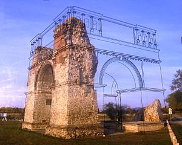

# 4.3 Lokal Artırılmış Gerçeklik ile Yer Tabanlı Yorumlama

[[İngilizce Metin](https://o-date.github.io/draft/book/place-based-interpretation-with-locative-augmented-reality.html)]

❗Bu bölüm geliştirilme aşamasındadır .

Artırılmış gerçeklik, kişinin görsel veya işitsel çevre algısının üzerine veri yerleştirmek için çeşitli teknolojilerin kullanılmasıdır. Artırılmış gerçekliğin dijital bir teknoloji olması gerekmez; Avusturya’daki Carnuntum’da olduğu gibi ‘eksik’ yapı(lar)ın görülebilmesi için kazınmış, arkeolojik bir alanın görünümünü çerçeveleyen bir pleksiglas/perspeks levha kadar basit olabilir.

Carnuntum

(Resim, Wikimedia Commons, [[Gryffindor](https://commons.wikimedia.org/wiki/User:Gryffindor)] kullanıcısı tarafından )

Artırılmış gerçekliğin görsel bir teknoloji olmasına da gerek yoktur. [[Poole (2018)](https://o-date.github.io/draft/book/place-based-interpretation-with-locative-augmented-reality.html#ref-poole_2018)], kendi maceranı seç tipi bir oyun mekaniğiyle birleştirilen, kulak misafiri olunan konuşmaların ve işitsel mekanların parçacıklarını oynatmak için bir ‘zamanlı radyoyu’ tetikleyen ‘ses havuzları’ veya fiziksel mekan alanları oluşturmak için ses tabanlı artırılmış gerçekliğin kullanımını göstermektedir. ‘Ghosts in the Garden’ (Bahçedeki Hayaletler) adı verilen bu oyun deneyimi, tarihi bir mekana gelen ziyaretçilere, mekana ilişkin kendi anlayışlarını inşa edebilecekleri araçlar sunmayı amaçlıyor.

https://www.youtube.com/channel/UCZZI7_ARgM5E5KJxqci2M6g

[[Poole (2018)](https://o-date.github.io/draft/book/place-based-interpretation-with-locative-augmented-reality.html#ref-poole_2018)], miras alanları bağlamında artırılmış gerçeklik için üç ana kullanım alanı tanımlamaktadır:

Zenginleştirilmiş bir rehber ve bilgi kaynağı olarak, gelişmiş bir simülasyon aracı olarak ve (daha az sıklıkla) miras alanlarında tarihsel bilgiyi inşa edip tanımladığımız kuralları değiştirmek için bir araç olarak.

AG’nin (Augmented Reality) arkeolojideki uygulamalarının çoğu bu ilk iki kategoriye girme eğilimindedir, ancak sınırları zorlayan bireyler ve ekipler de vardır. Geçtiğimiz yıllarda York Üniversitesi’nde düzenlenen [[HeritageJam](http://www.heritagejam.org/)]’in kazananları olan aşağıdaki iki videoyu ele alalım:

https://www.youtube.com/watch?v=wAdbynt4gyw

https://www.youtube.com/watch?v=Y_yE-TkDn5I

Birinci video, bir mezarlığın alanına dair anlayışımıza meydan okumak için işitsel bir AG yaklaşımını kullanırken, ikincisi, araştırma ve inceleme amacıyla arkeolojik bakış açımızı geliştirmek için AG’yi kullanıyor. Bu yaklaşımların her ikisi de makul derecede teknik akıcılık gerektirir ve platform ve cihazlar planlanan eskime döngüleri boyunca sürekli bakım gerektirir.

Artırılmış gerçeklik şu anda ‘sihrin’ gerçekleşmesi için kullanıcının elinde bir akıllı telefon veya başka bir cihazı tutmasını gerektiriyor. O halde etkili bir deneyim, cihazın neden kullanıldığını da hesaba katmalıdır. Neden bir sayfaya, bir reklam panosuna, bir dergiye ya da her neyse ona bakıyorsunuz? Bu hiç de doğal değil. Oculus (transparan moddayken) veya Hololens gibi çeşitli kulaklık cihazları, elleri serbest bırakmaları açısından bir gelişmedir. Ghosts in the Gardens deneyiminde, cihazın bu sorunu hikayenin bir parçası haline geliyor ve böylece bir akıllı telefonun yaratabileceği araya girme durumundan kaçınılıyor. Cihaz doğru hissettiriyor. Cihaz, ziyaretçinin bu dünyanın sınırlarının ötesini duymasına yardımcı oluyor.

Hikayenin cihazla net bir bağlantısı olmadan AG sadece bir hileden ibarettir. Bir şekilde orijinal değildir. AG hilelerini kullanan çeşitli müze uygulamalarının gerçekten popüler olmamasının nedenlerinden biri de bu olabilir. Bu gözlemin sonucu AG’nin oyun tabanlı hikaye anlatımının araç ve tekniklerinden ayrı tutulamayacağıdır (arkeo-oyun ve sanal arkeoloji bölümlerine bakınız ).

Korkutucu haber şu ki, bir hikayenin içinde yaşıyoruz. İşin rahatlatıcı yanı ise bunun kendi yazdığımız bir hikâye olması. Ne yazık ki çoğumuz bunun farkında bile değiliz – ya da kabullenmekten korkuyoruz. Hikaye anlatma araçlarına daha önce hiç bu kadar çok erişimimiz olmamıştı – ancak çok azımız bunların yaratılmasına katılmaya istekliyiz.

– [[Rushkoff (2005)](https://o-date.github.io/draft/book/place-based-interpretation-with-locative-augmented-reality.html#ref-rushkoff_2005)], 415

‘Ghosts in the Garden’ aynı zamanda bize musallat olanları da düşündürüyor. Birkaç yıl önce Mark Sample, ‘heteropya’ fikrini entegre ederek artırılmış gerçeklikle kesişen, ‘Haunts’ adı verilen bir tür oyun geliştirdi:

Haunts mekanların gizli hikayelerini konu alıyor.

Haunts yerel travmayla ilgilidir.

Haunts, Foucault’nun “heterotopyalar” olarak adlandırdığı, birbiriyle uyumsuz karşıt mekanların üst üste ya da yan yana bindirildiği tek bir gerçek mekanın üretimiyle ilgilidir.

Haunts’un arkasındaki genel fikir şudur: öğrenciler ekipler halinde çalışarak çeşitli kamusal alanları ziyaret eder ve buraları gerçek hayattan esinlenen veya kurgusal bir travma hikayesinin parçalarıyla etiketler. Her ekip kendi yarattığı kapsayıcı bir travmatik anlatı üzerinden çalışacak, ancak mekana dayalı ipuçları metin mesajı boyutunda parçalarla sınırlı olduğu için, hikaye bir dizi mekanda yalnızca bakışlar ve izler halinde ortaya çıkacak.

– [[Sample (2010)](https://o-date.github.io/draft/book/place-based-interpretation-with-locative-augmented-reality.html#ref-sample_haunts_2010)]

Arkeolojide bulduğumuz şeylerin çoğu travmayla ilgilidir. Evler yanar: arkeoloji yaratılır. Eşyalar kasıtlı olarak gömülür: arkeoloji yaratılır. Malzemeler kırılır: arkeoloji yaratılır.

Sample’s Haunts daha sonra bir tür arkeolojik AG yapmak için potansiyel bir çerçeve sunuyor. Yazar ayrıca şunları ekler:

Tek bir ekibin hikayesinin anlatısı ve coğrafi yolu tek başına takip etmek için yeterince ilgi çekici olmalıdır, ancak daha da umut verici olan, her ekibin bir veya iki ortak anlatı olayı, [[müstesna kadavra](http://en.wikipedia.org/wiki/Exquisite%20corpse)] tarzı üzerine inşa ettiği, uğraklar arasında bir tür çapraz polenlenmedir. Aynı travmatik özün farklı bakış açılarından tekrar tekrar anlatıldığını hayal edin. Farklı anlatı ve coğrafi bakış açıları. Sonunda bu çoklu yollar bir ana anlatıda – ya da daha büyük olasılıkla bir ana veritabanında – toplanabilir; böylece Haunts (deneyimlenmese de) bir bütün olarak görülebilir.

Basit katmanlardan müstesna kadavralar tarzına kadar artırılmış gerçekliğin tüm olasılıkları henüz çizilmedi bile; ancak cihazın basit sorunu şu anda arkeolojik artırılmış gerçekliğin önündeki en büyük engel olmasıdır. Yani herhangi bir deneyim, bu cihazın neden kullanıldığını açık ya da örtük bir şekilde olarak ortaya koymalıdır . Güçlü bir hikaye bunun bir yolu olabilir. Başka bir yol da cihazın kullanıcının elinden tamamen alınması olabilir.

## 4.3.1 Projeksiyon Haritalama

Projeksiyon haritalama, farklı alanların aynı anda farklı videolar veya görüntüler göstermesi amacıyla ışıklı alanları engellemek için bilgisayarınızdaki dijital video projektörlerini ve özel yazılımı kullanan bir tür AG’dir. Bir ışık dikdörtgeni yerine, projeksiyon alanlarının sınırlarını bir bina cephesinin mimarisine uyacak şekilde ‘haritalandırabilirsiniz’ (örneğin). Buna ilişkin diğer terimler arasında ‘mekansal artırılmış gerçeklik’ veya ‘video haritalama’ yer alır.

Sanatçı [[Craig Winslow](http://craigwinslow.com/work/lightcapsules/)], Winnipeg’in şehir merkezindeki solmuş tarihi tabelaları hayata döndürmek için teknolojiyi kullandı. Tarih yüksek lisans öğrencisi Cristina Wood, [[Picturing Lebreton Flats](http://picturinglebretonflats.ca/)] adlı çalışmasında açık kaynak kodlu [[Mapmap](https://mapmapteam.github.io/)] araç setini kullanarak Ottawa şehrinin bir bölgesinin sosyal tarihini, o zamandan beri dönüştüğü devasa inşaat alanına yeniden tanıtmak için kullandı. Mapmap’in kurulumu biraz zahmetli olsa da, kullanımı bir powerpoint sunumuna medya eklemeye benzer. Kişi projeksiyonun içine video, görüntü ve ses ekleyebileceği alanlarını tanımlar. Projeksiyon alanları, yansıtılan mimari ile hizalanacak şekilde sürüklenebilir ve deforme edilebilir. Her şey hizalandıktan sonra yerine sabitlenebilir. Ardından, projeksiyon eşlemesini gerçekleştirme zamanı geldiğinde, projektörü yerine geri yerleştirmek ve oynat tuşuna basmak yeterlidir.

Projektör üreticisi Optoma’nın bir android uygulaması olan “[[optoma projeksiyon eşleyicisi](https://play.google.com/store/apps/details?id=com.reotek.projectionmappergoogle&hl=en_US)]”, “[[optoma projection mapper](https://play.google.com/store/apps/details?id=com.reotek.projectionmappergoogle&hl=en_US)]”“ başlangıç ​​sırasında daha sezgisel bir kullanıma sahip olabilir, ancak bu uygulamanın destek web sitesinin artık çözülmediğini ve bu nedenle eğitimimizde kullanmış olmamıza rağmen bu ürünü onaylayamayacağımızı not ediyoruz.

## 4.3.2 Alıştırmalar

1- Artırılmış gerçeklik üretmeye en iyi giriş şu anda Jacob Greene’in [[Programming Historian](https://programminghistorian.org/)]‘daki [[Unity’de Mobil Artırılmış Gerçeklik Deneyimleri Yaratmak](https://programminghistorian.org/en/lessons/creating-mobile-augmented-reality-experiences-in-unity#setting-up-unity-for-ar-development)] adlı kitabıdır. Bu eğitimde, akıllı telefon AG uygulamaları oluşturmak için [[Unity 3d oyun motoru](https://unity3d.com/)]nun yerleşik özelliklerinin nasıl kullanılacağını gösteriyor. Eğitimi tamamlayın ve ardından 3 boyutlu modeller ekleyerek uygulamayı genişletin ([[Sketchfab](https://sketchfab.com/)]‘da ‘kültürel miras’ kategorisinde creative-commons lisanslı modeller var). Hikaye ve kapsam hakkında açık olun, böylece neden bu cihaz sorusuna yanıt verebilirsiniz.
    
2- Etkileşimli kurgu motoru [[Twine](https://twinery.org/)], kullanıcı belirli bir konumda durduğunda yalnızca belirli metin pasajlarını veya ses veya görüntüleri görüntüleyen web sayfaları oluşturmak için hacklenebilir. [[Twine Cookbook](https://twinery.org/cookbook/)]‘taki ‘Geolocation’ bölümüne bakın. Bu özelliği kullanmanın bir yolu [[burada](https://github.com/shawngraham/ar-archaeology/blob/master/workshop%20materials/Hacking%20Twine%20to%20make%20a%20location-based%20game.md)]. Kampüsünüz için taşınabilir bir rehber planlamak için bununla oynayın.

# Referanslar

Poole, Steve. 2018. “Ghosts in the Garden: Locative Gameplay and Historical Interpretation from Below.” International Journal of Heritage Studies 24 (3). Routledge: 300–314. doi:10.1080/13527258.2017.1347887.

Rushkoff, Douglas. 2005. “Renaissance Now! The Gamers’ Perspective.” In Handbook of Computer Game Studies, edited by Joost Raessens and Jeffrey Goldstein, 415–21.

Sample, Mark. 2010. “Haunts: Place, Play, and Trauma.” samplereality.com. http://www.samplereality.com/2010/06/01/haunts-place-play-and-trauma/.