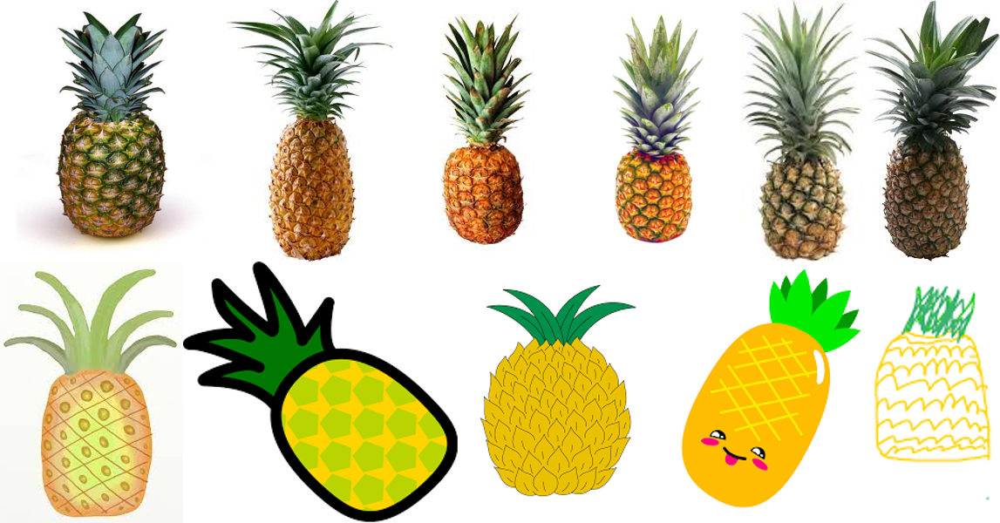
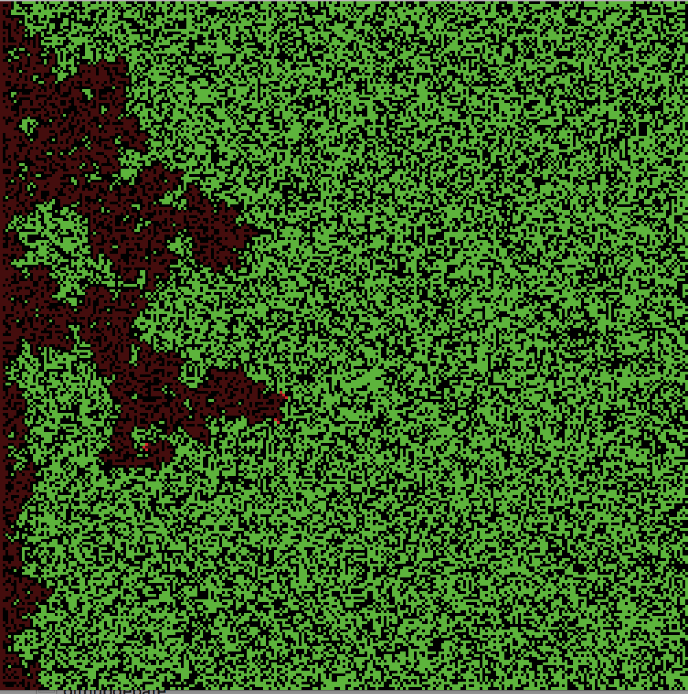
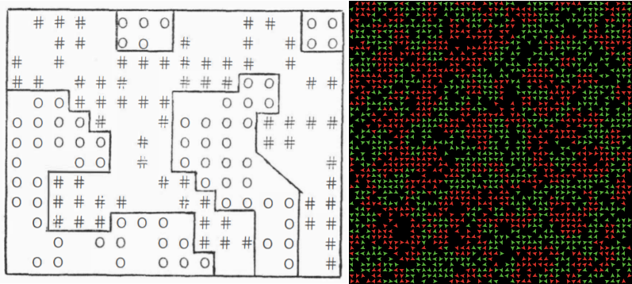
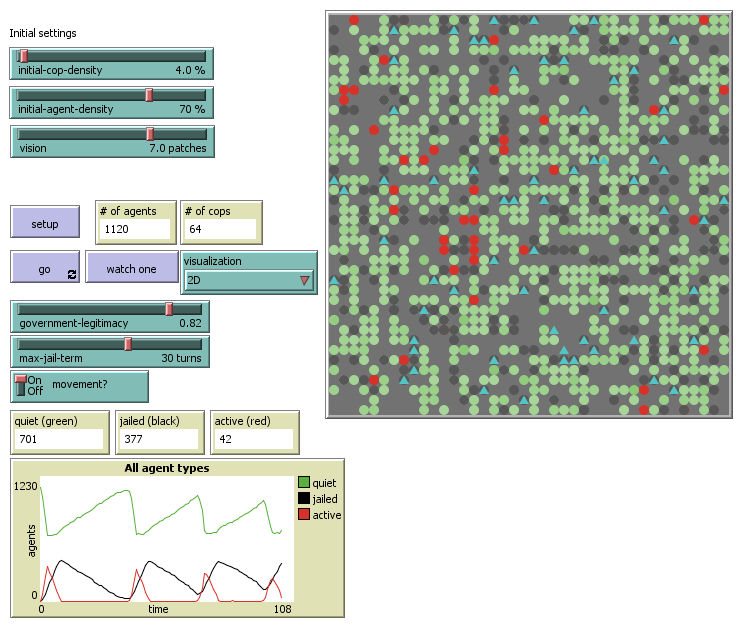
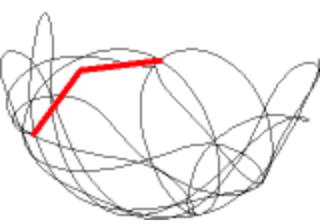

# 4.4 Dijital Arkeolojide Yapay Zeka

[[İngilizce Metin](https://o-date.github.io/draft/book/artificial-intelligence-in-digital-archaeology.html)]

Arkeolojide ‘yapay zeka’dan bahsetmek için henüz çok erken olabilir. Arkeolojinin hizmetinde olan makine öğrenimine sahibiz (örneğin sınıflandırma amaçlı nöral ağlar) ve simülasyon açısından ‘yapay zeka’ başlığı altına girebilecek köklü bir çalışma grubu bulunmaktadır.

O zaman neden bu terimi kullanalım? Bu terimi kullanmanın hala faydalı olduğunu düşünüyoruz çünkü bize simülasyon veya görüntü sınıflandırma için hesaplama gücünü kullanırken uzmanlığımızın ve yeteneklerimizin bir kısmını insan olmayan bir aktöre devrettiğimizi hatırlatıyor. Makine öğrenimi ve nöral ağlar söz konusu olduğunda, ‘kara kutunun’ içini gerçekten göremeyiz. Ancak eğitim verilerini inceleyebiliriz, çünkü eğitim verilerinin seçiminde hesaplamaya önyargılar veya hedefler katarız. Bu durumda makineyi insan olmayan bir şey olarak düşünerek, arkeolojide yapay zekanın sonuçlarını ya da yöntemlerini, sanki makine ırkçı ya da sömürgeci sonuçlar veremezmiş gibi körü körüne kabul etmemenizi hatırlatmayı umuyoruz.

Makine öğrenimi: verileri önceden belirlenmiş bazı değerlere göre tanımlamak ve sınıflandırmak için bir bilgisayar programını eğitmeye çalışan bir dizi yöntemdir. Bu bölümde, Tensorflow paketini kullanarak sorgulayacağımız, Google tarafından eğitilen sinir ağı modeli Inception3 modelini kullanarak görüntü tanımayı tartışacağız.

Agent-based simulation (Ajan/Etmen Tabanlı simulasyon): bireysel aracıların davranışlarını yöneten bağlamsal kurallarla (örneğin, bu olursa, şunu yap) programlanmış bir yazılım ‘aracıları’ popülasyonu oluşturan bir dizi tekniktir. Bağlam, hem simüle edilen ortam (örneğin CBS verileri) hem de sosyal ortam (bir ağ olarak sosyal ilişkiler) açısından olabilir. Simülasyon deneyleri, parametrelerin değerlerinin çoklu kombinasyonları, yani ‘davranış uzayı’ üzerinde yinelenir. Simülasyon sonuçları daha sonra araştırmacı tarafından ‘gerçek dünya’ olgusunu, belirli durumlar altında bir dizi kuralı izleyen bir etmen popülasyonunun acil durumu olarak açıklamak için kullanılır.

Makine öğreniminin değeri: ilk etapta neyi aradığımız ve neye ulaşmaya çalıştığımız konusunda dikkatlice düşünmemizi sağlar; ve daha sonra kitlesel olarak ölçeklendirilebilir.

ajan/Etmen tabanlı modellemenin değeri: bizi geçmişte gerçekte ne olduğunu düşündüğümüz hakkında dikkatlice düşünmeye zorlar, böylece belirli koşullar altında işleyen bir dizi bağlamsal davranış kuralı olarak ifade edilebilir.

## 4.4.1 Agent-based modeling (ABM) (Ajan/Etmen Tabanlı Modelleme)

❗ Bu bölüm geliştirilme aşamasındadır.

🔧 [[Python ile Etmen Tabanlı Modelleme](https://mybinder.org/v2/gh/o-date/abm/master)] (Agent-based modeling) Binder’ı başlatın.

🔧 [[Netlogo GUI’si olmadan Netlogo ile Etmen Tabanlı Modelleme için Binder](https://mybinder.org/v2/gh/o-date/abm3/master)]’ı başlatın.

Bu bölüm, arkeoloji, antropoloji ve davranış bilimlerinde kullanıldığı şekliyle ajan tabanlı modellemeye (agent based modelling-ABM) genel bir bakıştır. “Ajan tabanlı “yı ele almadan önce, “modelleme “nin ne anlama geldiğine dair kısa bir girişle başlayacağız. ABM’yi daha büyük bir resme yerleştirmek için, okuyucuya simülasyon modellerinin değişkenliğinin çeşitli boyutlarını tanıtıyoruz. ABM modellerinin gerekli ve isteğe bağlı parçalarını, karakteristik unsur türü, yani aracı da dahil olmak üzere açıklıyoruz. Bu noktada öğrenci, bizim bağlamımızdaki simülasyon modellerinin bilgisayar kodu (dijitaldirler) ve süreçlerin yinelenmesini (dinamiktirler) içerdiğinin farkında olmalıdır.

ABM’nin tanımını takiben, bir model oluşturma veya gayri resmi bir modeli resmileştirme sürecini açıklıyoruz. Bu süreç yedi aşamaya ayrılabilir: tanımlama, tasarım, uygulama, doğrulama, onaylama, anlama ve belgeleme. Tüm modelleme görevlerini açıklarken, talimatları çoğu yaklaşım, teorik arka plan ve platform veya programlama dili için geçerli olacak kadar genel tutmayı amaçlıyoruz. Son olarak, ABM modellerinin oluşturulması ve kullanılmasıyla ilgili pratik yönleri tanıtmak için bir dizi alıştırma sunuyoruz.

Bu bölüm boyunca, birçok kavram muhtemelen çoğu tarih ve arkeoloji öğrencisine yabancı gelecektir; ve bazıları bu dersi tamamladıktan uzun süre sonra bile belirsiz kalabilirler. Herhangi bir pratik uygulamanın ötesinde, ABM’nin matematik ve mantıkta güçlü kökleri vardır. Panik yapmayın! ABM modelleyicilerinin çoğu resmi tanıtımlardan geçmediği gibi cebir ve kalkülüs konusunda da bilgili değildir. Beşeri ve sosyal bilimlerdeki çoğu dijital yaklaşımda olduğu gibi, ABM de çoğunlukla hibrit ve dolambaçlı akademik profillere sahip kendi kendini yetiştirmiş uzmanlar tarafından yapılır. Ayrıca, arkeolojideki ABM modelleyicileri genellikle bilgisayar bilimcisi olmadığından, topluluk, modellerin ve simülasyon sonuçlarının nasıl iletileceğine dair kurallardan yoksundur, ancak öneriler mevcuttur (örneğin, ODD belgesi, bkz. [[Grimm vd. 2006](https://o-date.github.io/draft/book/artificial-intelligence-in-digital-archaeology.html#ref-Grimm2006)]; [[Grimm vd. 2010](https://o-date.github.io/draft/book/artificial-intelligence-in-digital-archaeology.html#ref-Grimm2010)]; [[Müller vd. 2013](https://o-date.github.io/draft/book/artificial-intelligence-in-digital-archaeology.html#ref-Muller2013)]). Uyarı: Burada açıklanan modelleme stratejisi, hipotez testi ve tahmine (spesifik, veri odaklı) değil, teori oluşturmaya (genel, keşfedici) odaklanmıştır. Bu anlamda, bu bölümün içeriği ABM-arkeoloji topluluğu arasında standart olarak kabul EDİLMEMELİDİR.

Şimdiye kadar, ABM yapmaya başlamanın kolay bir yolu olmamıştır. Öğrencileri, alıştırmalarımızı, diğer eğitimleri takip ederek veya ilgi alanlarını, araştırma sorularını ve yaratıcı kaygılarını geliştirmeye çalışarak ne kadar erken, o kadar iyi modelleme yapmaya teşvik ediyoruz. ABM’nin tam olarak kavranması için yıllarca pratik yapmak ve disiplinler ötesi okumalar yapmak gerekecektir; kuşkusuz programlamada daha büyük bir ustalık da gerekecektir. 

ABM’nin tarih ve arkeoloji ana akım müfredatlarında nadiren yer almasına rağmen, farklı geçmişlere ve bakış açılarına sahip yazarlar tarafından kaleme alınmış, arkeolojide ABM’ye giriş niteliğinde birçok yayın bulunmaktadır (örneğin Breitenecker, [[Bicher ve Wurzer 2015](https://o-date.github.io/draft/book/artificial-intelligence-in-digital-archaeology.html#ref-Breitenecker2015)]; [[Cegielski ve Rogers 2016](https://o-date.github.io/draft/book/artificial-intelligence-in-digital-archaeology.html#ref-Cegielski2016)]; [[Romanowska 2015](https://o-date.github.io/draft/book/artificial-intelligence-in-digital-archaeology.html#ref-Romanowska2015)]); ayrıca kapsamlı ve sürekli güncellenen bir referans listesi için [[Arkeolojide ABM Bibliyografyası](https://github.com/ArchoLen/The-ABM-in-Archaeology-Bibliography)]‘nı ziyaret edebilirsiniz. Örnekler ve eski deneyimler için bir kaynak olarak öğrenci, [[Journal of Archaeological Method and Theory](https://link.springer.com/journal/10816)], [[Ecological Modelling](https://www.journals.elsevier.com/ecological-modelling)], [[Journal of Artificial Societies and Social Simulation (OPEN)](http://jasss.soc.surrey.ac.uk/JASSS.html)], [[Proceedings of the National Academy of Sciences (OPEN)](https://www.pnas.org/)], [[Journal of Archaeological Science](https://www.journals.elsevier.com/journal-of-archaeological-science)], [[Journal of Anthropological Archaeology](https://www.journals.elsevier.com/journal-of-anthropological-archaeology)], [[Structure and Dynamics](https://escholarship.org/uc/imbs_socdyn_sdeas)], [[Human Biology](https://digitalcommons.wayne.edu/humbiol/)] gibi akademik dergilerde arkeoloji/ABM ile ilgili çeşitli makaleler bulabilir.

### 4.4.1.1 Modelleme ve simülasyon olarak ABM

 “Essentially, all models are wrong, but some are useful”
    George Box, 1987
    [Box and Draper (1987)](https://o-date.github.io/draft/book/artificial-intelligence-in-digital-archaeology.html#ref-box1987empirical), p. 424

“Esasen tüm modeller yanlıştır, ancak bazıları yararlıdır”

    George Box, 1987, Box ve Draper (1987), s. 424

Dikkate alınması gereken ilk husus, ABM’nin modellerle ilgili olmasıdır. Bir model, bir olgunun bir dizi unsur ve bunların ilişkileri olarak temsilidir; buradaki anahtar kavram temsildir. Olgu olarak kabul ettiğimiz şeyin bir genellemesi/soyutlaması/basitleştirmesidir.

Bir ananası düşünün. “Ananas” fenomeninin zihinsel temsili zaten bir modeldir. Bir dizi özellikten ya da görsel ipucundan ve bunların göreceli konumlarından oluşur (örneğin, tepede dikenli yapraklardan oluşan taç, oval gövdeyi kaplayan dikenler). Ampirik olarak her ananas farklı görsel özelliklere sahiptir, ancak yine de bu modeli kullanarak karşılaştığımız herhangi bir ananası tanımlayabiliriz.



Modellerle ilgili bir diğer önemli ifade de, modellerin herhangi bir zihinsel süreç gibi kendi başına bir olgu olduğudur. Bu bizi epistemoloji ve bilişsel bilimlerin alanına sokar. Buradan, kişinin modelinin bir model olduğu ve bir olguyu temsil eden çok sayıda örnek olduğu ve bu olguyu tanıyan zihinlerin var olduğu sonucu çıkar. Ananas çizimlerinin çeşitliliğini gözlemleyin.

Bu tabloyu daha da karmaşık hale getiren şey, zihinlerin yeni deneyimlerin entegrasyonuyla sürekli değişiyor olması (modellerin yaratılması, değiştirilmesi, birleştirilmesi ve unutulması) ve sık sık alternatif modelleri kendimize ve başkalarına ifade ederek değiş tokuş etmemiz ve karşılaştırmamızdır. Karmaşanın son damlası olarak, modelleri iletme becerisi, onlara kendi varlıkları olan, öğrenme yoluyla yeniden üretilen, yeni deneyimlerin çatışmasıyla kontrol edilen , yenilik ve yaratıcılık yoluyla sürekli değişim içinde olan ‘maddi nesneler’ statüsü kazandırır. Örneğin, ‘gerçek ananas’ ile çok az deneyimi olan ya da hiç deneyimi olmayan bir çocuk, bir ananas modelini öğrenebilir (ve bunu nazikçe değiştirebilir).

Peki, ananas çizimlerinin arkeolojide modelleme yapmakla ortak noktası nedir? Eğer bir ananasın zihinsel temsili bir model ise, insan zihninin modellerin modelleri, modellerin içindeki modeller ve kendi modellerimiz de dahil olmak üzere her şey hakkında modellerle dolu olduğunu hayal edebilirsiniz. Eğer bir arkeologsanız, bu tür zihinsel araçların derinliklerine gömülü arkeolojik açıdan hassas pek çok model olacaktır.

“Bu alandaki insanlar neden yiyecek kalıntılarını küçük çukurlara gömüyorlardı?”

“Yaratıkların dikkatini çekmekten kaçınmak istemişler.”

“Çürüme kokusuna dayanamadılar.”

“Yüksek statülü bir kişi bunu yapmaya başladı ve diğerleri de onu takip etti.”

“Toprak ruhuna destek sunuyorlardı.”

Bu açıklamalar doğrudan insanların neden öyle davrandıklarına dair modellerden türetilmiştir. Genellikle sosyal veya davranışsal olarak etiketlenen bu tür modeller, arkeolojide ihmal edildiği kadar her yerde de bulunmaktadır. Arkeolojik uygulamaların materyaller etrafında döndüğü düşünüldüğünde, arkeologlar sosyal modelleri ikinci plana atma eğilimindedir; sanki amaç davranışın kendisinden ziyade insan davranışının maddi kalıntılarını anlamakmış gibi. Daha da önemlisi, pek çok arkeolog açıkça ‘teorik olmayan’ sosyal modeller kullandıklarının farkında bile değildir.

Bir başka yaygın uygulama da, otoriter modelleri ‘mantra’ olarak sunarken, kullanılan modelleri bilinçsizce gizlemektir. Sosyal modeller gerçekten de öznel bakış açılarına (örneğin bir tabakalaşma modelinin aksine) daha geçirgendir çünkü arkeolojik meseleler bir yana, onları her gün başkalarıyla etkileşim kurmak için kullanırız. Dolayısıyla, yaş ve cinsiyet gibi daha az belirgin olanlar da dahil olmak üzere birçok sosyo-kültürel faktöre bağlı olarak değişen yaşam deneyimlerimiz ve inançlarımızla güçlü bir şekilde şekillenirler. Aralarında ortak özellikler olsa da, bu modeller ananas çizimleri kadar çok ve çeşitlidir.

O halde neden araştırmalarımızda biçimlendirilmiş modellerle uğraşıyoruz?

Nihayetinde, herhangi bir bireyden bağımsız olarak, en azından bir miktar doğruluk değeri olan ifadeler, bilgi arıyoruz. Unutmayın ki bir olgunun modelleri, ne kadar çeşitli olursa olsunlar, o olgunun çok daha az değişken olan deneyimleriyle karşılaştırılır. George Box’ın ünlü ifadesinde belirttiği gibi, modeller bir olgunun eşdeğer yeniden üretimleri DEĞİL, olguyu gözlemlemek ve onunla etkileşime geçmek için kullanılan araçlardır. Gülümseyen ananas gibi hayali modeller olarak tanımlayabileceğimiz modeller, başka amaçlar için hala var olsalar da, bir dereceye kadar doğruluk payı olan modellerden açıkça ayırt edilebilirler, çünkü duyusal deneyimlerimizle uyuşmazlar ve diğer başarılı modellerle uyumsuzdurlar. Ayırt edilemeyenler geçerli, rakip modeller olarak kabul edilmelidir; bunların incelenmesi, doğrulanması ve geliştirilmesi bilimsel çabaların ana hedefidir.

Ne yazık ki, insan davranışını içeren modellerin doğrulanması ya da reddedilmesi “gülen bir ananastan” daha zordur. Yine de, birbiriyle rekabet eden çok sayıda model olduğunda, birçok kritere göre ‘doğru olma olasılığına’ göre sıralayarak ilerleme kaydedilebilir. Yine de bir uyarı: neredeyse kesin olan modellerin sonunda yanlış olduğu kanıtlanabilir ve marjinal (hatta gözden düşmüş) modeller ana akım haline gelebilir. Modellerin canlı (kullanışlı) olabilmesi için iletilmesi, kullanılması, yeniden kullanılması, kötüye kullanılması, geri dönüştürülmesi, hacklenmesi ve kırılması gerekir. Pek çok yerde ve formatta muhafaza edilen iyi belgelenmiş bir model, kolaylıkla kış uykusuna yatmış, doğrulama için yeni kanıtlar veya yeni bir akademik nesil bekliyor olarak düşünülebilir.

Modeller yalnızca yaşayan her zihin için kaçınılmaz olmakla kalmaz, aynı zamanda bilgi üretiminin de temel taşıdır. Ancak, modeller bir ananas çizimi kadar basit, spontane ve sezgisel olabiliyorsa, karmaşık denklemler, özenli spesifikasyonlar ve derinlemesine tasarımlarla garip modeller yapmaya ne gerek vardır? Arkeologlar modelleri araştırma gündemlerini tanımlamak ve yorumlarına rehberlik etmek için kullanırlar. Arkeolojik ve arkeolojiyle ilgili modellerin sunulması, tartışılması ve yeniden gözden geçirilmesi konusunda çok fazla çalışma yapılmıştır. Bununla birlikte, bu çalışmaların çok azı söz konusu model(ler)i net bir şekilde tanımlayabilmiştir; bunun nedeni çabalarının yetersizliği değil, modeli nesneleştiren ortamın (insan, doğal, sözel dil) içsel sınırlılığıdır.

Örneğin, bilinen kanıtlar ışığında, akrabalık bağının Erken Roma İmparatorluğu dönemindeki Ermeniler arasında mülkiyet haklarıyla nasıl ilişkili olduğuna inandığımıza dair bir kitap yazabiliriz. Akıl yürütmemiz ve olası faktörleri tanımlamamız uzun ve kusursuz olabilir; ancak bir noktada yanlış anlaşılmamız kaçınılmazdır, çünkü okuyucular aynı kavramları ve kesinlikle iletmek istemiş olabileceğimiz tüm çağrışımları paylaşmayabilir. Zihnimizdeki modelin önemli bir kısmı satır aralarına yazılmış ya da hiç yazılmamış olabilir. Okuyucular, geçmişlerine bağlı olarak, bir modelden bahsettiğimizi tamamen gözden kaçırabilir ve modelimizin unsurlarını gevşek spekülasyonlar veya daha da kötüsü verili gerçekler olarak değerlendirebilirler.

Resmi modeller ya da daha doğrusu resmi olmayan modellerin resmileştirilmesi, belirsizliği azaltarak yanlış anlaşılma riskinin bir kısmını ortadan kaldırır. Resmi bir modelde, modelimizin unsurları hala soyut ve genel olsa bile her şey tanımlanmalıdır. Eski Ermeniler hakkındaki hayali kitabımız, gayri resmi model(ler)imizin temel özelliklerini kristalize eden bir veya birkaç resmi modelle tamamlanabilir. Örneğin, mülkiyet mirası hakkındaki gayri resmi modelimiz ana akrabalık yapısı olarak çekirdek ataerkil aileyi içeriyorsa, bunu boş terimlerle tanımlamalı, kendimize ve başkalarına “aile”, “çekirdek” ve “ataerkil” kelimelerinin en azından modelimiz bağlamında ne anlama geldiğini açıklamalıyız. Bir model ailenin birlikte yaşama anlamına geldiğini varsayar mı? Modelimiz evlat edinilmiş üyeleri dikkate alıyor mu? Eşlerden biri ölürse ne olur? Çoğu zaman olduğu gibi, resmi olmayan modelimizi resmileştirme çabasıyla değiştirebiliriz; örneğin, modelimiz aileler içinde belirli bir güç yapısı varsaymadığı için “ataerkil” yerine “babasoylu” kelimesini kullanabileceğimizi fark ederek.

Biçimselleştirme genellikle biçimsel mantığın ve bir dereceye kadar nicelemenin kullanılmasını gerektirir. İnsanın doğal dili açısından bakıldığında, matematik ve mantık çok sayıda tekrar, sabit kelime dağarcığı içerir ve nüans içermez. Bununla birlikte, hesaplama sistemleri kesinlikle bu tür bir dille çalışır ve bu dil tarafından hem güçlendirilir hem de sınırlandırılır.

Resmi bir tanım şöyle diyen bir feragatnamedir: “Bu modelde X’in anlamı budur, ne eksik ne fazla. Artık bunu istediğiniz gibi eleştirebilirsiniz.” Resmi tanım olmasaydı, muhtemelen “çekirdek ataerkil aile” hakkında okuduğumuz ve düşündüğümüz her şeyi gözden geçirmek için bir bölüm harcardık ve yine de tüm okuyucularımızla “aynı sayfada” olmazdık. Bir modeli tanımladığımız terimler onun varsayımlarıdır. Herhangi bir noktada, yeni kanıtlar ya da içgörüler bize bir varsayımın haksız ya da gereksiz olduğunu gösterebilir ve biz de bu varsayımı değiştirebilir ya da tamamen kaldırabiliriz.

Simülasyonun gücü, bu titiz biçimsel tanımların sonuçlarının detaylandırılması ve keşfedilmesinden ortaya çıkar. [[Epstein (2008)](https://o-date.github.io/draft/book/artificial-intelligence-in-digital-archaeology.html#ref-Epstein2008)] belki de bunu en iyi şekilde ifade etmiştir:

ıklıkla sorulan ilk soru -bazen masumane bazen de masum olmayan bir şekilde- basitçe “Neden modelcilik?” oluyor. Retorik (masum olmayan) bir sorgulayıcı düşündüğümde, en sevdiğim karşılık “Sen bir modelleyicisin” oluyor. Bir öngörüde bulunan ya da sosyal bir dinamiğin -salgın, savaş ya da göç- nasıl gelişeceğini hayal eden herkes bir model yürütüyor demektir. Ancak bu genellikle varsayımların gizli olduğu, iç tutarlılıklarının test edilmediği, mantıksal sonuçlarının ve verilerle ilişkilerinin bilinmediği üstü kapalı bir modeldir. Ancak, gözlerinizi kapatıp bir salgının yayıldığını ya da başka herhangi bir sosyal dinamiği hayal ettiğinizde, bir modeli ya da başka bir şeyi çalıştırıyorsunuzdur. Bu sadece yazılı hale getirmediğiniz üstü kapalı bir modeldir… Durum böyle olunca, aynı kişiler bana “Modelinizi doğrulayabilir misiniz?” sorusunu yönelttiklerinde hep eğlenirim. Elbette uygun karşılık, “Sen kendininkini doğrulayabilir misin?” olacaktır. En azından benimkini yazabilirim, böylece prensipte verilerle kalibre edilebilir, eğer “doğrulamak” ile kastettiğiniz buysa, ki ben bu terimden özenle kaçınırım (iyi bir Poppercıyımdır). O halde seçim, model oluşturup oluşturmamak değil; açık modeller oluşturup oluşturmamaktır. Açık modellerde varsayımlar ayrıntılı olarak ortaya konur, böylece tam olarak neyi gerektirdiklerini inceleyebiliriz. Bu varsayımlar üzerinde bu tür şeyler olur. Varsayımları değiştirdiğinizde olan budur. Açık modeller yazarak başkalarının sizin sonuçlarınızı tekrarlamasına izin verirsiniz.

ABM de dahil olmak üzere modelleme bazen tahmin anlamına gelebilir; arkeoloji için tahmin, biçimlendirilmiş bir modelin yapabileceği en az yararlı şey olabilir. Bunun yerine, Epstein’in (2008) de belirttiği gibi, modelleme yapmak için pek çok neden vardır:

Açıklamak (tahminden çok daha farklı) Veri toplamaya rehberlik etmek Temel dinamikleri aydınlatmak Dinamik analojiler önermek Yeni sorular keşfetmek Bilimsel bir zihin alışkanlığını teşvik etmek Sonuçları makul aralıklara bağlamak (paranteze almak) Temel belirsizlikleri aydınlatmak. Neredeyse gerçek zamanlı olarak kriz seçenekleri sunmak Dengeleri göstermek / verimlilik önermek Pertürbasyonlar yoluyla hakim teorinin sağlamlığına meydan okumak Mevcut verilerle uyumsuz olarak hakim bilgeliği ortaya çıkarmak Uygulayıcıları eğitmek Politika diyaloğunu disipline etmek Genel kamuoyunu eğitmek Görünüşte basit (karmaşık) olanın karmaşık (basit) olduğunu ortaya koymak.

Bu listedeki her şey arkeoloji için geçerli olmayabilir, ancak yine de bu liste arkeolojik simülasyon için bir olasılık alanı açmaktadır. Örneğin Vi Hart ve Nicky Case’in Schelling’in 1971 tarihli Segragation Modelini ([[T. Schelling 1971](https://o-date.github.io/draft/book/artificial-intelligence-in-digital-archaeology.html#ref-schelling1971)], ayrıca bkz. bu bölümdeki Alıştırma 2) uygulayan ve küçük tercih ifadelerinin bile nasıl ayrışmış bölgelere yol açabileceğini gösteren [[Parable of the Polygons](https://ncase.me/polygons/)] adlı çalışmasına bakınız. Hart ve Case’in ‘oynanabilir postası’ modeli tarayıcıda etkileşimli olarak uygulamakta ve dinamiği halka iletmek için ilgi çekici grafikler kullanmaktadır. Arkeolojik etmen tabanlı bir modelin benzer şekilde kullanılması mükemmel bir kamu arkeolojisi girişimi olabilir.

### 4.4.1.2 Ajan tabanlı modeller ve temel unsurları

ABM genel olarak bir olguyu, onu oluşturan parçaları modelleyerek modellemenin bir yolu olarak anlaşılabilir. Dolayısıyla ABM, makro düzeydeki olgunun mikro düzeydeki dinamiklerin acil bir durumu olduğu beklentisini içerir. Dahası, ABM parçaların, yani etmenlerin ‘popülasyonlar’ oluşturduğunu, yani ortak özellikleri ve davranış kurallarını paylaştıklarını ima eder. ‘Ajan’ aynı zamanda diğer etmenlere ve çevreye karşı belirli bir özerklik anlamına gelir ki bu da davranışlarının bireysel düzeyde simüle edilmesini haklı çıkarır.

Pratikte ‘özerklik’ genellikle etmenlerin harekete geçme, hareket etme, karar verme ve hatta düşünme ve hatırlama yeteneği olarak çevrilebilir. Bununla birlikte, etmen tabanlı modeller, teknik olarak etmen olan (çoklu etmenli sistemler açısından), ancak bu yeteneklerden yoksun olan veya gerçek ayrık varlıklar olarak kabul edilmeyen varlıkları da içerir. En yaygın durum, dağıtılmış mekansal süreçlerin (örneğin bitki örtüsünün yerel faktörlere bağlı olarak büyümesi) uygulanmasını kolaylaştırmak için mekan bölümlerini bir ızgarada benzersiz konumlara sabitlenmiş aracılar olarak temsil etmektir. NetLogo’da bu tip ajanlar eklemeler (patches) olarak önceden tanımlanmış olup ekoloji ve coğrafya modellerinde yaygın olarak kullanılmaktadır.

Diğer modelleme ve simülasyon yaklaşımlarıyla karşılaştırıldığında, ABM daha sezgisel ama aynı zamanda daha karmaşıktır. Örneğin, ekolojideki [[Lotka-Volterra av-avcı modeli](https://en.wikipedia.org/wiki/Lotka%E2%80%93Volterra_equations)], nispeten basit ve kavramsal olarak anlaşılır bir çift diferansiyel denklemdir.

daha fazla av -> daha fazla yırtıcı hayatta kalacak ve üreyecektir, daha fazla yırtıcı-> daha az av hayatta kalacak ve üreyecektir, daha az av -> daha az yırtıcı hayatta kalacak ve üreyecektir, daha az yırtıcı-> daha fazla av hayatta kalacak ve üreyecektir

Aynı model ABM ile de uygulanabilir (NetLogo’nun Model Kütüphanesi Kurt-Koyun Predasyonu (Yerleşik Hibrit)‘ ( [[NetLogo’s Model Library Wolf-Sheep Predation (Docked Hybrid))](http://ccl.northwestern.edu/netlogo/models/WolfSheepPredation(DockedHybrid))]) ndaki karşılaştırmaya bakınız). ABM uygulaması, yırtıcı ve av etmenlerinin ayrı ayrı nasıl davranması gerektiğine dair birçok ek özellik gerektirir. Bu özellikler hem modelin daha ‘sezgisel’ veya ‘gerçekçi’ olmasına yardımcı olur hem de denklem tabanlı versiyonun aynı toplam dinamiklerini (yani salınımlar) üretmesine rağmen model tasarımını ve uygulamasını önemli ölçüde karmaşıklaştırır.

Ajan tabanlı modellerin bir diğer önemli ve ayırt edici yönü de kaçınılmaz olarak rastlantısal olmalarıdır. Tanım gereği, bir türdeki etmenlerin işlemlerini gerçekleştirme sırası önceden tanımlanmamalı ve genel olarak modelin her yinelenmesinden sonra aynı olmamalıdır. Etmenlerin süreçlerini planlamanın tek tarafsız yolu, bir sözde rastgele sayı üreteci ([[pseudorandom number generator](https://en.wikipedia.org/wiki/Pseudorandom_number_generator)]) kullanarak tüm dizileri rastgele hale getirmektir. Bu teknik aynı zamanda bir etmen popülasyonu içinde varyasyon yaratmak, yani bir olasılık dağılımından bireysel bir özelliğin değerini çekmek için de kullanılır.

### 4.4.1.3 ABM ile nasıl modelleme yaparız?

Gerçek daha karmaşık olsa da, bu süreç araştırma sorusu ve olgunun tanımlanması, tasarım, uygulama ve doğrulama olarak ayrılabilir. Modelleme literatürünün çoğu tarafından beşinci adım olarak kabul edilen doğrulama, burada genellikle bir modelin oluşturulması ve keşfedilmesiyle ilgili görevlerden ayrılabilen ekstra, uzun bir süreç olarak kabul edilmektedir. Ayrıca, normalde kabul edilmeyen iki ek adımı da sunuyoruz: modelin anlaşılması ve belgelenmesi. Tüm modelleme adımlarını açıklarken, talimatları herhangi bir platform veya programlama dili ile çalışırken geçerli olacak kadar genel tutuyoruz.

Basit bir ifadeyle, bir model oluşturmak aşağıdaki adımları içerir. – Hipotezleri, soruları ya da sadece ilgilenilen olguyu tanımlayın (sistemi tanımlayın) – Sistemi ele almak için gerekli olan unsurları ve süreçleri tanımlayın (sistemi modelleyin). Basitlik yasasına karşı ortaya çıkma paradoksundan bahsedin- Seçilen unsurları ve süreçleri bilgisayar kodu olarak ifade edin (modeli uygulayın) – Modelleme sürekli bir yineleme sürecidir. Her aşama, bir sonraki adıma geçmeden önce genellikle birkaç kez tekrarlanan bir yineleme döngüsüdür. Bir modelin geliştirilmesi ve keşfedilmesinin nihai sonucu, genellikle yayın şeklinde olmak üzere nispeten istikrarlı olabilir. Ancak, bu ürün potansiyel olarak yeni bir modelleme çabasını besler (ve bu aslında uzun vadede modellerin temel faydasıdır).

### 4.4.1.4 Alıştırmalar

ABM’nin pratiklerini tanıtmak için bir dizi alıştırma öneriyoruz. Öğrencinin birden fazla platform ve programlama dilindeki model uygulamalarını anlamasını sağlamak için bu alıştırmalar [[Python 3](https://www.python.org/)] ve [[NetLogo](https://ccl.northwestern.edu/netlogo/)]‘daki kodlara referanslar içermektedir (Wilensky 1999).

Alıştırmalar ayrıntılı veya sınırlayıcı değildir ve öğrencilerin ilgi alanlarını daha derinlemesine inceleyebilecek diğer materyallerin araştırılmasını öneririz. [[CoMSES ağının](https://www.comses.net/)] OpenABM’i, NetLogo’nun [[Resmi](http://ccl.northwestern.edu/netlogo/models/)] ve [[Topluluk](http://ccl.northwestern.edu/netlogo/models/community/)] Model Kütüphaneleri ve Modeling Commons gibi çevrimiçi olarak erişilebilen pek çok modelleme örneği kaynağı bulunmaktadır. Ayrıca Shawn Graham’ın Python’da yazılmış etmen tabanlı bir modeli bilgisayımsal yaratıcılığın keşfi için temel olarak kullanan Jupyter Notebook’unu ziyaret etmenizi öneririz ([[bu dijital veri arşivindeki](https://github.com/o-date/creativity2)] ‘Worldbuilding’ alt dizinine bakın). Ben Davis’in [[R ve NetLogo ile tarih öncesi peyzaj kullanımının etmen tabanlı modellemesi](https://benmarwick.github.io/How-To-Do-Archaeological-Science-Using-R/agent-based-modelling-prehistoric-landscape-use-with-r-and-netlogo.html)], sosyal dinamikleri temsil etmenin ötesine geçen arkeoloji için ETM uygulamalarının iyi belgelenmiş bir örneğini veriyor.

1-3’teki alıştırmalar, Python tabanlı bir sistem olan [[mesa](https://github.com/projectmesa/mesa)] (bundan sonra mesa-Python şeklinde adlandırılacak) kullanılarak yapılan uygulamalara atıfta bulunarak ETM’nin (Orman Yangını, Schelling’in Ayrımı ve Epstein’in Sivil Şiddet modelleri) (Forest Fire, Schelling’s Segregation, and Epstein’s Civil Violence models) klasik örneklerini sunmaktadır. Bu uygulamalar,[[ ODATE ana web sayfasında](https://o-date.github.io/support/notebooks-toc/)] sunulan çevrimiçi Jupyter Notebook kullanılarak veya doğrudan [[binder](https://mybinder.org/v2/gh/o-date/abm/master)] içinde yürütülebilir. Bu alıştırmalar karmaşık değildir, ancak tam olarak anlaşılması için asgari düzeyde Python (veya benzer nesne yönelimli programlama ([[object-oriented programming](https://en.wikipedia.org/wiki/Object-oriented_programming)]) dilleri) bilgisi gerektirir.

4. alıştırma, arkeolojideki ABM uygulamalarında yaygın olan birçok unsuru sergilemek için özel olarak tasarlanmış Pond Trade modelini sunmaktadır. Bu model, maddi değişim yoluyla bölgesel kültürel entegrasyonun ortaya çıkışı ve çöküşü temasından esinlenmiştir. Tasarım ve programlama görevleri, basitten giderek karmaşıklaşan algoritmalara kadar kod geliştirmenin organize hızını göstermek için kasıtlı olarak daha küçük, aşamalı adımlara bölünmüştür. Pond Trade modeli ve tüm versiyonları bu [[dijital veri arşivinde](https://github.com/Andros-Spica/PondTrade)] bulunmaktadır ve yerel bir NetLogo kurulumu kullanılarak indirilebilir ve çalıştırılabilir. Alıştırma, önceden programlama bilgisi olmadığını varsayar, ancak modelin gelişmiş sürümlerinin kodunu tam olarak anlamak için NetLogo’nun dili ve arayüzü ile pratik yapmak gerekir. Lütfen[[ Netlogo GUI_ olmayan Netlogo ile Ajan Tabanlı Modelleme binder](https://mybinder.org/v2/gh/o-date/abm3/master)]'ını ( binder for Agent-Based Modeling with Netlogo without the Netlogo GUI)  göz önünde bulundurun.

Tüm alıştırmalar için notlar: – ‘Rastgele’ (‘randomized’, vb.), aksi belirtilmediğinde, tekdüze bir olasılık dağılımı kullanarak önceden tanımlanmış bir aralıktaki değerlerin çizilmesini ifade eder. – NetLogo’da, 2D ızgara hücreleri veya konumları özel bir etmen türü (eklemeler) (patches) olarak açıkça tanımlanır. – ‘Neighborhood’, 2B ortogonal ızgara bağlamında bir referans hücresinin etrafındaki hücreleri ifade eder. Genellikle köşegenler dahil sekiz hücreye ([[Moore neighborhood](https://en.wikipedia.org/wiki/Moore_neighborhood)]) özel olarak atıfta bulunmak için kullanılır.

#### 4.4.1.4.1 Alıştırma 1: Orman Yangını (Forest Fire) Modeli
Orman Yangını, özellikle ağaç yoğunluğuna bağlı olarak bir ormandaki yangının yayılmasını temsil eden bir modeldir. Fizikteki süzülme teorisinin ([[percolation theory](https://en.wikipedia.org/wiki/Percolation_theory)] ) arkasındaki kavramları gösteren modellerden biridir. Bu model ABM için eğitim modellerinden biridir ve hem doğa bilimleri hem de sosyal bilimlerdeki çoğu yayılma modelinin temel mekanizmasını barındırır.

Jupyter Notebook’umuzda kullanılan mesa-Python versiyonu [[ODATE dijital veri arşivinde](https://github.com/o-date/abm/tree/master/forest_fire)] mevcuttur ([[mesa dilital veri arşivinin orijinaline](https://github.com/projectmesa/mesa/tree/master/examples/forest_fire)] de bakınız). Öğrenci ayrıca [[Modeling Commons](http://modelingcommons.org/browse/one_model/1624)] veya [[NetLogo Model Kütüphanesi](http://ccl.northwestern.edu/netlogo/models/Fire)]‘ndeki [[‘Fire’ adlı NetLogo versiyonuna](https://ccl.northwestern.edu/netlogo/)] da başvurabilir; burada bu modelin daha karmaşık bir versiyonu da bulunmaktadır.



Bu model, 2 boyutlu bir ızgaradaki konumlar arasında dağıtılmış bir dizi ağacı (etmeni) temsil eder. Ağaçların üç olası durumu vardır: “İyi” (ing. fine), “Yanıyor” (ing. On Fire), and “Yandı” (ing. Burned Out). Her adımda ağaçların Yanıyor olup olmadıklarını kontrol ederler, bu durumda İyi olan tüm komşu ağaçları ateşe verirler ve durumlarını Yandı olarak güncellerler. Bu model, etmeni çevreleyen sekiz komşu ızgara hücreyi (Moore neighborhood) göz önünde bulundurur.

“forest_fire/agent.py” içindeki  27-35 satırlar
```
def step(self):
  """
  If the tree is on fire, spread it to fine trees nearby.
  """
  if self.condition == "On Fire":
    for neighbor in self.model.grid.neighbor_iter(self.pos):
      if neighbor.condition == "Fine":
        neighbor.condition = "On Fire"
    self.condition = "Burned Out"

def step(self):

 

  """

 

  Eğer ağaç yanıyorsa, yangını yakındaki iyi ağaçlara da sıçratın.

 

  """

 

  if self.condition == "On Fire":

 

    for neighbor in self.model.grid.neighbor_iter(self.pos):

 

      if neighbor.condition == "İyi":

 

        neighbor.condition = "Yanıyor"

 

    self.condition = "Yandı"
```
Modelin döngüsü, yalnızca mesajlaşma aracılarının döngülerini rastgele bir sırayla (yani, zamanlama) çalıştırmasını içerir. "forest_fire/model.py" içinde, satır 15-61:
```
def __init__(self, height=100, width=100, density=0.65):

 ### <skiped code>
  self.schedule = RandomActivation(self) ### this line initialize the class object that randomizes the order of agents steps
  ### <skiped code>
        
def step(self):
  ### <skiped code>
  self.schedule.step() ### this line orders agents to execute their own "step"
  ### <skiped code>
```

Bu tasarımın, yakma ve yaymanın aynı süreyi aldığını varsaydığını unutmayın (yani, modelin bir “adımı”). Bu modeli daha da geliştirmenin olası yolları, yanma süresini yayılmaya göre uzatmak olabilir. Bir meydan okuma olarak, modeli, bir ağacın yanmasını yangının yayılmasından beş kat daha fazla zaman alacak şekilde değiştirmeye çalışın. İpuçları: (1) en azından TreeCell (etmen) sınıfını değiştirmelisiniz; (2) ForestFire sınıfının içinde yeni bir parametre bildirmek burada en iyi uygulama olacaktır; (3) bu meydan okuma sadece dört satır kod eklenerek yapılabilir.

Bu model etmen tabanlı olmasına rağmen, teknik olarak daha az gelişmiş olan ve [[hücresel otomat](https://en.wikipedia.org/wiki/Cellular_automaton)] sistemi olarak adlandırılan başka bir resmi model türünün bir türevidir. Hücresel otomatlarda ‘etmenler’ hücrelerdir, 2 boyutlu bir ızgara üzerinde belirli bir konuma sabitlenmiş varlıklardır. Tipik olarak bu tür sistemler, bir etmenin durumunu, etmenlerin ‘yakınlık’ durumlarına bağlı olarak düzenleyen nispeten basit kurallarla ifade edilebilir. Nispeten ünlü (ve eğlenceli) bir örnek [[Conway’s Game of Life](https://en.wikipedia.org/wiki/Conway%27s_Game_of_Life)] adlı oyundur (bkz. [[mesa-Python versiyonu](https://github.com/projectmesa/mesa/tree/master/examples/conways_game_of_life)]) ve bu, ne kadar az ve basit yerel kuralların sistem davranışı çeşitliliğinde (yani ortaya çıkışında) muazzam bir zenginlik yaratabildiğini göstermektedir. Kavramsal bir meydan okuma olarak, Orman Yangını modelinin hücresel bir otomat olarak nasıl tasarlanabileceğini düşünün. İPUÇLARI: (1) ABM versiyonu hücresel otomat versiyonundan daha az hesaplama gerektirir – Neden?

#### 4.4.1.4.2 Alıştırma 2: Schelling’s Segregation (Schelling’in Ayrıştırma) Model 

Ayrıştırma modeli, ayrışmanın dinamiklerini çok soyut ancak zorlayıcı bir şekilde temsil eder. Nobel ödüllü ekonomist [[Thomas C. Schelling ](https://en.wikipedia.org/wiki/Thomas_Schelling)]tarafından 1969 yılında Amerika Birleşik Devletleri’nde ırksal olarak karışık ve ayrıştırılmış mahallelerin oluşumunu çözmeyi amaçlayarak oluşturulmuştur (T. Schelling 1971). Bu alıştırma için mesa-Python versiyonuna ([[ODATE veri arşivine](https://github.com/o-date/abm/tree/master/Schelling)] veya [[orijinal mesa veri arşivine](https://github.com/projectmesa/mesa/tree/master/examples/Schelling)]) ve [[NetLogo](https://ccl.northwestern.edu/netlogo/)] versiyonuna ([[Modeling Commons](http://modelingcommons.org/browse/one_model/1466)] veya [[NetLogo Model Kütüphanesi](http://ccl.northwestern.edu/netlogo/models/Segregation)]‘ndeki ‘Ayrıştırma’ maddesi; ayrıca bu kütüphanede bulunan diğer versiyonlara da bakınız) başvurmanızı öneririz.

Model, sonlu bir uzayda bir pozisyon işgal eden ve çevrelerinden memnun olmadıkları takdirde uzaklaşabilen iki türden (“ırk”) bireyler veya hanelerden (“etmenler”) oluşmaktadır. Memnuniyetleri, küresel bir parametre olarak tanımlanan, kabul edilebilir bulunan seviyeye (homofili) ilişkin aynı türden komşuların oranı ile verilmektedir.

Orman Yangını’nda olduğu gibi, model döngüsü, etmenlere döngülerini rastgele bir sırayla gerçekleştirmelerini bildirmektedir. Temsilci döngüsü iki süreçten oluşur: (1) komşulukta aynı türden kaç temsilci olduğunu saymak ([[Moore neighborhood](https://en.wikipedia.org/wiki/Moore_neighborhood)]); (2) homofilinin gerektirdiğinden daha az benzer komşu varsa boş bir hücreye geçmek.

“Sechilling/agent.py” içinde, satır 26-36:
```
def step(self):
  # FIRST PROCESS: counting similar neighbors
  similar = 0
  for neighbor in self.model.grid.neighbor_iter(self.pos):
    if neighbor.type == self.type:
      similar += 1

  # SECOND PROCESS: check if the number of similar neighbors is less than homophily,
  ## move if it isn't
  # If unhappy, move:

  if similar < self.model.homophily:
    self.model.grid.move_to_empty(self)
  else:
    self.model.happy += 1
```
Ayrıştırma modeli (segregation model), ABM topluluğundaki en eski ve en etkili referanslardan biridir. Bununla birlikte, Orman Yangını modelinin öncülleri olarak, bu modelin orijinal versiyonu hücresel bir otomattır; burada hücreler, boş ve iki tür sakinden oluşan üç duruma sahip habitat birimleridir (örneğin, evler, apartmanlar). T. Schelling (1971) daha da basit bir modelle işe başlamış, mekanizmaları önce tek boyutta analiz etmiş, ardından 2 boyutlu ızgaralar kullanarak simülasyonlar gerçekleştirmiştir.



ABM uygulamaları, çoğunlukla eşdeğer olsa da, sakinleri kavramsal olarak daha sağlam olan etmenler olarak açıkça temsil eder. Tam gelişmiş etmen tabanlı yaklaşım ayrıca daha fazla esneklik sağlar; örneğin, sakinler 2 boyutlu bir ızgara yerine sürekli bir alana yerleştirilebilir (örneğin, ‘Q[[uantitative Economics with Julia](https://lectures.quantecon.org/jl/schelling.html)]‘deki başka bir Python uygulamasına bakın).

Model, sistem dinamikleri, kaos teorisi ve sibernetik gibi genel alanlardaki diğer çağdaş fikirlerle uyumlu bilgiler üretebilmiştir: (1) karmaşık davranışlar basit kurallardan doğabilir (ortaya çıkış kuralı için; bkz. [[T. C. Schelling 1978](https://o-date.github.io/draft/book/artificial-intelligence-in-digital-archaeology.html#ref-Schelling1978)]) ve (2) bireysel düzeydeki asgari farklılıklar, toplu veya kolektif düzeyde büyük farklılıklar olarak yankılanabilir (devrilme noktası). Schelling, özellikle, bu modelde, bireysel tercihlerin mahallelerindeki çeşitliliğe oldukça toleranslı olduğu durumlarda bile yüksek ayrışma seviyelerinin ortaya çıktığını bulmuştur. Ayrıca model, ayrışma düzeylerinin bireylerin tolerans düzeyine doğrusal olarak yanıt vermediğini göstermektedir. Bu modelin mantığı ve sonuçları üzerine eğlenceli bir tartışmaya örnek olarak Vi Hart ve Nicky Case’in [[Çokgenler Benzetmesi](https://ncase.me/polygons/)]‘ni (Parable of the Polygons) öneriyoruz.

Schelling/analysis.ipynb, dosyasında, segment 3’teki parametre değerlerini değiştirin, segment 3 ila 7’yi yeniden çalıştırın ve segment 7 grafiğindeki etkileri gözlemleyin. Bu uygulama parametrelerin sistematik bir araştırması olamaz. Ancak, model davranışına aşina olmanın yararlı bir yoludur.

Bir programlama alıştırması olarak, Jupyter Notebook’ta "Schelling/model.py" dosyasını değiştirerek modeli genişletmeyi deneyin (NOT:  Schelling/analysis.ipynb dosyasını yeniden çalıştırarak sonucu kontrol edin). Her ne kadar yeni fikirlerin keşfedilmesini teşvik etsek de, üçüncü bir aracı türü eklemek, ‘mutluluk’ kriterini farklı bir  türdeki komşu sayısını dikkate alacak şekilde değiştirmek veya her bir aracı türü için farklı homofili parametrelerine sahip olmak gibi kavramsal olarak basit eklemelerle başlayın. Bir başka zorluk da ‘tip’ yaklaşımını değiştirmek ve sürekli bir değişken (örneğin boy) kullanarak aracıları farklılaştırmaktır.

#### 4.4.1.4.3 Alıştırma 3: Epstein’s Civil Violence (Epstein’in Sivil Şiddet) Modeli 

Sivil Şiddet modeli, polislik ve baskı unsurları aracılığıyla hareket eden merkezi bir güce karşı sivil isyanın dinamiklerini temsil eder. ETM topluluğundaki en etkili yazarlardan biri olan [[[Joshua M. Epstein](https://en.wikipedia.org/wiki/Joshua_M._Epstein)] ([[Epstein 2002](https://o-date.github.io/draft/book/artificial-intelligence-in-digital-archaeology.html#ref-Epstein2002)])] tarafından oluşturulmuştur. Bu modelin bir de mesa-Python versiyonu vardır ([[ODATE dijital veri arşivi](https://github.com/o-date/abm/tree/master/epstein_civil_violence)] veya [[orijinal mesa dijital veri arşivi](https://github.com/projectmesa/mesa/tree/master/examples/epstein_civil_violence)]) ve bu alıştırma boyunca buna atıfta bulunacağız. Bununla birlikte, eşdeğer NetLogo sürümüne de başvurabilirsiniz ([[Modeling Commons](http://modelingcommons.org/browse/one_model/1472)] veya [[NetLogo Model Kütüphanesi](http://ccl.northwestern.edu/netlogo/models/Rebellion)]‘ndeki ‘Rebellion’; ayrıca bu kütüphanede bulunan diğer sürümlere de bakınız).

Ayrıştırma modelinin aksine, Sivil Şiddet modeli niteliksel olarak farklı özelliklere ve davranış kurallarına sahip iki tür etmen tanımlar: Vatandaş ve Polis etmenleri. Genel nüfusun üyeleri olan Vatandaş (Citizen) etmenleri isyankar olabilir (“Active”) ya da olmayabilirler “Quiescent”. Polis etmenleri asi vatandaşları takip eder ve tutuklar. Tüm etmenler yer kaplar ve 2 boyutlu bir ızgarada hareket eder.



Bir vatandaşın isyankar olma olasılığı, mevcut mağduriyetine bağlıdır (grievance (G) zorluk seviyesi ile artan hardship (H) yaşadıkları ve meşruiyetle birlikte azalan legitimacy (L) merkezi güce atfetmektedirler.
```
G=H (1−L)

“civil_violence/agent.py” içinde satır 60:

self.grievance = self.hardship * (1 - self.regime_legitimacy)
```
[[Epstein (2002)](https://o-date.github.io/draft/book/artificial-intelligence-in-digital-archaeology.html#ref-Epstein2002)] tarafından açıklandığı üzere:

    For example, the British government enjoyed unchallenged legitimacy (L=1) during World War II. Hence, the extreme hardship produced by the blitz of London did not produce grievance toward the government. By the same token, if people are suffering (high H), then the revelation of government corruption (low L) may be expected to produce increased levels of grievance.

    Örneğin, İngiliz hükümeti 2. Dünya Savaşı sırasında tartışmasız bir meşruiyete sahipti (legitimacy (L=1) Dolayısıyla, Londra’nın bombalanmasının yarattığı aşırı sıkıntılar hükümete yönelik bir şikayet yaratmamıştır. Aynı şekilde, eğer insanlar acı çekiyorsa (yüksek H), hükümetin yolsuzluğunun ortaya çıkmasının (düşük L) şikayet düzeylerini artırması beklenebilir.

Besides their grievance, citizens decide to rebel depending on their perception of the current risk of being arrested (arrest_probability or P), which, in turn, depend on the ratio between cops and rebel citizens within the agent’s radius of vision ((C/A)v).

P=1−exp(−k(C/A)v)

in “civil_violence/agent.py”, lines 107-109:
```
self.arrest_probability = 1 - math.exp(
  -1 * self.model.arrest_prob_constant * (
    cops_in_vision / actives_in_vision))
```
The parameter arrest_prob_constant (k) expresses the probability of a cop arresting a rebel citizen when there is only one of each (= 1 , A = 1 C=1,A=1).

Dolayısıyla, Londra’nın bombalanmasının yarattığı aşırı sıkıntılar hükümete yönelik bir şikayet yaratmamıştır. Aynı şekilde, eğer insanlar acı çekiyorsa (yüksek H), hükümetin yolsuzluğunun ortaya çıkmasının (düşük L) şikayet düzeylerini artırması beklenebilir.

Şikâyetlerinin yanı sıra, vatandaşlar mevcut tutuklanma riski (arrest_probability or P), algılarına bağlı olarak isyan etmeye karar verirler tutuklanma_olasılığı veya ki bu da etmenin görüş alanı içindeki polisler ve isyancı vatandaşlar arasındaki orana bağlıdır ((C/A)v).

 "civil_violence/agent.py" içinde, satır 107-109:
```
net_risk = self.risk_aversion * self.arrest_probability
```

Citizens become rebellious only if their grievance, discounted the risk of being arrested, is greater than an arbitrary general threshold (T or active_threshold in “model.py” and threshold in “agent.py”).

if G−N>T be active; otherwise be quie
In “civil_violence/agent.py”, lines

Citizens become rebellious only if their grievance, discounted the risk of being arrested, is greater than an arbitrary general threshold (T� or active_threshold in “model.py” and threshold in “agent.py”).

if G−N>T�−�>� be active; otherwise be quiet

“civil_violence/agent.py” içinde 73-78 satırlar:
```
if self.condition == 'Quiescent' and (
    self.grievance - net_risk) > self.threshold:
  self.condition = 'Active'
elif self.condition == 'Active' and (
    self.grievance - net_risk) <= self.threshold:
  self.condition = 'Quiescent'
```
İsyancı vatandaşlar tutuklanırsa, herhangi bir eylemde bulunmadan zaman adımlarıyla ifade edilen bir ceza alırlar. “civil_violence/agent.py”,  içinde, 68-69. satırlar:
```
if self.jail_sentence:
  self.jail_sentence -= 1
  return  # no other changes or movements if agent is in jail.
```
Polislerin davranışı daha az karmaşıktır. Görüş alanlarındaki hücrelerde isyancıları arayacaklar ve varsa içlerinden birini rastgele tutuklayacaklardır. Cezanın uzunluğu 0 ile model.max_jail_term parametresi arasında rastgele verilir. Son olarak, etrafta hiç vatandaş olmadığında rastgele bir yönde hareket edeceklerdir. "civil_violence/agent.py" içinde, 139-149. satırlar:
```
class Cop(Agent):
  ### <skiped code>
  def step(self):
        """
        Inspect local vision and arrest a random active agent. Move if
        applicable.
        """
        self.update_neighbors() # Cop 'sees' and identifies citizens/cops around (held in self.neighbors)
        active_neighbors = []
        for agent in self.neighbors: # identifies 'active' citizens
            if agent.breed == 'citizen' and \
                    agent.condition == 'Active' and \
                    agent.jail_sentence == 0:
                active_neighbors.append(agent)
        if active_neighbors: # if there are active citizens,
            arrestee = self.random.choice(active_neighbors) # make an arrest
            sentence = self.random.randint(0, self.model.max_jail_term) # emit a sentence
            arrestee.jail_sentence = sentence # the sentence is held by the citizen
        if self.model.movement and self.empty_neighbors: # if there are no citizens around
            new_pos = self.random.choice(self.empty_neighbors) # move to a random neighbor position
            self.model.grid.move_agent(self, new_pos)
  ### <skiped code>
```

Sivil Şiddet modeli, etmen tabanlı simülasyonların nasıl yeni içgörüleri teşvik edebileceğini ve beklentilerimizi muhakeme etmemize yardımcı olabileceğini anlamak için iyi bir fırsat sunmaktadır. [[Epstein (2002)](https://o-date.github.io/draft/book/artificial-intelligence-in-digital-archaeology.html#ref-Epstein2002)], s. 7245-48, bu modelin sonuçlarını dört açıdan yorumlamaktadır:

    Deceiving agents: “Etmenleri kandırmak: “(…) özel olarak mağdur edilmiş etmenler polisler yakındayken maviye döner (isyankar değilmiş gibi), ancak polisler uzaklaştığında kırmızıya döner (aktif olarak isyankar).”
    Rebellion outburst as ‘social breakdowns’: ‘Sosyal çöküşler’ olarak isyan patlaması: “(…) polis yoğunluğunun düşük olduğu bölgelerde yüksek yoğunlukta aktifler içsel olarak ortaya çıkar.”
    Salami tactics Kademeli olarak yok etme ya da devrim stratejisi olarak dramatik meşruiyet krizlerini teşvik etmek: “Rejimin meşruiyetini günlük küçük yolsuzluk ifşalarıyla uzun bir süre boyunca kırıp dökmektense, uzun süre sessiz kalıp tek bir çarpıcı ifşa biriktirmek çok daha etkilidir.”
    Cop reduction Polisin azaltılması patlamalara neden olur: “Yukarıdaki aşamalı meşruiyet azaltmalarından (kademeli olarak yok etme taktikleri) farklı olarak, merkezi otoritedeki marjinal bir azalmanın toplumu isyana ‘sürüklediği’ bir nokta vardır.” 

Simülasyon sonuçlarının bu tür bir ‘okuması’ ABM topluluğunda ‘stilize gerçekler’ olarak bilinir ve ya güçlü bir sosyal bileşene sahip modellerle uğraşırken ya da asıl amaç tahmin etmekten ziyade açıklamak olduğunda yaygın bir uygulamadır.

model.py ve agent.py içindeki kodu dikkatlice okuyun. Hem uygulama hem de eleştirel tartışma için ilk alıştırma olarak,[[ Epstein (2002) ](https://o-date.github.io/draft/book/artificial-intelligence-in-digital-archaeology.html#ref-Epstein2002)]tarafından dikkate alınmasına rağmen mesa-Python uygulamasının simülasyonları etkilemeyen bir yönünü bulun. Bu ‘hayalet kod’  ‘phantom code’  muhtemelen bu sürümün tamamlanmamış olmasından kaynaklanmaktadır. İPUÇLARI: (1) İnternet tarayıcınızın bulma aracı burada güçlü bir müttefik olabilir; (2) tüm parametrelerin model dinamikleri üzerinde bir etkisi var mı? Parametre değerlerini değiştirmek ve simülasyonları yeniden çalıştırmak için “Epstein civil violence.ipynb” kullanın.

ABM içinde, bir modeldeki hataları bulma ve düzeltmeye doğrulama veya iç doğrulama diyoruz. Ne yazık ki, simülasyon sonuçlarının ampirik veri kümelerine göre doğrulanmasına odaklanılan Bilgisayar Bilimleri dışında bunun önemi büyük ölçüde göz ardı edilmektedir. Ancak, ABM’de eksik, aldatıcı ve hatta ‘hatalı’ kodlar nadir değildir. Bir modelci, simülasyonların makul sonuçlar üretmesini (ve bunları yayınlamasını!) engellemeyen kavramsal bir hata yerine modelin kodunda bir hata varsa şanslı olacaktır. Orman Yangını ve Schelling’in Ayrıştırma modeli ile bir perspektiften bakıldığında, bir hücresel otomat sisteminden biraz daha karmaşık olan etmen tabanlı modellerde hataları tespit etmenin ne kadar zor olduğu anlaşılabilir. Bu, bir model oluştururken “elimizi çabuk tutmamızın” en önemli nedenlerinden biridir. Modelleme kararlarımızın bilincinde olsak bile, modelin bütünü genellikle insan anlayışımızı aşacaktır. İşte bu yüzden simülasyonlarla başa çıkmak için bilgisayarlara ihtiyacımız var! Genel tavsiye şudur: tasarımı aşırı karmaşıklaştırmayın ve her küçük, önemsiz görünen adımda kodu test edin.

Daha ileri düzeyde ikinci bir zorluk olarak, [[Epstein (2002)](https://o-date.github.io/draft/book/artificial-intelligence-in-digital-archaeology.html#ref-Epstein2002)] tarafından sunulan ikinci modeli uygulamaya çalışın. Epstein tarafından Gruplar arası şiddet olarak adlandırılan ikinci model, merkezi otoritenin iki grup vatandaş arasındaki toplumsal şiddeti bastırmaya çalıştığı bir uzantıdır.

#### 4.4.1.4.4 Alıştırma 4: The Pond Trade (Gölet Ticareti) model

Bu alıştırma, öğrenciye özgün bir model tasarlama ve uygulama sürecini tanıtmaktadır. Kavramsal bir model tanımlanırken (ve yeniden formüle edilirken) öngörülen davranışların nasıl oluşturulacağına dair bazı pratik yönleri gösteriyoruz. Özellikle ilgilendiğimiz konu, uygulama sürecinde kaybolmayı önlemeye yardımcı olabilecek sistematik, aşamalı ve test odaklı bir iş akışı örneği sunmaktır.

Pond Trade modeli, arkeoloji ve tarih için ABM’ye ilişkin öğrenme sürecini kolaylaştırmak amacıyla A. Angourakis tarafından [[NetLogo‘da](https://ccl.northwestern.edu/netlogo/)] tasarlanmıştır. Bu model, heterojen bir alanda (“gölet”) yer alan yerleşimler arasındaki malzeme alışverişinin (“ticaret”) neden olduğu kültürel entegrasyon ve ekonomik döngüleri birbirine bağlayan mekanizmaları temsil etmektedir. Model uygulaması, arkeoloji ve sosyal bilimlerde ABM’de yaygın olarak kullanılan çok sayıda etmen türü, etmen özellikleri olarak vektörler (yani “kültürel vektör”), parametrik haritalar (yani “prosedürel olarak oluşturulmuş”), ağlar ve alt modellerin ve algoritmaların geri dönüşümü gibi çeşitli yönleri kasıtlı olarak içermektedir.

Pond Trade modeli ve tüm versiyonları [[bu dijital veri arşivinden](https://github.com/Andros-Spica/PondTrade)] indirilebilir. Aynı veri arşivi, tüm adımları açıklayan ayrıntılı bir öğretici içerir (“README.md” ana sayfada görülebilir; GELİŞTİRİLMEKTEDİR). “.nlogo” dosyaları, ücretsiz olan, çoğu işletim sisteminde ve bilgisayar ayarında çalışan ve kayıt gerektirmeyen yerel bir NetLogo kurulumu kullanılarak çalıştırılabilir.

Adımlar

    Adım 0: mavi bir daire çizme
    Adım 1: “Sihirli sayıların” değiştirilmesi
    Adım 2: Yeniden Düzenleme
    Adım 3: Gürültü ekleme
    Adım 4: Tasarım alternatifleri ve konsola yazdırma
    Adım 5: Yeniden düzenleme ve organize etme
    Adım 6: Temsilci türleri
    Adım 7: Etmen Yapay Zekası
    Adım 8: Geri bildirim döngülerinin eklenmesi I
    Adım 9: Geri bildirim döngülerinin eklenmesi II
    Adım 10: Kültürel vektörler
    Adım 11: Özellik seçimi
    Adım 12: Arayüz İstatistikleri
    Adım 13: çıktı istatistikleri

İlk fikirlerin tanımlanması (kavramsal model v.0.1)

    Olgular veya temsil etmek istediğimiz şey: iklim değişikliği ile açıklanamayan büyüme ve çöküş döngüleri (yani, alan işgali ölçeğindeki dalgalanmalar). Kara ve deniz taşımacılığı maliyetleri arasındaki zıtlığı kavramak için bir su kütlesi (ör. göl, koy, deniz) etrafındaki kıyı yerleşimlerine odaklanın.
    Temel varsayım: topografya, ulaşım teknolojisi, değişim ağı, yerleşim büyüklüğü, zenginlik ve kültürel çeşitlilik iç içe geçmiştir.
    Unsurlar: “Gölet” veya su kütlesi, yerleşim yerleri, gemiler, rotalar, mallar.
            Kurallar:
                Yuvarlak bir su kütlesi (“gölet”) etrafında değişken büyüklükte kıyı yerleşimleri.
                Ticaret gemileri yerleşimler arasında seyahat eder.
                Gemiler ana yerleşim yerlerine vardıklarında tüm olası yolculukları değerlendirir ve en yüksek maliyet-fayda oranına sahip olanı seçerler.
                Gemiler ana ve hedef yerleşimler arasında ekonomik değer ve kültürel özellikler taşır.
                Yerleşim büyüklüğü ticaretten elde edilen ekonomik değere bağlıdır.
                Bir yerleşimde üretilen ekonomik değer o yerleşimin büyüklüğüne bağlıdır.
                Yerleşim başına düşen gemi sayısı büyüklüğüne bağlıdır.

Uygulama

[[Eğitimdeki (tutorial)](https://github.com/Andros-Spica/PondTrade/blob/master/README.md)] adımları takip edin.

I. İlk kavramsal model (0. adımdan 7. adıma kadar).

Bu aşamada, modelimizin temel mekanizmasını (nasıl olacağını) kurmayı hedefliyoruz. İlk olarak sezgisel bir şekilde aklınıza gelenle başlamanızı öneririz. Mantık yapısı daha sonra incelendiğinde aşırı basitleştirilmiş, eksik veya hatalı olsa da, konuyla daha önce temas kurduğumuz göz önüne alındığında, büyük olasılıkla diğer akademisyenlerle paylaştığımız gayri resmi bir modeli temsil edecektir. Başlangıç stratejisi olarak bilinçli bir tahminde bulunmak, ‘boş sayfa paniği’nden kaçınmaya yardımcı olurken, aynı zamanda kullanışlılığı ilk doğasında yatan bir model versiyonu üzerinde fazla düşünmeyi ve fazla çalışmayı da önler.

Pond Trade modelinin ana fikri, bir yerleşimle ilişkili ekonominin büyüklüğünün (örneğin nüfus büyüklüğü, malzeme üretim hacmi, inşa edilmiş yüzeyin kaba bir ölçüsü olarak), ekonomik nedenlerle (‘ticaret’ olarak adlandırılır) yerleşimler arasında değiş tokuş edilen malzemelerin hacmine, özellikle de ulaşım fırsatları olarak deniz ve akarsu yollarına bağlı olduğu önermesinden esinlenmiştir. Yol gösterici öneri, ticaret yollarının değişken doğası nedeniyle, ekonomi büyüklüğünün kaos teorisi tarafından tanımlandığı gibi kaotik bir davranış sergilediğidir (görünüşte ‘rastgele’ salınımlar).



Kaotik davranışın en basit örneklerinden biri: çift bileşik sarkaç. KAYNAK: Catslash (Kamu malı), Wikimedia Commons‘tan

Başlangıçtaki ilham teorik olarak derin, ampirik temelli veya akademik literatürdeki tartışmalarla iyi bağlantılı olsa da, birincil çekirdek mekanizma basit, anlaşılır bir sürece indirgenmelidir. Bu durumda odak noktası, ekonomik büyüklük ile giren ve çıkan ticaret hacmi arasında aşağıdaki gibi tanımlanabilecek pozitif bir geri besleme döngüsünü temsil etmektir:

    Gemi paydaşları, yerleşim büyüklüğünü ve ana yerleşim yerlerine olan uzaklığı göz önünde bulundurarak yüklerinin değerini en üst düzeye çıkarmaya çalışarak varış noktalarını seçerler;
    Aktif bir ticaret rotası her iki uçtaki yerleşimlerin ekonomik büyüklüğünü artıracaktır;
    3a, büyüklükteki bir artış ticareti artırır. 3b, bir yerleşimi diğer yerleşimlerden gelen gemi paydaşları için daha cazip hale getirir. Yerleşimin daha fazla gemiye ev sahipliği yapmasını sağlar;

Temel mekanizmaya ek olarak, olguyu daha iyi temsil etmek için başka yönleri de göz önünde bulundurabiliriz. Örneğin, Gölet Ticareti eğitimindeki ilk uygulama adımları, rota kavramında örtük olarak yer alan yerleşim yerlerinin bir ‘coğrafyasının’ belirlenmesini ele almaktadır ki bu, programlama açısından önemsiz bir görev değildir.

.png)

Gölet Ticareti başlangıç kavramsal modeli. Elips düğümler: küresel parametreler; gri düğümler: belirli bir yerleşime ilişkin harici değişkenler.

Asgari bir kavramsal model tanımlandıktan sonra, ilk uygulamamızı denerken dikkatli olmalıyız. Önceki alıştırmada görüldüğü gibi, nispeten basit bir model yine de kontrol edilmesi ve anlaşılması çok zor olabilecek bir koda karşılık gelebilir. Simülasyon modelleri geri besleme döngülerinin varlığına karşı çok hassastır. Eğitimde, kavramsal modelde bulunan pozitif geri besleme döngülerinin, en temel ve öngörülebilir yönler düzgün bir şekilde tanımlanana ve davranışları doğrulanana kadar dahil edilmediğine dikkat edin.

Modelde 7. adıma kadar yer alan unsurlar:

    agents: settlements and ships
    variables:
    settlement: sizeLevel
    ship: base, route, destination, direction, lastPosition
    patch: isLand, pathCost
    parameters:
    numberOfSettlements
    relativePathCostInLand, relativePathCostInPort
    Map parameters: pondSize, noiseType, coastalNoiseLevel, costLineSmoothThreshold, smoothIterations

.png)

Adım 7’deki model arayüzü

  II. Geri bildirim döngülerini dahil ettikten sonra (adım 8 ve 9)

Başlangıçtaki kavramsal modeli kodla ifade etmeye çalışırken, daha ileri modelleme kararları gerektiren bazı öngörülemeyen komplikasyonlarla karşılaşabiliriz. Yeni sorunların ve soruların ortaya çıkması genellikle ilk yaklaşımın ‘tanımlanmamış’ veya ‘gayri resmi’ doğasından kaynaklanmaktadır. Örneğin, yerleşim büyüklüğü ticaretle birlikte artıyorsa, başka nedenlerle de azaldığını düşünmeli miyiz? Aksi takdirde, sonsuza doğru artan ve büyüyen yerleşim yerlerinden oluşan bir modele sahip oluruz.

Bu aşamada, temel mekanizmaları potansiyel olarak etkileyen faktörleri tespit etmeli ve bunları parametre veya alt süreçler olarak dahil etmeliyiz. Modelleme detayları açısından ‘sınır gökyüzüdür’; ancak, tüm ek karmaşıklığın bir maliyeti vardır: daha yüksek hata riski, daha zorlu hesaplama gereksinimleri ve modeli doğrulamak, belgelemek ve iletmek için daha büyük zorluklar.

Pond Trade conceptual model in step 9. Ellipse nodes: global parameters; grey nodes: external variables in respect to a given settlement; yellow nodes: variables representing settlement trait

.png)

Adım 9’daki Gölet Ticareti kavramsal modeli. Elips düğümler: küresel parametreler; gri düğümler: belirli bir yerleşime ilişkin dış değişkenler; sarı düğümler: yerleşim özelliğini temsil eden değişkenler

Adım 9’a kadar modele dahil edilen unsurlar:

    variables:
    settlement: sizeLevel, currentNumberOfShips, potentialNumberOfShips, stock, frequencyOverQuality (fixed at set up)
    ship: base, route, destination, direction, lastPosition, cargoValue, isActivated (helper)
    patch: isLand, pathCost
    parameters:
    numberOfSettlements
    relativePathCostInLand, relativePathCostInPort
    settlementSizeDecayRate, stockDecayRate, productionRate
    Map parameters: pondSize, noiseType, coastalNoiseLevel, costLineSmoothThreshold, smoothIterations

Gölet Ticareti modelinin 9. adımda tamamlanan versiyonu, başlangıçtaki kavramsal modelin çalışan bir uygulamasıdır. Bu anlamda, bu versiyon temsil etmek istediğimiz sistem davranışını halihazırda sergilemektedir: yerleşim büyüklüğünde patlama ve alçalma şeklinde öngörülemeyen döngüler. Ayrıca, ticaret ağı içindeki yerleşimlerin merkeziliği arasındaki periyodik değişimi ve herhangi bir içsel avantajı olmayan ‘merkezi bölgelerin’ ortaya çıkışını gözlemleyebiliriz (model arayüzünün ‘Yerleşim merkeziliği değişimi’ grafiğine bakın: ‘yeşil’ ve ‘mor’ yerleşimler birbirlerine yakın konumdayken daha büyük ekonomiler olarak değişmektedir).

.png)

Adım 9’daki model arayüzü.

III. Yerleşim kültür vektörü ve özellik dinamikleri dahil edildikten sonra

Bir hümanist veya sosyal bilimci olarak, sadece başlangıçtaki kavramsal modelin açıkladığı hususları temsil etmekle yetinmeniz pek mümkün olmayacaktır. Modeli uygularken, ilgilendiğiniz olgularla bağlantılı olduğuna inandığınız diğer faktörleri/süreçleri/sonuçları da keşfetme fırsatı bulmanız çok olasıdır. Bunu yapmalı mısınız? ABM uygulayıcıları arasında, başlangıçtaki amaçlarının ötesinde hedeflere ulaşmak için modellerin karmaşıklığını genişletmenin hem lehinde hem de aleyhinde güçlü argümanlar vardır. Bir modelin karmaşıklığını sınırlamak genellikle iyi bir uygulama olsa da, sonuçta modelleyici kendi kararını takip etmelidir.

Adım 10 ve 11, önceki sürümlerdeki global bir parametrenin (örneğin,  productionRate) yeni bir global parametreye (örneğin, maxProductionRate) ve bir aracı değişkene (örneğin, her settlement’ın culturalVector’ünde yedinci konumda 0 ile maxProductionRate arasında bir değer) ayrıldığı bir tür model genişletmesini göstermektedir. Benzer bir örnek, ‘averageHeight’ adlı bir parametreye sahip bir nüfus modeline sahip olmak ve daha sonra ‘minHeight’ ve ‘maxHeight’ adlı iki yeni parametre arasında bir sayı çizerek her bireyin ‘boyunu’ tanımlayarak genişletmek olabilir.

Bu durumda, ticaretin neden olduğu sistem davranışının kültürel çeşitliliği nasıl etkileyebileceğini temsil etmek için başlangıçtaki kavramsal modeli genişletmeye karar verdik. Adım 11 versiyonunda, yerleşimler iki tür kültürel özelliği temsil eden 12 uzunluğunda bir kültürel vektöre sahiptir: ‘nötr’ olan, modelde tanımlanan mekanizmalara hiçbir etkisi olmayanlar ve ‘işlevsel’ olanlar, yerleşim süreçlerinin sonucunu etkileyenlerdir. Yerleşimlerin özünde birbirinden farklı olduğunu (özelliklerin değiştiğini ve ‘mutasyona uğradığını‘) ve yerleşim yerleri arasında malzeme taşınmasının bu farklılıkları azalttığını (özelliklerin aktarıldığını) varsayıyoruz. İşlevsel özellikler potansiyel olarak çeşitli nitelikteki ek geri bildirim döngülerini harekete geçirir. Örneğin, daha yüksek üretim oranına (özelliğe) sahip bir yerleşim aktif ticaret ortaklarına daha fazla kargo değeri göndererek boyutlarını güçlendirir ve rotanın aktif kalma olasılığını artırırken aynı zamanda kendi özelliklerini de aktarır. Nötr özellikler, rakip ticaret ‘illeri’ olduğunda sürüklenme veya sapma sürecini ve çoğu yerleşim bir veya iki ‘merkez’ aracılığıyla bağlandığında yakınsama sürecini gözlemlemek için kullanışlıdır (simülasyon sırasında yerleşim renklerinin arayüzde nasıl değiştiğine dikkat edin).

Pond Trade conceptual model in step 13. Ellipse nodes: global parameters; grey nodes: external variables in respect to a given settlement; yellow nodes: variables representing settlement trait.

.png)

Adım 13’teki Gölet Ticareti kavramsal modeli. Elips düğümler: küresel parametreler; gri düğümler: belirli bir yerleşime ilişkin dış değişkenler; sarı düğümler: yerleşim özelliğini temsil eden değişkenler.

Modelde 13. adıma kadar yer alan unsurlar:

    variables:
    settlement: sizeLevel, currentNumberOfShips, potentialNumberOfShips, stock, culturalVector, which includes: three neutral traits (1, 2, 3), the deviations from relativePathCostInLand (4) and relativePathCostInPort (5), settlementSizeDecayRate (6), stockDecayRate (7), productionRate (8), frequencyOverQuality (9), traitTransmissionRate (10), mutationRate (11)
    ship: base, route, destination, direction, lastPosition, cargoValue, culturalSample, isActivated (helper)
    patch: isLand, pathCost
    parameters:
    numberOfSettlements
    relativePathCostInLand, relativePathCostInPort, landTechVariation, portTechVariation
    maxSettlementSizeDecayRate, maxStockDecayRate, maxProductionRate
    maxTraitTransmissionRate, maxMutationRate
    Map parameters: pondSize, noiseType, coastalNoiseLevel, costLineSmoothThreshold, smoothIterations

The model interface in step 13

.png)

Adım 13’teki model arayüzü

Eğitimi tamamladıktan sonra, diğer yönergeleri ve ilgi alanlarını izleyerek Gölet Ticareti modelini değiştirmeyi / genişletmeyi / basitleştirmeyi öneriyoruz. Başlangıç için basit bir alıştırma olarak, aynı modeli iki veya daha fazla bitişik göle sahip bölgeler veya gezilebilir nehirler ağı gibi diğer senaryolarda test etmek için harita oluşturma prosedürlerini değiştirmek söylenebilir. Daha kapsamlı bir başka alıştırma ise mesa-Python veya başka bir ABM platformunda yapılan tüm adımları uygulamaktır.
Referanslar

Grimm, Volker, Uta Berger, Finn Bastiansen, Sigrunn Eliassen, Vincent Ginot, Jarl Giske, John Goss-Custard, et al. 2006. “A standard protocol for describing individual-based and agent-based models.” Ecological Modelling 198 (1-2). Elsevier: 115–26. doi:10.1016/J.ECOLMODEL.2006.04.023.

Grimm, Volker, Uta Berger, Donald L. DeAngelis, J. Gary Polhill, Jarl Giske, and Steven F. Railsback. 2010. “The ODD protocol: A review and first update.” Ecological Modelling 221 (23). Elsevier: 2760–8. doi:10.1016/J.ECOLMODEL.2010.08.019.

Müller, Birgit, Friedrich Bohn, Gunnar Dreßler, Jürgen Groeneveld, Christian Klassert, Romina Martin, Maja Schlüter, Jule Schulze, Hanna Weise, and Nina Schwarz. 2013. “Describing human decisions in agent-based models – ODD + D, an extension of the ODD protocol.” Environmental Modelling & Software 48 (October). Elsevier: 37–48. doi:10.1016/J.ENVSOFT.2013.06.003.

Breitenecker, Felix, Martin Bicher, and Gabriel Wurzer. 2015. “Agent-Based Simulation in Archaeology: A Characterization.” In Agent-Based Modeling and Simulation in Archaeology, edited by Gabriel Wurzer, Kerstin Kowarik, and Hans Reschreiter, 53–76. Springer. doi:10.1007/978-3-319-00008-4_3.

Cegielski, Wendy H., and J. Daniel Rogers. 2016. “Rethinking the role of Agent-Based Modeling in archaeology.” Journal of Anthropological Archaeology 41 (March). Elsevier: 283–98. doi:10.1016/J.JAA.2016.01.009.

Romanowska, Iza. 2015. “So You Think You Can Model? A Guide to Building and Evaluating Archaeological Simulation Models of Dispersals.” Human Biology Open Access Pre-Prints 79. http://digitalcommons.wayne.edu/humbiol{\_}preprints/79.

Box, George E.P., and Norman R. Draper. 1987. Empirical Model-Building and Response Surfaces. John Wiley; Sons.

Epstein, Joshua M. 2008. “Why Model?” Journal of Artificial Societies and Social Simulation 11 (4). JASSS: 12. http://jasss.soc.surrey.ac.uk/11/4/12.html.

Schelling, Thomas. 1971. “Dynamic Models of Segregation.” Journal of Mathematical Sociology 1 (143-186).

Wilensky, Uri. 1999. “NetLogo.” Evanston, IL: Center for Connected Learning; Computer-Based Modeling, Northwestern University. https://ccl.northwestern.edu/netlogo/.

Schelling, Thomas C. 1978. Micromotives and macrobehavior. New York: Norton.

Epstein, Joshua M. 2002. “Modeling civil violence: an agent-based computational approach.” Proceedings of the National Academy of Sciences of the United States of America 99 Suppl 3 (suppl 3). National Academy of Sciences: 7243–50. doi:10.1073/pnas.092080199.