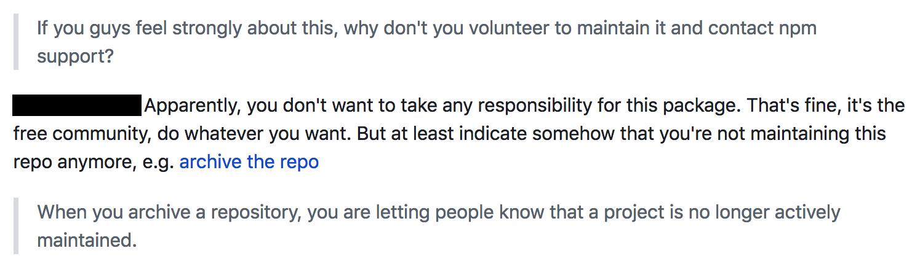

# 5.2 Dijital Arkeolojide Sürdürülebilirlik ve Güç

[İngilizce Metin](https://o-date.github.io/draft/book/sustainability-power-in-digital-archaeology.html)

❗Bu bölüm geliştirme aşamasındadır.

Bu metinde karşılaştığınız tüm araçları ve yaklaşımları düşünün. Hepsinin işe yaraması için önemli miktarda zaman ve enerji – ve genellikle para! – gerektirir. Ve bu bir iştir – dijital arkeolojinin dayandığı çeşitli paket ve hizmetleri tasarlamak, uygulamak ve sürdürmek, en az ‘akademik’ çalışma kadar bilimsel, en az ‘yorucu’ bir iştir. Bu işi kim yapıyor? Para nereden geliyor? Bazı durumlarda cevap ‘kütüphane’dir. Hangi çalışanlar? Tam zamanlı mı çalışıyorlar, yoksa güvencesiz olarak mı istihdam ediliyorlar? Bu emeğin cinsiyet dağılımı nedir ve krediyi kim alıyor? Diğer durumlarda ise (genellikle kurumsal desteği olmayan) bir kişi bunu bir görev olarak üstlenir. Bazen bu durum, ekran görüntüsünün (Şekil 5.1) gösterdiği gibi [[sorunlara](https://arstechnica.com/information-technology/2018/11/hacker-backdoors-widely-used-open-source-software-to-steal-bitcoin/)] yol açabilir.

*Eğer bu konuda güçlü hissediyorsanız, neden bunu sürdürmek için gönüllü olmuyorsunuz ve npm desteğini kabul etmiyorsunuz?*

*Görünüşe göre, bu paket için herhangi bir sorumluluk almak istemiyorsunuz. sorun değil, burası özgür topluluk, ne istersen yap. Ama en azından bu depoyu artık sürdürmediğinizi bir şekilde belirtin, örneğin depoyu arşivleyin*

*Bir depoya ulaştığınızda, insanlara bir projenin artık aktif olarak sürdürülmediğini bildirmiş olursunuz.*

 Açık kaynaklı bir paketin istismar edilmesinin ardından Github’da yapılan tartışma, temel sorunu tanımlıyor.

Neyse ki böyle şeylere nadiren rastlanıyor. Ancak bu durum temel sorunu ortaya koyuyor – başkalarının yazılımlarını kullanmaktan memnunuz, ancak bunun için ödeme yapmaktan memnun muyuz? Yazılımı kimin geliştirdiğini anlamak ve bu kişileri çalışmamızın ortak yaratıcıları olarak tanımak gibi ağır bir işi yapmaktan mutlu muyuz?

[[OpenContext](http://opencontext.org/)] veya [[Archaeological Data Service](http://www.archaeologydataservice.ac.uk/advice/chargingPolicy.xhtml)] gibi kritik hizmetlerin işletilmesi maliyetlidir. Austin’deki Texas Üniversitesi Entomoloji Küratörü Alex Wild’ın Şekil 5.2’de gösterilen ve koleksiyonlarını dijitalleştirmenin maliyetini hesapladığı bu [[tweet](https://twitter.com/Myrmecos/status/1036437847153274881)]‘ini dikkate alın.

.png)

Alex Wild’ın dijitalleşmenin maliyeti üzerine 2 Eylül 2018 tarihli tweeti

 Alex Wild @Myrmecos.  2 Eylül

Saatte 12 dolar ödeyerek 10 dakika/örnek ile 1-2 fotoğraf ve örnek verisi çekebileceğimizi varsayarsak, koleksiyonumuzu dijital ortama aktarmak için 4 milyon dolar gerekir.

Bu tür şeyler için bütçemiz yılda sadece 3 bin dolar.

 Bu sadece bir fotoğraf çekmenin maliyeti. Bir de verileri temizlemenin, verilerin çevrimiçi olarak erişilebilir olmasını, saldırılara karşı korunmasını ve en iyi uygulamalara uygun olarak sunulmasını sağlamanın maliyetini hayal edin.

Bu çalışmayı, bu emeği tanımamak bir ayrıcalık ve güç kullanımıdır. Yani, çalışmaları kendi çalışmalarımızın temelini oluşturan kişilerin katkılarını silme gücüdür. Bu nedenle, ODATE’in bu son bölümünde sizleri kendi dijital arkeolojik çalışmalarınızın temelinde neyin yattığını düşünmeye ve sürdürülebilirliğini sağlamak için ne yapılması gerektiğini merak etmeye davet ediyoruz. Kodunuz açık mı? Verileriniz? Geleceğe hazırlandı mı? Katkıda bulunan herkes uygun bir şekilde kamuya açık olarak tanındı mı?

Université de Montréal’den Katherine Cook, Kasım 2018’de Carleton Üniversitesi’nde halka açık bir konferansta bu ve diğer konuları tartıştı. “Dijital arkeolojide ‘ağ tarafsızlığı’ yoktur” (“T[[here is no ‘net neutrality’ in digital archaeology](https://youtu.be/vDqle5mNiZE)]”) başlıklı konuşmasının tamamı dikkate değerdir.

https://www.youtube.com/watch?v=vDqle5mNiZE

## 5.2.1 Alıştırmalar

1- ODATE’de kullandığınız farklı hizmetleri düşünün. Bu hizmetleri işletmenin/barındırmanın/geliştirmenin maliyetlerini hesaplayabilir misiniz?

2- Dijital arkeolojik araçları veya perspektifleri kullanan yeni bir yayın arayın. Yazarlar araçlarının sürdürülebilirliği hakkında ne söylüyor ya da söylemiyor?

3- Bir saha raporu arayın. Dijital analitik çalışmayı kim yapıyor? Proje hiyerarşisindeki statüleri nedir?

4- İlgi alanınızdaki bir proje için [[OpenContext](http://opencontext.org/)]‘i araştırın. Alex Wild’ın görüntüleri dijitalleştirme kuralını kullanarak OpenContext için projeyi dijitalleştirmenin maliyetini tahmin etmeye çalışın. Tahmininiz elbette düşük bir tahmin olacaktır. Başka hangi maliyetleri gözden kaçırıyor olabilirsiniz?
